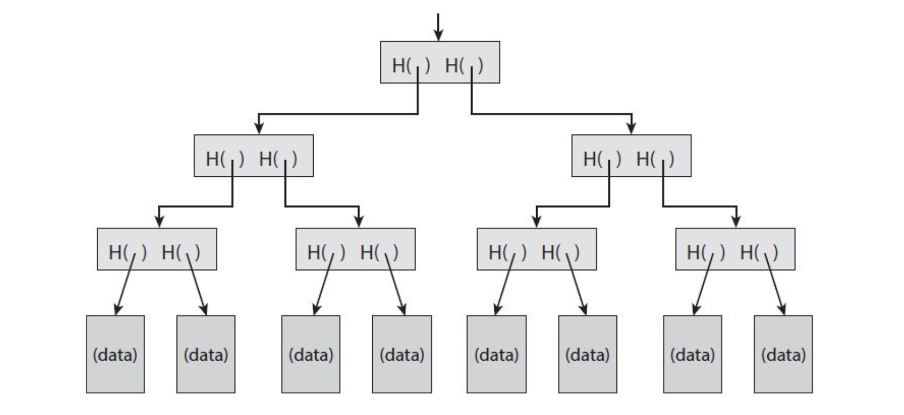
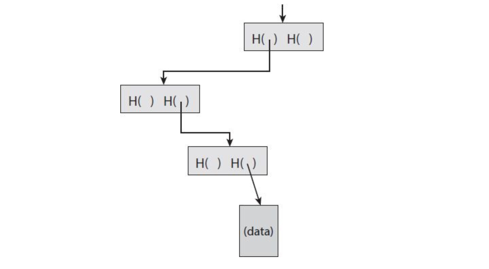
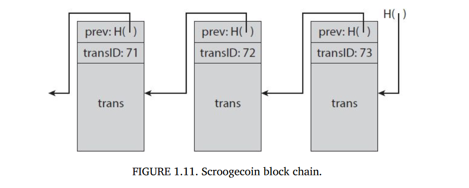
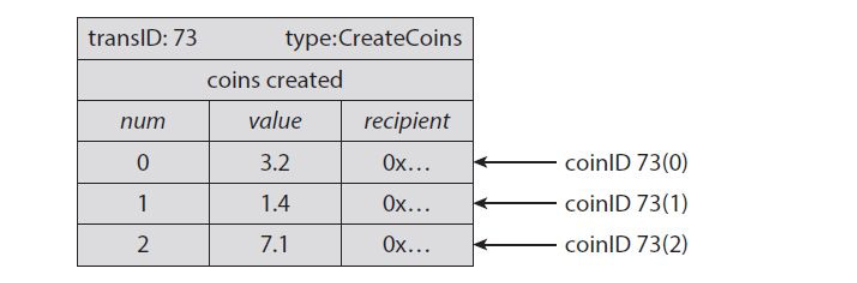

# Crittografia e criptovalute

Tutte le valute necessitano di sistemi di controllo, in modo da controllare l'offerta e di rafforzare il sistema per prevenire truffe. Nelle valute legali, organizzazioni come le banche centrali controllano l'offerta e aggiungono proprietà di anticontraffazione ai soldi fisici. Inoltre, è necessario l'intervento delle forze dell'ordine per impedire alle persone di infrangere le regole del sistema. Anche le criptovalute hanno sistemi di sicurezza che impediscono alla gente di manomettere lo stato del sistema. 

> Se Alice convince Bob a farsi pagare con una moneta digitale, lei non dovrebbe riuscire a pagare Carol con la stessa moneta. Tuttavia, a differenza delle valute legali, i sistemi di sicurezza delle criptovalute devono essere rinforzati puramente con la tecnologia, senza l'aiuto di una autorità centrale. 

La crittografia fornisce un meccanismo per codificare le regole del sistema dietro la crittovaluta all'interno del sistema stesso. Possiamo utilizzarla sia per prevenire manomissioni / truffe, sia per creare ulteriori unità della criptovaluta.  


## Funzioni hash crittografiche

Le funzioni hash crittografiche sono largamente discusse nel blocco di appunti riguardante il corso di crittografia, per cui ne parleremo sommariamente. Una *funzione hash* è una funzione matematica con le seguenti tre proprietà: 

1. L'input è una stringa di lunghezza arbitraria.
2. L'output è una stringa di lunghezza fissa.
3. È efficientemente calcolabile.

Queste proprietà sono legate ad una semplice funzione hash. Una *funzione hash crittografica* ha altre 3 proprietà addizionali: 

1. È resistente alle collisioni (cr2-kk)
2. È hiding 
3. È puzzle friendly

> Prima di iniziare a parlare delle proprietà, Bitcoin utilizza la funzione hash SHA256, che è ampiamente trattata nel capitolo dedicato alle funzioni hash del blocco di appunti di Crittografia, per cui verrà saltato, insieme all'introduzione del paradigma di costruzione di Merkle-Damgard. 


### Prop 1. Collision resistance 

Della collision resistance daremo solo la definizione formale, poiché ampiamente trattata nel capitolo dedicato alle funzioni hash del blocco di appunti di Crittografia.

**Def.** Una funzione hash $H$ è detta **resistente alle collisioni** se è computazionalmente difficile trovare due valori $x$ e $y$, tali che $x \ne y$ e $H(x)=H(y)$.  


### Prop 2. Hiding 

La proprietà di hiding garantisce che dato l'output $y=H(x)$ di una funzione hash, non esiste alcun modo computazionalmente semplice per estrapolare l'input $x$. Per fare ciò ho bisogno di alcuni prerequisiti: (1) il dominio deve essere grande, altrimenti mi basta provare tutte le possibili $x$ per risolvere il problema; (2) le $x$ devono essere distribuite in maniera pressoché uniforme, altrimenti potrei sfruttare la distribuzione di probabilità per velocizzare la ricerca. 

Se il dominio in cui mi muovo non è abbastanza grande, posso comunque ottenere la proprietà di hiding concatenando alla $x$ la randomness $r$, che è distribuita uniformemente. 

**Def.** Una funzione hash $H$ si dice **hiding** se, dato un valore segreto $r$ estratto da una distribuzione di probabilità con alta min-entropy, e dato $H(r \parallel x)$, è computazionalmente difficile trovare $x$.

> In teoria dell'informazione, la min-entropy è la misura di quanto prevedibile sia un risultato. Una alta min-entropy cattura intuitivamente l'idea di una distribuzione pressoché uniforme. Se ad esempio la randomness $r$ è selezionata casualmente dall'insieme di stringhe di bit lunghe 256 bit, allora la probabilità che coincida con una determinata stringa è $1 / 2^{256}$.

> [Da reddit](https://www.reddit.com/r/crypto/comments/4qwxdz/high_minentropy/): Min entropy measures how likely you are to guess a value on your first try. If this probability is p, then the min entropy is defined as $-\log_2(p)$. For example, for a fair coin  toss, you'd have p = 0.5, giving a min entropy of 1 bit.  A uniformly  random 256-bit string would have $-\log(2^{-256})= 256$ bits of min entropy. Min entropy is used all the time in analyzing RNGs with imperfect sources  of randomness because the left over hash lemma relates the best possible quality of the RNG output to the min entropy of its source.


#### Applicazioni: Commitment 

Un commitment (impegno) è l'analogo digitale di scrivere qualcosa (che ci si impegna a rispettare) su un pezzo di carta, sigillare tale pezzo di carta su una busta e porre la busta sul tavolo. Le altre persone non potranno vedere il contenuto della busta, sino ad un certo punto, quando si decide di aprirla per svelarne il contenuto. 

> Se ad esempio ad una vendita vince la miglior offerta iniziale, tutti i partecipanti potrebbero fare un commitment, inserendo l'offerta all'interno di una busta sigillata e mettendola sul banco. Il venditore aprirà le buste solo quando tutti i partecipanti avranno consegnato l'offerta. I partecipanti non possono vedere le offerte posizionate sul banco, poiché sigillate, e quindi non possono offrire poco di più dell'offerta migliore per assicurarsi la vincita.   

Un commitment si compone di due algoritmi: 

* $\text{com} \coloneqq \text{commit}(msg, nonce)$
* $\text{verify}(com, msg, nonce)$

La funzione $\text{commit}$ prende in input un messaggio ed un valore randomico segreto, chiamato $nonce$, e ritorna un commitment. La funzione di verifica $\text{verify}$ prende in input il commitment, il parametro segreto $nonce$ ed il messaggio, e ritorna vero se $com == \text{commit}(msg, nonce)$, falso altrimenti. Affinché tutto funzioni, dobbiamo assicurarci che valgano le seguenti proprietà: 

1. **Hiding**: dato il commitment $com$, deve essere computazionalmente difficile trovare $msg$. 
2. **Binding**: deve essere comp. difficile trovare due coppie $(msg, nonce)$ e $(msg', nonce')$ tali che $msg \ne msg'$ e $\text{commit}(msg, nonce) = \text{commit}(msg', nonce')$.  

Per utilizzare lo schema di commitment, prima di tutto generiamo la stringa random segreta $nonce$, dopodiché la passiamo insieme al messaggio alla funzione commit, che genera il commitment. Pubblichiamo quindi il commitment ottenuto. Se ad un certo punto vogliamo svelare agli altri il messaggio dentro il commitment, pubblichiamo il $nonce$ ed il messaggio, cosicché gli altri potranno verificare se il commitment contenesse tali informazioni attraverso l'algoritmo di verify.  

> Ogni volta che si genera un commitment, è importante utilizzare un valore random nonce differente. In crittografia, il termine **nonce** si utilizza per i valori che vanno utilizzati una sola volta.

La proprietà di hiding permette di non svelare il contenuto del commitment agli altri, mentre la proprietà di binding garantisce agli altri che il contenuto del commitment non possa cambiare una volta generato. 

Un valido schema di commitment può essere realizzato attraverso una funzione hash crittografica $H$ nel seguente modo: 

* $\text{commit}(msg, nonce) = H(nonce \parallel msg )$
* $\text{verify}(com, msg, nonce) = H(nonce \parallel msg) == com$

Se la funzione $H$ è hiding, allora anche lo schema sarà hiding. Se la funzione $H$ è collision resistant, allora lo schema sarà binding, dato che trovare le due coppie il cui commitment coincide equivale a trovare una collisione. Quindi lo schema rispetta le due proprietà. 


### Prop 3. Puzzle friendliness

Partiamo dalla definizione formale della proprietà: 

**Def. ** Una funzione hash $H$ è detta puzzle friendly se per ogni possibile output $y$ di $n$ bit, se $k$ è scelto da una distribuzione con alta min-entropy, allora è computazionalmente difficile trovare $x$ tale che $H(k \parallel x )= y$ in un tempo significativamente più piccolo di $2^n$. 

Intuitivamente, se qualcuno targettizza la funzione hash per avere un particolare output $y$, e se parte dell'input è opportunamente randomizzato, allora è computazionalmente difficile trovare un altro input che mappi esattamente quel target. 


#### Applicazioni: Search puzzle

Consideriamo un'applicazione che illustri l'utilità di tale proprietà. Costruiremo un search puzzle, ovvero un problema matematico che richiede di ricercare la soluzione in uno spazio molto grande. In questo problema, non c'è altro modo di trovare la soluzione meno che cercare in tale spazio. Tale puzzle consiste di: 

* Una funzione hash $H$
* Un valore $id$ ($\text{puzzle-ID}$) scelto in una distribuzione con alta min-entropy
* Un insieme target $Y$  

Una soluzione a tale puzzle è trovare $x$ tale che $H(id \parallel x) \in Y$.

L'intuizione è la seguente: se $H$ ha un output di 256 bit, allora la funzione hash avrà un codominio formato da $2^{256}$ valori. L'insieme target $Y$ è un sottoinsieme dell'insieme dei valori di output. Se $Y$ è grande, allora è più semplice risolvere il puzzle. La difficoltà aumenta al diminuire della dimensione di $Y$, e raggiunge la massima difficoltà per $|Y|=1$. Se il puzzle ID ha una alta min-entropy, allora risulta difficile imbrogliare andandosi a precalcolare le soluzioni con tale ID. Se la funzione hash è puzzle friendly, allora non c'è modo migliore per risolvere il puzzle che provare casualmente elementi $x$. Questa proprietà verrà sfruttata nel mining, di cui parleremo in seguito.   


## Hash pointers e strutture dati

### Hash pointers

Un **hash pointer** è un determinato tipo che contiene due informazioni: il luogo in cui è conservata una certa informazione e l'hash dell'informazione stessa. L'hash serve a capire se l'informazione è cambiata o meno: basterà consultare l'informazione grazie al puntatore, calcolare il suo hash e confrontarlo con quello conservato nell'hash pointer. Se i due hash coincidono, allora l'informazione è quella originale. 


### Block chain

Una block chain è praticamente una linked list, dove al posto dei puntatori utilizziamo gli hash pointer. Ogni blocco ci indica la posizione del blocco precedente e l'hash del suo contenuto. Quest'ultimo ci permette di verificare che il contenuto del blocco precedente non sia cambiato. Il primo blocco della block chain viene chiamato **genesis block**, e non punta a nessun blocco precedente. Dato che il blocco punta al precedente, l'inserimento viene effettuato in testa. Viene conservata solo la head della block chain, da cui possiamo raggiungere tutti gli altri blocchi a cascata. Di seguito un esempio di validazione della blockchain: 

```python
def validateBlockchain(blockchain: Blockchain):
	for block in blockchain:
		if block.is_genesis():
            return True
        prev = block.get_prev_block()
        if block.prev_hash() != prev.calculate_hash():
            return False
```


#### Applicazioni: tamper evident log

Una possibile applicazione della block chain è un **tamper-evident log** (registro a prova di manomissione). Proviamo a manomettere il registro: l'obiettivo dell'avversario sarà quello di manomettere il contenuto di un blocco senza che chi contiene l'head della block-chain si accorga della manomissione. Supponiamo di manomettere il blocco $k$: questo implica che l'hash del blocco $k$ conservato nel blocco $k+1$ non corrisponderà all'hash del blocco $k$ modificato (questo è garantito statisticamente dalla collision resistance della funzione hash). Per risolvere questo problema, l'attaccante potrebbe provare a modificare l'hash del blocco $k+1$, ma a questo punto la manomissione sarà rilevata nel blocco $k+2$. Continuando in questo modo, alla fine la manomissione verrà rilevata nella head della block chain, che non essendo accessibile all'attaccante non potrà essere modificata.  

Il risultato è che per mantenere la block chain consistente pur manomettendo il contenuto di blocchi, bisogna modificare gli hash di tutti i blocchi della catena fino all'head, che potrebbe benissimo essere memorizzata da qualche parte. Quindi potremmo costruire una grossa block chain, e mantenerla consistente memorizzando solo la head. 

 

### Merkle trees

Un'altra struttura dati che possiamo costruire con gli hash pointers è l'**albero binario**. Un albero binario che utilizza gli hash pointer è detto **Merkle Tree**. Supponiamo di avere dei blocchi contenenti dei dati: tali blocchi saranno le foglie del nostro albero. Dividiamo questi blocchi in coppie e per ogni coppia costruiamo una struttura dati contenente due hash pointers. Continuiamo a costruire livelli dell'albero in questo modo sino a che non raggiungiamo un solo blocco, ovvero la radice dell'albero. 



Una manomissione in un blocco qualsiasi dell'albero provocherà una inconsistenza sul parent al livello superiore. Modificare il parent causerà una inconsistenza al livello ancora superiore, e così via fino alla root dell'albero. Questo implica che per validare un merkle tree possiamo conservare l'hash pointer della sola root. 


#### Proof of Membership

Un'altra funzionalità dei merkle tree è la proof of membership coincisa. Per mostrare che un blocco appartiene alla block chain, bisogna mostrare la porzione della lista che va dal blocco sino alla head. Al contrario, nel Merkle tree basta indicare la strada che va dal blocco alla radice, che è molto più coincisa: 



Se l'albero contiene $n$ nodi, bisogna mostrare al più $\log(n)$ nodi per dimostrare l'appartenenza all'albero. In una block chain, nel caso pessimo è necessario mostrare tutti ed $n$ i nodi. 


#### Proof of Nonmembership

Un **sorted merke tree** (merkle tree ordinato) è un merkle tree in cui i blocchi sottostanti sono ordinati secondo una certa funzione di ordinamento (alfabetico, lessicografico, numerico, etc.).  

Un sorted Merkle tree ha la proprietà di verificare la **non appartenenza** di un certo nodo in tempo e spazio logaritmico. Sia $x$ il nodo cercato, troviamo un cammino che va dalla radice al predecessore $x_p$ di $x$, dopodiché troviamo il cammino che va dalla radice al successore $x_s$ di $x$. Se $x_p$ ed $x_s$ sono consecutivi, allora sicuramente $x$ non apparterrà all'albero. Questo poiché se $x$ appartenesse all'albero allo tra $x_p$ ed $x_s$ dovrebbe esserci lo spazio per conservare $x$, cosa non vera dato che i due nodi sono consecutivi. 

> Possiamo utilizzare gli hash pointer in qualsiasi struttura **che utilizza puntatori** e che **non abbia cicli**. Se ci fossero dei cicli, allora non sarebbe possibile creare un hash che riassuma il ciclo. In una struttura aciclica, partiamo dai blocchi che non hanno puntatori uscenti e calcoliamo i loro hash nei parent, e così via fino ad un certo head della struttura. In una struttura ciclica, il ciclo non contiene nodi che non hanno puntatori uscenti.  


## Firme digitali

Le firme digitali sono una primitiva crittografica ed insieme alle funzioni hash costituiscono i mattoncini per creare la criptovaluta. Gli algoritmi di firma digitale devono godere delle seguenti proprietà: 

1. La firma deve essere verificabile
2. La firma deve essere infalsificabile (uf-cma)

Non tratteremo le firme digitali, che sono già ampiamente trattate nel capitolo 11 "Firme Digitali" del blocco di appunti. Bitcoin utilizza ECDSA, per cui bisogna leggere attentamente il paragrafo dedicato. 


## Public key as Identities 

L'idea è quella di utilizzare le chiavi pubbliche degli schemi di firma digitale come **identità**. La firma in un messaggio indica l'identità $pk$ se $pk$ verifica correttamente la firma. Per impersonare l'identità $pk$, l'utente deve detenere la chiave di firma $sk$. La conseguenza di questo modello è che nuove identità possono essere facilmente create generando una coppia di chiavi $(sk, pk)$. 

> Possiamo utilizzare anche un hash della chiave pubblica $pk$ come identità $Id= h(pk)$, ed in questo modo l'utente dovrà prima verificare che $h(pk) == Id$ per attribuire uno statement ad una identità e dopodichè verificare la firma con $pk$.

La chiave pubblica $pk$ sembrerà una stringa random, tuttavia non garantisce anonimato poiché dall'analisi delle transazioni (e statements) potremmo collegare una $pk$ ad una persona reale. 


### Gestione decentralizzata dell'identità

Anziché registrare le utenze in un sistema centralizzato, l'identità viene creata localmente generando una nuova coppia $(sk, pk)$, e l'utente può generare pressoché infinite identità. La probabilità di generare due identità uguali è così piccola che non dovremmo preoccuparci che ciò accada. Questo è il modo in cui opera Bitcoin. Le identità prendono il nome di **indirizzi**. L'indirizzo non è altro che un **hash della chiave pubblica**. 


## Due semplici criptovalute

Vediamo due esempi totalmente differenti di criptovalute e analizziamo benefici e problemi. 


### Goofycoin

In Goofycoin ci sono solo due regole: 

1. Una certa identità può creare arbitrariamente monete che gli appartengono. 
2. Chiunque detiene una moneta può trasferirla ad un'altra identità. 

(1) Per generare una moneta l'utente utilizza la funzione *CreateCoin* e genera un identificativo univoco della moneta, chiamato *uniqueCoinID*. Poi crea la stringa CreateCoin[UniqueCoinID], e la firma digitalmente con la propria chiave di firma $sk$, generando la firma $sig$. La stringa, insieme alla firma $sig$, è una moneta. Attraverso la chiave pubblica dell'utente, tutti possono verificare correttamente che egli ha firmato lo statement di creazione della moneta, e che quindi tale moneta è valida. 

(2) Supponiamo che l'utente Goofy voglia inviare una moneta all'utente Alice. Per fare ciò, Goofy crea un nuovo statement "Paga **questo** ad Alice", dove "questo" è un hash pointer allo statement di creazione della moneta. Dopodiché, Goofy firma digitalmente lo statement. Dopo aver firmato, Alice è la legittima proprietaria della moneta e può dimostrarlo mostrando lo statement di pagamento firmato da Goofy. Dopodiché, Alice può pagare Bob con la moneta acquisita attraverso lo statement "Paga **questo** a Bob", dove "questo" è un hash pointer allo statement di pagamento firmato da Goofy. Dopodiché Alice firma digitalmente il nuovo statement e la moneta apparterrà a Bob (e così via). La validità viene verificata dalla catena di hash pointers. 

Riassumendo: 

1. L'utente $x$ può creare nuove monete firmando uno statement in cui asserisce di star creando una nuova moneta con un identificativo univoco. 
2. Chiunque detenga una moneta può passarla ad un altro utente $y$ firmando uno statement "Paga $y$ con questa moneta", dove $y$ è una chiave pubblica. 
3. Tutti possono verificare le legittima proprietà di una moneta seguendo la catena di hash pointers, fino alla creazione della moneta stessa, e verificando correttamente le firme man mano. 

Il **problema** principale è il **double spending attack**: Alice può pagare Bob con una moneta firmando lo statement e non comunicandolo a nessuno. Alice può pagare Chuck con la stessa moneta, poiché quest'ultimo è ignaro della precedente transazione, ed inoltre lo statement risulterà valido. Alice sta spendendo la moneta due volte. Il double spending è uno dei problemi principali delle criptovalute e, non risolvendolo, Goofycoin risulta essere una criptovaluta insicura. 


### Scroogecoin 

Scroogecoin prova a risolvere il problema del double spending centralizzando il sistema. Esiste una entità chiamata Scrooge che detiene un libro mastro (ledger) append-only, contenente lo storico di tutte le transazioni. La proprietà append-only garantisce che ciò che viene scritto rimarrà per sempre nel libro mastro. Se la proprietà è verificata, allora possiamo prevenire il double spending controllando se la moneta è stata spesa precedentemente dal pagante attraverso il libro mastro. Per garantire ciò, Scrooge può semplicemente utilizzare una blockchain, dove ogni blocco è una transazione (un'ottimizzazione consiste nell'inserire più transazioni nello stesso blocco, come fa Bitcoin).  Ogni blocco contiene un ID della transazione, il contenuto della transazione e l'hash pointer al blocco precedente. Scrooge firma digitalmente l'ultimo blocco della catena (l'head, che verifica l'intera catena), e pubblica la sua firma insieme alla block chain. 



In Scroogecoin, Scrooge firma digitalmente ogni transazione, oltre a firmare l'head della blockchain. Scrooge si prenderà cura di non firmare transazioni contenenti double spending. L'esistenza della blockchain assicura agli utenti che Scrooge non possa rimuovere o aggiungere transazioni a suo piacimento senza che la struttura cambi. 

Anche in Scroogecoin esiste l'operazione *CreateCoin*, ma è estesa per permettere di creare più monete nella stessa transazione. Ogni moneta ha un numero seriale, un valore (in Scroogecoin), ed un recipient (destinatario), ovvero la public key del detentore. Ci riferiremo ad una moneta con un CoinID, formato dall'id della transazione e dal numero seriale della moneta.  



Per definizione, una transazione CreateCoin è valida se è firmata da Scrooge. Il secondo tipo di transazione è la PayCoin. Questa transazione consuma delle monete (le distrugge) e crea nuove monete con lo stesso valore ma con dei CoinID differenti. La transazione deve essere firmata da chiunque stia pagando con una moneta. Una transazione PayCoin è valida se soddisfa le seguenti 4 condizioni: 

1. Le monete consumate devono essere valide e create in transazioni precedenti. 
2. Le monete consumate non devono essere state consumate in precedenza. 
3. Il valore totale delle monete generate è uguale al valore totale di quelle consumate. 
4. La transazione è valida solo se è firmata da tutti i proprietari delle monete consumate. 

Se la transazione è valida, Scrooge la accetterà e la inserirà nella blockchain. Gli utenti considereranno la transazione come "avvenuta" se e solo se essa sarà inserita nella blockchain firmata da Scrooge. Le monete in questo sistema sono **immutabili**, ovvero non sono mai divise o combinate. Possiamo comunque aggirare il sistema facendo un pagamento dall'utente a se stesso, dove dividiamo o combiniamo delle monete e le assegniamo all'utente stesso (il valore in uscita è comunque uguale al valore in entrata). 

Il **problema** della criptovaluta è proprio Scrooge: anche se non può creare transazioni false, può rifiutarsi di firmare valide transazioni di utenti. Inoltre Scrooge può creare infinite monete per se stesso. Il problema è proprio la **centralizzazione**, nel senso che gli utenti dovrebbero fidarsi ciecamente di Scrooge per utilizzare il sistema. Il nostro prossimo obiettivo sarà quello di costruire una criptocurrency dove Scrooge è decentralizzato. 

