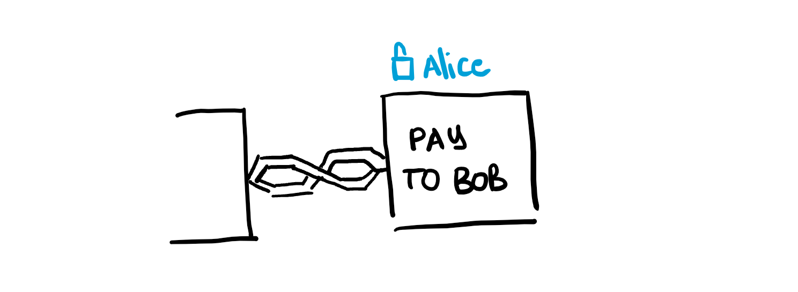
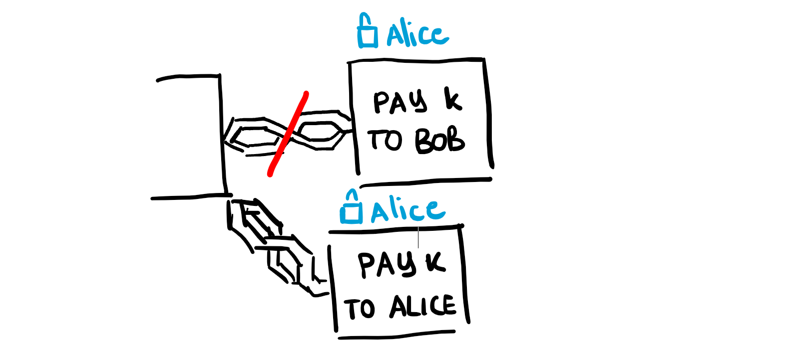
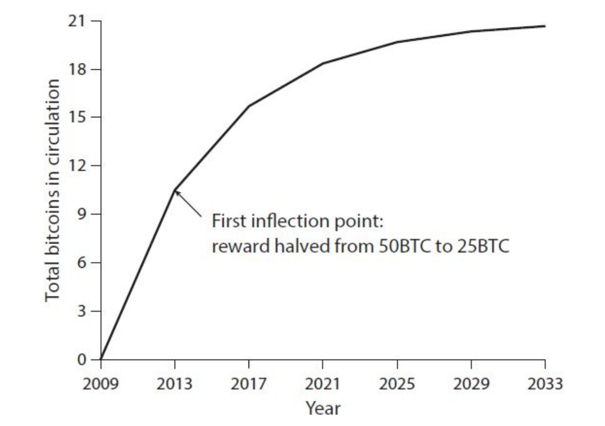
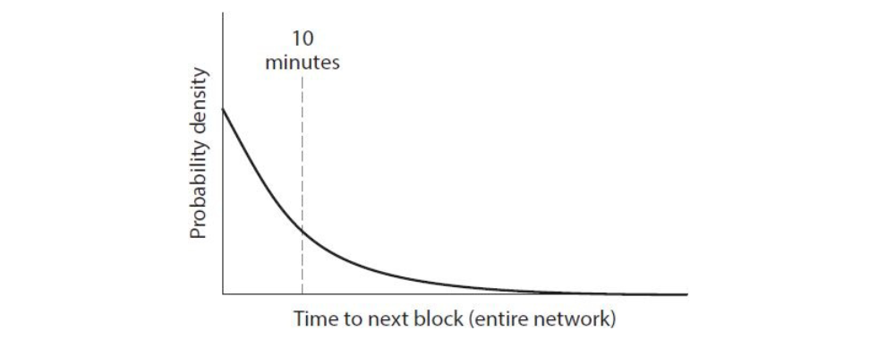

# Decentralizzazione

Lo scopo di questo capitolo è quello di introdurre tecniche che permettano di effettuare le azioni di Scrooge in Scroogecoin, ma in maniera decentralizzata. Dividiamo il discorso sulla decentralizzazione di Bitcoin su 5 diverse domande: 

1. Chi mantiene il libro mastro delle transazioni?
2. Chi ha autorita su quali transazioni sono valide?
3. Chi crea nuovi Bitcoin?
4. Chi determina come cambiano le regole del sistema?
5. In che modo i bitcoin acquisiscono valore di scambio?

Le prime tre domande riflettono i dettagli tecnici del protocollo Bitcoin, e saranno il focus di questo capitolo. La rete **peer to peer** raggiunge la quasi totale decentralizzazione, dato che chiunque può eseguire un nodo Bitcoin (non troppo difficilmente, attraverso un client Bitcoin). Anche il **mining di Bitcoin** è teoricamente aperto a tutti, ma richiede un elevato costo computazionale, di conseguenza il mining ha un alto grado di centralizzazione (dato che richiede un grosso investimento). I nodi aggiornano singolarmente il software che permette l'operazione del protocollo (che è aperto), ma quasi tutti utilizzano una implementazione di riferimento, e i maintainers di tale implementazione hanno grande potere. 


## Distributed consensus 

Il consenso distribuito serve a creare affidabilità nei sistemi distribuiti. Formalmente: 

> Supponiamo di avere $n$ nodi, ognuno con un valore di input. Alcuni di questi sono nodi malevoli / corrotti. Un **protocollo di consenso distribuito** ha le seguenti due proprietà: 
>
> 1. Al termine, tutti i nodi onesti devono essere d'accordo sul valore scelto. 
> 2. Il valore scelto deve essere generato da un nodo onesto.


### Concetti di base

Bitcoin è un sistema peer-to-peer: quando Alice vuole pagare Bob, tecnicamente manda in broadcast una transazione a tutta la rete. 


Bob non deve necessariamente essere un nodo della rete per ricevere il pagamento. Esso verrà scritto nella blockchain, per cui esisterà e Bob sarà il legittimo proprietario. Se Bob vuole essere **notificato** del pagamento, allora è una buona idea eseguire un nodo Bitcoin e restare in ascolto. 

Dato che vari utenti eseguono transazioni nello stesso momento, i nodi della rete Bitcoin devono stabilire un consenso su quali transazioni sono state trasmesse e sul loro ordine di effettuazione. Come in Scroogecoin, più transazioni venivano inserite in un blocco, allo stesso modo, in Bitcoin, il consenso avviene blocco per blocco.

In ogni momento, ogni nodo della rete Bitcoin avrà un libro mastro che consiste in una lista di blocchi, ognuno dei quali conterrà transazioni che hanno raggiunto il consenso distribuito. Addizionalmente, ogni nodo può contenere un pool di transazioni di cui è venuto a conoscenza, ma che non sono ancora incluse nella blockchain. Tale pool può essere diverso tra nodi, questo avviene poiché le transazioni non si propagano istantaneamente nella rete peer to peer, ed un nodo può andare spesso offline.  


### Processo di consenso

Ad intervalli regolari (es. 10 minuti) ogni nodo propone al sistema di includere il proprio transaction pool nel nodo successivo. Dopodiché i nodi eseguono qualche protocollo di consenso, dove ogni nodo propone il proprio input da inserire nel blocco. Possiamo supporre che al protocollo partecipino nodi onesti e disonesti. Se il protocollo di consenso riesce, alora il blocco proposto viene selezionato in output (anche se proposto da un solo nodo). Alcune transazioni valide possono essere escluse dal blocco di output, ma questo non è un problema poiché potranno partecipare al blocco successivo. 

Questa è una descrizione a grandi linee, poiché: (1) la rete peer to peer non è totalmente connessa; (2) ci sono problemi di latenza e connettività; (3) alcuni nodi possono cercare di sovvertire il sistema. Una conseguenza della latenza è la **mancanza di un tempo globale**, per cui non tutti i nodi possono essere d'accordo sull'ordine delle transazioni semplicemente osservando i loro timestamp. 


### Risultati di impossibilità

La mancanza di un tempo globale ha spinto la letteratura ad una visione pessimistica dei protocolli di consenso. Un famoso risultato prende il nome di **Byzantine Generals Problem**. 

> In questo problema, l'esercito è formato da divisioni, con a capo dei generali. I generali comunicano tra loro attraverso i messaggeri per stabilire un piano d'azione. Alcuni generali sono dei traditori e cercano di sabotare tale piano. Lo scopo è quello di arrivare ad un piano stabilito da generali onesti e di non permettere a quelli corrotti di sabotare l'azione. E' stata provata l'impossibilità di arrivare ad un piano non corrotto se almeno $\frac 1 3$ dei generali sono corrotti. 

Un'altro risultato di impossibilità è il **Fischer-Lynch-Paterson**, dagli autori che lo hanno dimostrato. Sotto certe condizioni, il problema dimostra che è impossibile arrivare al consenso anche con 1 solo nodo corrotto nel sistema. 

A dispetto di tali risultati di impossibilità, esistono protocolli di consenso come **Paxos**, basati su compromessi. Paxos non arriva mai ad un risultato inconsistente, ma sotto certe condizioni può procedere senza fare progressi.     


### Breaking traditional assumptions 

I risultati di impossibilità sono stati provati per determinati modelli, in cui Bitcoin non rientra. Il consenso di Bitcoin funziona bene nella pratica, pur non essendo completamente coperto il suo lato teorico. Capire teoricamente il perché del suo funzionamento è importante per sviluppare modelli che permettano di studiare sviluppi futuri. Vediamo quali sono le assunzioni che Bitcoin viola: 

1. Bitcoin introduce l'idea degli incentivi (ad agire onestamente)
2. Bitcoin fa pesante uso di randomness 
3. Il consenso non ha un inizio ed una fine, ma è consolidato nel tempo

Riguardo al punto (3), andando avanti nel tempo la probabilità che la propria visione dei blocchi sia analoga a quella stabilità dal consenso aumenta, mentre quella che la propria visione sia differente decrementa esponenzialmente. 


## Consenso senza identità

Bitcoin non vuole assegnare delle identità ai nodi poiché la pseudo-anonimità è contenuta nel design del sistema. Ogni peer può generare molte identità, il che apre le porte alla possibilità di un **Sybil attack**: le copie sono indistinguibili da normali utenti del sistema, pur essendo unicamente gestite dall'avversario. Questa è un'altra differenza rispetto agli altri sistemi che necessitano di consenso. 

Per strutturare l'algoritmo di consenso di Bitcoin abbiamo bisogno di fare delle assunzioni, che spiegheremo successivamente. Assumiamo che il nostro sistema funzioni come una lotteria: esso distribuisce dei biglietti ai peer e seleziona il nodo candidato ad iniziare il protocollo di consenso estraendo un biglietto random. Dobbiamo anche supporre che se l'avversario sfrutta il Sybil attack, tutte le identità generate riescano a selezionare (insieme) un solo biglietto. 

L'assunzione della selezione randomica del nodo permette il **consenso implicito**. Il nodo selezionato proporrà il prossimo blocco della block-chain, senza alcun processo di votazione. Se il nodo è malevolo ed inserisce un blocco non valido, allora i nodi che verranno selezionati successivamente potranno scegliere di non appendere il blocco a quest'ultimo (rifiutandolo), e di appenderlo a quello precedente (che hanno accettato). 


### Bitcoin consensus algorithm (simplified)

L'algoritmo è semplificato nel senso che assume l'abilità di selezionare un nodo random senza essere vulnerabile al Sybil attack. L'algoritmo procede come segue: 

1. Le nuove transazioni vengono inviate in broadcast a tutti i nodi. 
2. Ogni nodo inserisce le transazioni nel blocco. 
3. Ad ogni round viene selezionato un nodo random.
4. Il nodo selezionato manda il broadcast il blocco.
5. I nodi accettano il blocco se e solo se tutte le transazioni sono valide (senza double spending e con delle firme valide). 
6. I nodi esprimono accettazione per il blocco estendendo la blockchain su quel blocco, quindi includendo il suo hash. 

Analizziamo perché questo attacco funziona. Supponiamo che l'avversario Alice voglia sovvertire il processo. 


#### Rubare Bitcoin

Supponiamo che Alice voglia rubare $n$ Bitcoin a Bob. Per fare ciò, Alice dovrà aggiungere al blocco una nuova transazione che trasferisce i Bitcoin da Bob ad Alice, ma questo richiede una firma valida di Bob. Se lo schema di firma sottostante è solido, Alice non riuscirà a contraffare la firma di Bob. 


#### Denial-Of-Service Attack

Supponiamo che Alice odi Bob, allora lei può decidere di non includere le transazioni provenienti da Bob nel blocco. In altre parole, Alice nega il servizio a Bob. Alice potrà fare questo durante il suo turno, ma non per sempre. A Bob basta aspettare un nodo successivamente selezionato randomicamente per avere le proprie transazioni all'interno della blockchain.  


#### Double Spending

Supponiamo che Bob abbia un negozio online e che Alice sia una sua cliente. Alice acquista un prodotto da Bob ed effettua una transazione. Supponiamo che qualche nodo onesto inserisca la transazione nel successivo blocco della blockchain. Vedendo la transazione nella blockchain, Bob invia il prodotto ad Alice. 



Supponiamo che per puro caso il prossimo nodo selezionato sia proprio Alice.  Allora Alice potrebbe benissimo ignorare il blocco che contiene la sua transazione verso Bob, ed estendere il blocco precedente. Inoltre, Alice inserirà nel blocco che lei propone una transazione che spende lo stesso numero di bitcoin dati a Bob verso un indirizzo controllato da lei stessa. 



Questo è un esempio di double-spending, dato che le due transazioni spendono la stessa moneta. Se Alice riesce a far estendere il suo nuovo (valido) blocco, allora il blocco contenente il pagamento a Bob non sarà più preso in considerazione (vedasi figura sotto). 


Il pagamento che andrà a buon fine sarà quello che risiede sulla coda più lunga della blockchain. I nodi onesti seguono la policy di estendere sempre il **longest valid branch**, ovvero il branch valido della blockchain più lungo.  In questo caso, entrambi i branch sono validi (entrambi legittimi dal punto di vista generale) ed hanno la stessa lunghezza. 

> In generale i nodi seguono l'euristica di estendere il primo blocco che arriva dalla rete. Ma bisogna considerare i problemi di latenza, per cui non è una regola solida. 

Quando uno dei due branch verrà esteso, la probabilità che continuerà ad essere esteso cresce, mentre l'altro branch verrà ignorato. I blocchi residenti su branch non continuati prendono il nome di **orphan blocks** o **stale blocks**. 

> Se Bob, anziché aspettare che la transazione sia all'interno della blockchain, inviasse il prodotto non appena Alice effettua la transazione, allora il double spending sarebbe ancora più semplice: Alice potrebbe benissimo inviare la transazione degli stessi Bitcoin verso se stessa e, con un po' di fortuna, un nodo onesto potrebbe inserire quest'ultima nella blockchain anziché il pagamento verso Bob.

In generale, più conferme riceve una transazione (in termini di blocchi che la estendono) più alta è la probabilità che essa sia consolidata. In termini probabilistici, la probabilità che Alice abbia confermata la seconda transazione decresce esponenzialmente con il numero di conferme della prima. Di fatto, l'euristica che si utilizza è quella di attendere 6 conferme per assumere una transazione consolidata nella blockchain. Il numero 6 è dato da un trade-off tra tempo atteso (circa 10 min a conferma, quindi per 6 conferme circa 1h), e la probabilità che la transazione resti nella blockchain. 

> La protezione contro transazioni non valide è crittografica, ma è rinforzata dal consenso. Questo vuol dire che l'unica ragione che impedisce ad una transazione di rientrare in una blockchain è che la maggior parte dei nodi sono onesti. La protezione contro il double spending è invece interamente gestita dal consenso. 


## Incentivi

Anziché "punire" i nodi malevoli (il che risulta problematico), Bitcoin punta ragionevolmente sul incentivare i nodi ad agire in modo onesto: spiegheremo i **block reward** e le **transaction fees**. 


### Block reward 

Il nodo selezionato che crea il blocco include anche una transazione speciale, ovvero una transazione di **coin-creation** dove dei Bitcoin vengono assegnati ad un indirizzo a sua scelta (tipicamente di sua proprietà). Questa transazione è legittima ed il numero di Bitcoin che vengono creati si dimezza (circa) ogni 4 anni. Il block reward incentiva i nodi a comportarsi onestamente perché è l'unico modo per riscuotere i soldi! Se il blocco diventa un orphan block, l'utente non potrà più utilizzare i coin creati, e quindi non avrà guadagnato nulla. 


### Transaction fees 

Dato che il numero di bitcoin della block reward dimezzano ogni quattro anni (serie geometrica), ad un certo punto (circa 2140) non ci sarà più nessun block reward per chi crea il blocco (21 mil bitcoin in totale) per questo introduciamo la **transaction fee**.



Il creatore di una transazione può decidere di devolvere una piccola percentuale dell'output della sua transazione a chi creerà il blocco nella blockchain che conterrà la transazione. Questa percentuale (a piacere) viene chiamata **transaction fee**. Il creatore del blocco guadagnerà tutte le transaction fees associate alle transazioni che il blocco contiene. 


## Mining e Proof of work

I problemi che nascono dagli incentivi sono i seguenti: 

* Tutti vogliono creare i blocchi per guadagnare con incentivi
* Un avversario potrebbe creare tanti nodi per aumentare la probabilità di essere selezionato

La soluzione è chiamata **proof of work**: seleziamo i nodi in proporzione ad una risorsa che speriamo che nessuno possa monopolizzare (es. potenza di calcolo). 

> Alternativamente, potremmo selezionare i nodi in proporzione al possesso della valuta, in questo caso parliamo di **proof of stake** (utilizzata in altre criptovalute). 

Tornando alla proof of work: è come mettere in competizione i nodi tra di loro utilizzando la loro potenza di calcolo, quindi quest'ultima diventa il parametro di selezione. La potenza di calcolo richiesta è così alta da non poter essere monopolizzabile. Bitcoin riesce a realizzare la proof of work attraverso degli **hash puzzles**. Al nodo che propone il prossimo blocco è richiesto di cercare un certo numero ($nonce$) che concatenato all'hash del blocco precedente e alla lista di tutte le transazioni che lo compongono, e dato in input alla funzione hash, produca una stringa che rientri in uno spazio target piccolo rispetto al codominio della funzione hash stessa, il che rende difficile il task. Potremmo definire il target space come l'insieme di valori minori di un certo numero $target$ (ad esempio), quindi $nonce$ dovrà soddisfare la seguente disequazione: 

$$
H(nonce \mid\mid \text{prev-hash} \mid\mid tx \mid\mid \dots \mid\mid tx ) 
< target
$$
Se la funzione hash $H$ è puzzle friendly, allora l'unico modo di trovare $nonce$ che risolva tale disequazione è tentare abbastanza numeri fino a trovare quello fortunato. La nozione di **hash puzzle** e **proof of work** rimuove completamente la necessità di selezionare un nodo random. I nodi competono in maniera indipendente ed il nodo fortunato propone il prossimo blocco. Vi sono 3 importanti proprietà che un hash puzzle deve rispettare, le vedremo di seguito. 


### Prop. 1 - Difficoltà del puzzle

La prima proprietà è che la soluzione del puzzle deve essere difficile da calcolare. Nel 2015 il numero atteso di hash per blocco da calcolare per trovare una soluzione era $\approx 10^{20}$. Il processo di risoluzione di questi hash puzzle è detto **Bitcoin mining**, ed i partecipanti prendono il nome di **miners**. Il mining diventa insensato per chi ha poca capacità computazionale. 


### Prop. 2 - Costo parametrizzabile

La seconda proprietà è il costo parametrizzabile, ovvero che può cambiare nel tempo. Questo è ottenuto poiché tutti i nodi della rete Bitcoin ricalcolano la grandezza del target space ogni 2016 blocchi. Il ricalcolo è fatto in modo tale che il tempo medio di produzione di un blocco sia ancora 10 minuti. Se un blocco viene creato ogni 10 minuti, 2016 blocchi vengono creati circa ogni 2 settimane, quindi il target space cambia circa ogni 2 settimane. 


Più miners si uniscono alla rete con hardware veloce, più i blocchi saranno trovati velocemente. Durante il ricalcolo del target space, questo diminuirà rendendo più difficile la creazione del blocco. Se investiamo una quantità fissata di hardware, allora la probabilità di trovare un blocco dipende da cosa fanno gli altri miners. Nello specifico, una formula cattura questo aspetto: 

> La probabilità che un miner qualunque vinca il prossimo blocco è equivalente alla frazione di potenza globale di calcolo degli hash che esso possiede e controlla. 

Se Alice detiene lo 0.1% della potenza di calcolo degli hash totale, allora vincerà la produzione di 1 blocco ogni circa 1000 blocchi. Il motivo di **ricalibrare il target** space e mantenere l'invariante dei 10 minuti è che se i blocchi si susseguissero in un intervallo breve di tempo, allora l'efficienza di inserire più transazioni nello stesso blocco verrebbe meno. Non c'è un calcolo particolare che ha portato alla conclusione dei 10 minuti, mettere 7 o 12 minuti farebbe comunque funzionare il sistema. 

> **Due modelli comportamentali dei miners**
> Anziché modellare il comportamento dei miner in due categorie, onesti e disonesti, il campo della teoria dei giochi assume che (in questo modello) ogni nodo si comporti bene in proporzione ai suoi incentivi. Se gli incentivi sono ben strutturati, allora la maggior parte dei nodi seguiranno le regole per la maggior parte del tempo. La grande domanda consiste nello scoprire se il comportamento standard di un miner è un equilibrio di Nash, ovvero rappresenta una situazione stabile in cui nessun miner guadagna di più deviando il sistema piuttosto che rispettando le regole. 

La maggior parte degli attacchi a Bitcoin sono infattibili se la maggior parte dei miners, pesati per potenza di calcolo, seguono il protocollo, ovvero sono onesti. Questo è vero poiché se la maggior parte dei miners, pesati per potenza di calcolo di hash, sono onesti, allora la competizione per produrre il prossimo blocco garantirà almeno il 50% di possibilità che il prossimo blocco sia prodotto da un nodo onesto. 


#### Considerazioni probabilistiche 

Il miglior modo di risolvere l'hash puzzle è di tentare tutti i numeri uno ad uno. Questo processo è chiamato **Bernoulli Trial** e consiste in un esperimento con due possibili risultati, nel nostro caso sono "L'hash ricade nel target space" ed il viceversa. Le probabilità non cambiano tra esperimenti successivi, e questo è garantito dal fatto che l'hash function è (pseudo)randomica. 

Tipicamente i miner provano così tanti hash che il Bernoully trials, che è un processo probabilistico discreto, è approssimabile da un processo probabilistico continuo, chiamato **Poisson process**, dove gli eventi occorrono in maniera indipendente ad una frequenza media costante. Da questo possiamo tirare fuori una PDF (probability density function) rispetto al tempo atteso prima che il blocco venga creato: 



Questa è una distribuzione esponenziale, e anche se esiste una piccola probabilità che il blocco venga creato dopo secondi o dopo qualche ora, la distribuzione ci garantisce che il tempo atteso è in media 10 minuti. Il grafico tiene conto dell'intera rete, ma fossimo miners e volessimo sapere qual è il tempo medio da attendere prima di trovare un blocco potremmo usare la seguente equazione:
$$
\text{tempo medio per il prossimo blocco} = \frac
{10 \text{ minuti}}
{\text{ frazione di potenza di calcolo di hash }}
$$
Quindi se possiedo lo 0.1% di potenza di calcolo, dovrò aspettare in media 10.000 minuti. Con questa distribuzione non solo la media sarà alta, ma anche la varianza! E questo ci impedisce di fare troppo affidamento al tempo medio. 

> **Concorrenza tra miners**
> Se Alice ha 100 volte la potenza computazionale di Bob, non vuol dire che Bob non produrrà mai un blocco, bensì vuol dire che in un certo periodo di tempo, Alice avrà prodotto 100 volte i blocchi prodotti da Bob. 


### Prop. 3 - Verifica semplice

Una soluzione dell'hash puzzle deve essere semplice da verificare. Nel nostro caso lo è, poiché avendo la nonce utilizzata, basta ricalcolare l'hash e controllare che il numero ottenuto sia minore del numero target. Ogni miner può verificare che il blocco soddisfi l'hash puzzle, per cui possiamo rinunciare ad una verifica centralizzata. 


### Costo del mining

Possiamo calcolare quanto sia redditizio fare mining: 

```
if 
	mining reward > mining cost
then the miner makes a profit
where 
	mining reward = block reward + tx fees
	mining cost = hardware cost + operating cost (electricity, cooling, etc.)
```

Ci sono varie complicazioni in questo statement: mentre il costo dell'hardware è fisso, il costo operativo è volatile, inoltre la frequenza con cui si trovano i blocchi dipende non solo dalla propria capacità computazionale, ma anche da quella della rete complessiva. Per ultimo, l'incentivo è in Bitcoin, il che è una (cripto)valuta estramamente volatile.  

>**Non esiste 1 BTC**
>Non esiste qualcosa come 1 bitcoin. I bitcoin sono output di transazioni, che possono avere un valore con massimo 8 cifre di precisione decimali. La cifra più piccola è 0.00000001 BTC ed è chiamata 1 **satoshi**. 

> **Bitcoin ownsership**
> Dato il funzionamento del sistema, dire che Alice possiede dei bitcoin equivale a dire che i nodi della rete concordano sul numero di Bitcoin posseduti da Alice. 


## Bootstrapping di una criptovaluta

Tre idee tengono insieme Bitcoin: 

- La sicurezza della blockchain
- La salute dell'ecosistema di mining 
- Il valore della valuta

La blockchain è sicura se l'avversario non è in grado di raggirare il sistema di consenso, e di conseguenza di disporre di molti (>50%) dei nodi di mining per la creazione di un nuovo blocco. Per soddisfare queste condizioni, si devono invogliare miners onesti a partecipare al protocollo, ma questo avviene solo se il valore di scambio della valuta permette di avere profitto. Il valore di scambio cresce se gli utenti si fidano della sicurezza della blockchain. Nella pratica, è un cane che si morde la coda. Non c'è una spiegazione specifica sul come e sul perché Bitcoin abbia raggiunto queste tre condizioni nel tempo. 


## The 51% attack 

Supponiamo che una entità controlli il 51% della potenza di mining della rete. Vediamo che attacchi può fare questa entità. 

**L'entità può rubare da un indirizzo esistente?**
La risposta è NO. L'attaccante non può rubare bitcoin da un indirizzo se non sovvertendo il sistema crittografico (di firma) sottostante. Supponendo che l'attaccante inserisca un blocco con una transazione del genere, e che prosegua per un certo periodo di turni ad inserire blocchi data la sua predominanza, ad un certo punto un blocco onesto semplicemente riconoscerà il blocco come non valido (come tutto il branch da esso esteso) e continuerà dal blocco precedente. 

**L'entità può sopprimere delle transazioni?**
L'attaccante ha quasi il controllo del protocollo di consenso, ma non può impedire alle transazioni di essere inviate in broadcast alla rete. Questo significa che esse raggiungeranno comunque un nodo onesto con grossa probabilità e verranno inserite, magari dopo un lasso di tempo maggiore.  

**L'entità può bloccare gli incentivi?**
L'attaccante non può modificare il software utilizzato da tutti i nodi, ma solo quello utilizzato dai propri nodi. Se l'attaccante cambia l'incentivo da 25 BTC a 100 BTC, semplicemente l'incentivo (e quindi il blocco) sarà considerato non valido dai nodi onesti. 

**L'entità può distruggere l'affidabilità della criptovaluta?**
Se il sistema diventa costantemente attaccato da tentativi di double spending o in generale di sovversione da questa entità, allora gli utenti potrebbero perdere fiducia nel sistema anche se gli attacchi non vanno a buon fine. Questo farebbe cadere l'exchange rate della criptovaluta. In effetti, questo è l'unico attacco che potrebbe effettuare una entità del genere.  

In generale, avere il 51% della potenza di mining significa investire una quantità di soldi stratosferica e non avere nessun guadagno (diretto), quindi a livello finanziario l'attacco è insensato. 

