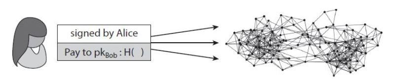
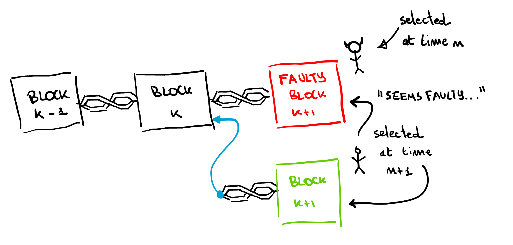
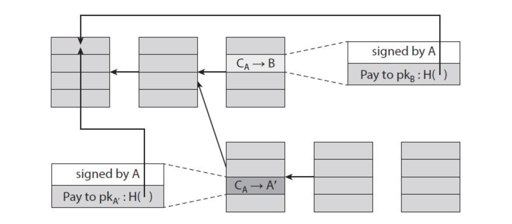

# Decentralizzazione

Lo scopo di questo capitolo è quello di introdurre tecniche che permettano di effettuare le azioni di Scrooge in Scroogecoin, ma in maniera decentralizzata. Dividiamo il discorso sulla decentralizzazione di Bitcoin su 5 diverse domande: 

1. Chi mantiene il libro mastro delle transazioni?
2. Chi ha autorita su quali transazioni sono valide?
3. Chi crea nuovi Bitcoin?
4. Chi determina come cambiano le regole del sistema?
5. In che modo i bitcoin acquisiscono valore di scambio?

Le prime tre domande riflettono i dettagli tecnici del protocollo Bitcoin, e saranno il focus di questo capitolo. La rete **peer to peer** raggiunge la quasi totale decentralizzazione, dato che chiunque può eseguire un nodo Bitcoin (non troppo difficilmente, attraverso un client Bitcoin). Anche il **mining di Bitcoin** è teoricamente aperto a tutti, ma richiede un elevato costo computazionale, di conseguenza il mining ha un alto grado di centralizzazione (dato che richiede un grosso investimento). I nodi aggiornano singolarmente il software che permette l'operazione del protocollo (che è aperto), ma quasi tutti utilizzano una implementazione di riferimento, e i maintainers di tale implementazione hanno grande potere. 

## Distributed consensus 

Il consenso distribuito serve a creare affidabilità nei sistemi distribuiti. Formalmente: 

> Supponiamo di avere $n$ nodi, ognuno con un valore di input. Alcuni di questi sono nodi malevoli / corrotti. Un **protocollo di consenso distribuito** ha le seguenti due proprietà: 
>
> 1. Al termine, tutti i nodi onesti devono essere d'accordo sul valore scelto. 
> 2. Il valore scelto deve essere generato da un nodo onesto.

### Concetti di base

Bitcoin è un sistema peer-to-peer: quando Alice vuole pagare Bob, tecnicamente manda in broadcast una transazione a tutta la rete. 

Bob non deve necessariamente essere un nodo della rete per ricevere il pagamento. Esso verrà scritto nella blockchain, per cui esisterà e Bob sarà il legittimo proprietario. Se Bob vuole essere **notificato** del pagamento, allora è una buona idea eseguire un nodo Bitcoin e restare in ascolto. 

Dato che vari utenti eseguono transazioni nello stesso momento, i nodi della rete Bitcoin devono stabilire un consenso su quali transazioni sono state trasmesse e sul loro ordine di effettuazione. Come in Scroogecoin, più transazioni venivano inserite in un blocco, allo stesso modo, in Bitcoin, il consenso avviene blocco per blocco.

In ogni momento, ogni nodo della rete Bitcoin avrà un libro mastro che consiste in una lista di blocchi, ognuno dei quali conterrà transazioni che hanno raggiunto il consenso distribuito. Addizionalmente, ogni nodo può contenere un pool di transazioni di cui è venuto a conoscenza, ma che non sono ancora incluse nella blockchain. Tale pool può essere diverso tra nodi, questo avviene poiché le transazioni non si propagano istantaneamente nella rete peer to peer, ed un nodo può andare spesso offline.  

### Processo di consenso

Ad intervalli regolari (es. 10 minuti) ogni nodo propone al sistema di includere il proprio transaction pool nel nodo successivo. Dopodiché i nodi eseguono qualche protocollo di consenso, dove ogni nodo propone il proprio input da inserire nel blocco. Possiamo supporre che al protocollo partecipino nodi onesti e disonesti. Se il protocollo di consenso riesce, alora il blocco proposto viene selezionato in output (anche se proposto da un solo nodo). Alcune transazioni valide possono essere escluse dal blocco di output, ma questo non è un problema poiché potranno partecipare al blocco successivo. 

Questa è una descrizione a grandi linee, poiché: (1) la rete peer to peer non è totalmente connessa; (2) ci sono problemi di latenza e connettività; (3) alcuni nodi possono cercare di sovvertire il sistema. Una conseguenza della latenza è la **mancanza di un tempo globale**, per cui non tutti i nodi possono essere d'accordo sull'ordine delle transazioni semplicemente osservando i loro timestamp. 

### Risultati di impossibilità

La mancanza di un tempo globale ha spinto la letteratura ad una visione pessimistica dei protocolli di consenso. Un famoso risultato prende il nome di **Byzantine Generals Problem**. 

> In questo problema, l'esercito è formato da divisioni, con a capo dei generali. I generali comunicano tra loro attraverso i messaggeri per stabilire un piano d'azione. Alcuni generali sono dei traditori e cercano di sabotare tale piano. Lo scopo è quello di arrivare ad un piano stabilito da generali onesti e di non permettere a quelli corrotti di sabotare l'azione. E' stata provata l'impossibilità di arrivare ad un piano non corrotto se almeno $\frac 1 3$ dei generali sono corrotti. 

Un'altro risultato di impossibilità è il **Fischer-Lynch-Paterson**, dagli autori che lo hanno dimostrato. Sotto certe condizioni, il problema dimostra che è impossibile arrivare al consenso anche con 1 solo nodo corrotto nel sistema. 

A dispetto di tali risultati di impossibilità, esistono protocolli di consenso come **Paxos**, basati su compromessi. Paxos non arriva mai ad un risultato inconsistente, ma sotto certe condizioni può procedere senza fare progressi.     

### Breaking traditional assumptions 

I risultati di impossibilità sono stati provati per determinati modelli, in cui Bitcoin non rientra. Il consenso di Bitcoin funziona bene nella pratica, pur non essendo completamente coperto il suo lato teorico. Capire teoricamente il perché del suo funzionamento è importante per sviluppare modelli che permettano di studiare sviluppi futuri. Vediamo quali sono le assunzioni che Bitcoin viola: 

1. Bitcoin introduce l'idea degli incentivi (ad agire onestamente)
2. Bitcoin fa pesante uso di randomness 
3. Il consenso non ha un inizio ed una fine, ma è consolidato nel tempo

Riguardo al punto (3), andando avanti nel tempo la probabilità che la propria visione dei blocchi sia analoga a quella stabilità dal consenso aumenta, mentre quella che la propria visione sia differente decrementa esponenzialmente. 

## Consenso senza identità

Bitcoin non vuole assegnare delle identità ai nodi poiché la pseudo-anonimità è contenuta nel design del sistema. Ogni peer può generare molte identità, il che apre le porte alla possibilità di un **Sybil attack**: le copie sono indistinguibili da normali utenti del sistema, pur essendo unicamente gestite dall'avversario. Questa è un'altra differenza rispetto agli altri sistemi che necessitano di consenso. 

Per strutturare l'algoritmo di consenso di Bitcoin abbiamo bisogno di fare delle assunzioni, che spiegheremo successivamente. Assumiamo che il nostro sistema funzioni come una lotteria: esso distribuisce dei biglietti ai peer e seleziona il nodo candidato ad iniziare il protocollo di consenso estraendo un biglietto random. Dobbiamo anche supporre che se l'avversario sfrutta il Sybil attack, tutte le identità generate riescano a selezionare (insieme) un solo biglietto. 

L'assunzione della selezione randomica del nodo permette il **consenso implicito**. Il nodo selezionato proporrà il prossimo blocco della block-chain, senza alcun processo di votazione. Se il nodo è malevolo ed inserisce un blocco non valido, allora i nodi che verranno selezionati successivamente potranno scegliere di non appendere il blocco a quest'ultimo (rifiutandolo), e di appenderlo a quello precedente (che hanno accettato). 

### Bitcoin consensus algorithm (simplified)

L'algoritmo è semplificato nel senso che assume l'abilità di selezionare un nodo random senza essere vulnerabile al Sybil attack. L'algoritmo procede come segue: 

1. Le nuove transazioni vengono inviate in broadcast a tutti i nodi. 
2. Ogni nodo inserisce le transazioni nel blocco. 
3. Ad ogni round viene selezionato un nodo random.
4. Il nodo selezionato manda il broadcast il blocco.
5. I nodi accettano il blocco se e solo se tutte le transazioni sono valide (senza double spending e con delle firme valide). 
6. I nodi esprimono accettazione per il blocco estendendo la blockchain su quel blocco, quindi includendo il suo hash. 

Analizziamo perché questo attacco funziona. Supponiamo che l'avversario Alice voglia sovvertire il processo. 

#### Rubare Bitcoin

Supponiamo che Alice voglia rubare $n$ Bitcoin a Bob. Per fare ciò, Alice dovrà aggiungere al blocco una nuova transazione che trasferisce i Bitcoin da Bob ad Alice, ma questo richiede una firma valida di Bob. Se lo schema di firma sottostante è solido, Alice non riuscirà a contraffare la firma di Bob. 

#### Denial-Of-Service Attack

Supponiamo che Alice odi Bob, allora lei può decidere di non includere le transazioni provenienti da Bob nel blocco. In altre parole, Alice nega il servizio a Bob. Alice potrà fare questo durante il suo turno, ma non per sempre. A Bob basta aspettare un nodo successivamente selezionato randomicamente per avere le proprie transazioni all'interno della blockchain.  

#### Double Spending

Supponiamo che Bob abbia un negozio online e che Alice sia una sua cliente. Alice acquista un prodotto da Bob ed effettua una transazione. Supponiamo che qualche nodo onesto inserisca la transazione nel successivo blocco della blockchain. Vedendo la transazione nella blockchain, Bob invia il prodotto ad Alice. Supponiamo che per puro caso il prossimo nodo selezionato sia proprio Alice.  Allora Alice potrebbe benissimo ignorare il blocco che contiene la sua transazione verso Bob, ed estendere il blocco precedente. Inoltre, Alice inserirà nel blocco che lei propone una transazione che spende lo stesso numero di bitcoin dati a Bob verso un indirizzo controllato da lei stessa. Questo è un esempio di double-spending, dato che le due transazioni spendono la stessa moneta. Se Alice riesce a far estendere il suo nuovo (valido) blocco, allora il blocco contenente il pagamento a Bob non sarà più preso in considerazione (vedasi figura sotto). 

