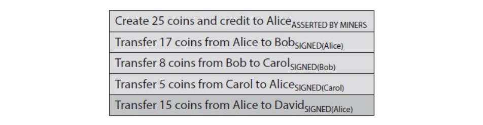

# Meccanica dei Bitcoin

In questo capitolo copriremo nello specifico l'implementazione dei meccanismi di Bitcoin. 

## Le transazioni

La prima idea che ci viene in mente quando pensiamo ad un ledger è qualcosa di **account based**, dove ogni record ha un mittente, un destinatario ed un quantitativo di bitcoin, e la transazione è firmata dal mittente, oppure una creazione di bitcoin consentita dai miners. 

Il problema è che per capire se una transazione è valida dobbiamo tener conto del saldo di un certo utente (indirizzo). Per fare questo senza utilizzare strumenti terzi, dobbiamo risalire a tutte le transazioni che riceve ed effettua Alice in ordine di inserimento.

A causa di questa inefficienza, Bitcoin utilizza un altro approccio chiamato **transaction-based**. Nel ledger vengono inserite solo transazioni, che hanno un certo numero **input** ed **output**. Pensiamo ai coin in input come dei coin che vengono distrutti, mentre a quelli in output come dei coin creati. L'output di una transazione che non è ancora stato speso prende il nome di **UTXO** (unspent transaction output). Ogni transazione ha un **identificativo unico**. Ogni output è indicizzato a partire da 0, quindi ci riferiremo al primo output come l'output 0. Vediamo un esempio: 

Nella transazione 1 Alice guadagna 25 BTC senza alcun input, grazie agli incentivi. Questa transazione non necessita di firma, essendo concordata con il protocollo di consenso. Nella transazione 2, l'input è 1[0], ovvero l'UTXO di indice 0 della transazione 1. Dato che Alice deve pagare 17 BTC a Bob, l'output della transazione sarà 17 BTC all'indirizzo di Bob, e gli 8 rimanenti all'indirizzo di Alice. La transazione viene infine firmata da Alice. Non considerando le transaction fees, l'input e l'output della transazione devono coincidere. Alice avrebbe potuto mandare gli 8 BTC ad un altro indirizzo di sua appartenenza, e questo viene chiamato **change address**.

**Efficient verification**
Per verificare che una transazione sia valida, basta utilizzare l'hash pointer dell'input (o degli input, come vedremo) e verificare che la somma in output sia uguale alla somma in input. Dopodiché bisogna verificare che tali coin non siano stati consumati controllando tutte le transazioni partendo da quest'ultima e risalendo fino alla head della block chain. Rispetto al metodo precedente, non è necessario arrivare fino al genesis block, ma solo alle transazioni referenziate. 

**Consolidating funds**
Supponiamo che Bob riceva 17 BTC da una transazione, e 3 BTC da un'altra, e che voglia consolidare i 20 BTC totali in una sola transazione. Allora Bob potrà creare una nuova transazione che ha come input le prime due, e come output 20 BTC ad un indirizzo a lui appartenente. 

**Joint payments**
Risulta semplice anche fare dei pagamenti congiunti: supponiamo che Alice e Bob vogliano effettuare un pagamento a David, allora nella transazione vi saranno input appartenenti ad Alice ed input appartenenti a Bob. L'unica differenza è che la transazione deve contenere le firme di entrambi i paganti. 

### Formato transazione

Vediamo il contenuto di una transazione in json, pur sapendo che la transazione viene serializzata e inviata come una stringa di bit. La transazione è composta da 3 parti: i metadati, gli input e gli output: 

 

**Metadati**
Tra i metadati troviamo la dimensione della transazione (size), il numero di input (vin_sz), il numero di output (vout_sz). L'hash dell'intera transazione (hash) è calcolato e viene utilizzato come identificativo univoco. Questo ci permette di utilizzare gli hash pointer per referenziare transazioni. 

**Input**
Le transazioni in input sono disposte in un array, e ogni input ha la stessa forma. L'input specifica la transazione da cui proviene (prev_out) attraverso l'hash e l'indice (n). L'hash funziona da hash pointer. All'input viene aggiunta la firma valida di chi detiene i bitcoin.

**Output**
Anche gli output sono degli array. Ogni output ha 2 campi ed ogni output ha un valore. La somma dei valori deve essere minore o uguale alla somma dei bitcoin in input. Se la somma è minore, allora la differenza è considerata transaction fee. Il campo "ScriptPubKey" contiene l'hash della public key del destinatario ed un insieme di comandi. 

## Bitcoin scripts

Il campo ScriptPubKey di ogni output nella transazione non specifica una public key, ma bensì uno script. In realtà, anche il campo SigScript degli input contiene uno script e non la mera firma di chi spende i bitcoin. Per capire se un input è corretto, basta concatenare al suo campo SigScript il campo ScriptPubKey dell'output della transazione precedente. Se l'esecuzione dello script finale ritorna true, allora l'input è lecito.  

### Bitcoin scripting language

Il linguaggio di scripting di Bitcoin è chiamato "Script" ed è un linguaggio stack-based. Questo significa che ogni estruzione è eseguita una sola volta, in maniera lineare, senza cicli o salti, e vi è un unico stack dove conservare i dati. Le operazioni built-in contengono operazioni crittografiche non banali, tuttavia il linguaggio non è Turing-completo. Dall'esecuzione di uno Script possiamo ottenere solo due valori: true o false. Se lo script termina senza errori, allora la transazione è valida, altrimenti la transazione non andrebbe accettata nella blockchain. Le istruzioni di Script occupano 1 byte e sono al più 256, di cui 15 disabilitate e 75 riservate per usi futuri, [cliccare qui per la lista completa](https://en.bitcoin.it/wiki/Script). 

> L'istruzione `CHECKMULTISIG` richiede $n$ chiavi (da inserire nello stack) ed una soglia $t$. Per essere eseguita con successo, almeno $t$ firme di $t$ su $n$ chiavi pubbliche devono essere valide affinché la transazione sia valida. Tuttavia, l'implementazione contiene un bug: l'istruzione effettua la pop di un elemento in più dallo stack e lo ignora, per cui per funzionare bisogna mettere un elemento (dummy) in più nello stack. 

### Eseguire uno script

Per eseguire uno script in un linguaggio stack-based, tutto ciò di cui abbiamo bisogno è uno stack e di due operazioni: push e pop, nessun altro tipo di memoria. Ci sono due tipi di istruzioni, **data instructions** e **opcodes**. Quando un data instruction appare nella sequenza dello script, il dato viene semplicemente inserito (push) nello stack. Gli opcodes performano azioni sui dati, prendendo (pop) input dallo stack. Vediamo come viene eseguito il seguente script che consente semplicemente di verificare un input. 

In ordine: 

1. La firma viene inserita nello stack 
2. La public key del firmatario viene inserita nello stack
3. `OP_DUP` duplica la public key e la inserisce nello stack
4. `OP_HASH160` estrae la public key, calcola l'hash e lo inserisce nello stack
5. Si inserisce nello stack l'hash della public key dell'UTXO referenziato
6. `OP_EQUALVERIFY` controlla che i primi due elementi dello stack siano uguali
7.  `OP_CHECKSIG` verifica la firma del pagante attraverso la public key fornita

Un output della transazione non contiene direttamente la public key del destinatario, ma il suo hash. Quindi nella operazione (6) ci si accerta che chi stia firmando detenga la public key a cui si recapitano i soldi, andando a confrontare i due hash. In soldoni chi deve firmare per autorizzare la transazione fornisce la propria public key, che viene verificata al passo 6, e la propria firma dell'**intera transazione precedente**, che viene verificata al passo 7. 

> L'elasticità del linguaggio non prende piede nella pratica, di fatto i nodi hanno una whitelist di script standard che possono eseguire, mentre rifiutano gli altri. 

### Proof of burn

Uno script proof-of-burn è uno script che elimina dei bitcoin, ovvero li rende inutilizzabili. Un caso d'uso è il bootstrap di una nuova valuta, in cui gli utenti distruggono i propri Bitcoin per averli nel nuovo sistema. L'implementazione consiste in uno script contenente l'istruzione `OP_RETURN`, che ritorna sempre falso. 

> È possibile inserire una frase a caso nella blockchain attraverso uno script di tipo proof-of-burn, inserendo la stringa dopo l'istruzione `OP_RETURN`. 

### Pay-to-Script-Hash

<Ancora da fare/> 

## Applicazioni di Script

Vediamo alcune delle più comuni applicazioni realizzabili con il linguaggio Script. 

### Escrow Transactions

Alice vuole comprare da Bob un prodotto, Alice non invia i soldi finché il prodotto non arriva, e Bob non invia il prodotto finché non riceve i soldi. Per risolvere questo problema, si chiama in causa un terzo, David, di cui entrambi si fidano, e si sviluppa una **escrow transaction**. Alice crea una transazione `MULTISIG` con $n=3$ e $t=2$, dove quindi sono richieste almeno 2 firme per utilizzare la UTXO. Quando la transazione viene inclusa nella blockchain, Bob invia il prodotto. Alice non può tentare di versare i soldi su un suo indirizzo, poiché oltre alla sua serve un'altra firma, quella di Bob o quella di David. Allo stesso tempo, Bob non può cercare di truffare Alice, poiché anche lui ha bisogno di due firme. Quando la vendita ha avuto successo, le parti firmeranno la transazione. Se Bob non invia il prodotto, David insieme ad Alice firmeranno per riversare i soldi su un indirizzo di Alice. Le monete stazionano sulla blockchain finché la vendita non viene risolta in qualche modo. 

### Green Addresses

I **green addresses** sono indirizzi fidati (es. banche, exchange) che hanno una buona reputazione nella blockchain, ovvero non hanno mai effettuato double spending o altri comportamenti disonesti. Se Alice vuole pagare Bob e Bob non può materialmente controllare la blockchain o aspettare le conferme, Alice può pagare Bob utilizzando un qualche servizio che dispone di un green address. Essendo un green address, Bob si fiderà e non dovrà controllare l'effettivo pagamento. Se il servizio dovesse non rispettare l'accordo, allora la fiducia in esso crollerebbe e gli utenti smetterebbero di utilizzarlo. 

### Efficient micropayments

Supponiamo che Alice paghi al suo operatore telefonico un certo numero di bitcoin per ogni minuto di chiamata effettuata. Anziché fare una transazione al minuto, Alice potrebbe creare una transazione `MULTISIG` in cui include la sua chiave e quella dell'operatore e carica tutto il suo credito disponibile. Quando la transazione è nella blockchain, l'operatore abilita il servizio ad Alice. Da qui iniziano i micropagamenti: dopo ogni minuto di chiamata Alice firma una transazione `MULTISIG` che ha come input la UTXO con il massimo credito, e in output ha due UTXO, una con l'importo corrente (BTC al minuto x minuti trascorsi) ed un'altra con il resto da ritornare ad un suo indirizzo. Si noti che la transazione non viene inserita nella blockchain, ma viene inviata all'operatore. Quando Alice finisce, smette di inviare micro-transazioni all'operatore. Quest'ultimo firma l'ultimo micropagamento arrivato (dove chiaramente guadagna di più) e sottomette la transazione alla blockchain (con le due firme necessarie).

### Lock Time 

Che succede se l'operatore decide di non firmare nessun micropagamento? I bitcoin di Alice resterebbero inutilizzabili nella blockchain per sempre. Per risolvere questo problema, si utilizza il campo `lock_time` presente nei metadati della transazione. Prima che inizino i micropagamenti, sia l'operatore che Alice firmeranno una transazione `MULTISIG` che rimborsa tutti i bitcoin ad Alice, prendendoli dall'UTXO creato nel passo iniziale (massimo credito). Tuttavia, questa transazione sarà bloccata per un certo lasso di tempo $t$. Se entro il tempo $t$ l'operatore non firma nessun micropagamento, allora Alice potrà riavere i suoi soldi attraverso questa transazione. Il campo $t$ comunica ai miners di non pubblicare la transazione prima di un tempo $t$, ma non essendoci una nozione di tempo, $t$ indicherà semplicemente un certo numero di un blocco futuro.

