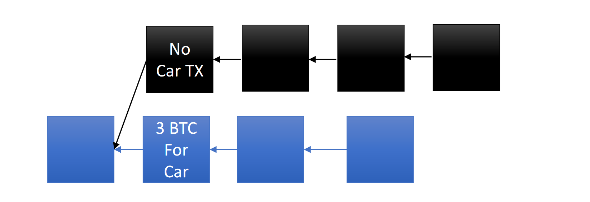
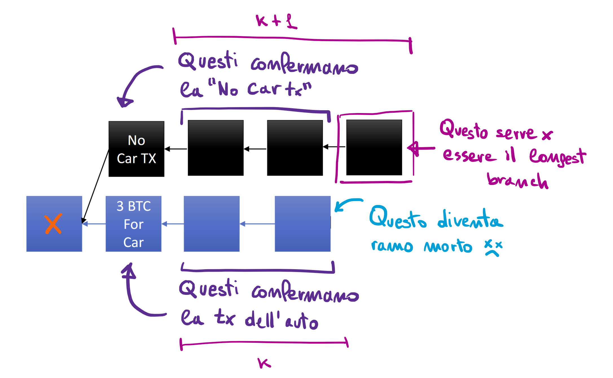

# Nakamoto Consensus

Il più grosso problema nelle criptovalute decentralizzate era quello di determinare consenso tra i partecipanti della rete, senza passare per un sistema centrale e senza alcun tipo di autenticazione (es. firma digitale, che in Bitcoin non è utilizzata per l'autenticazione, ma per la convalida dei dati). Il contributo maggiore di Satoshi Nakamoto è proprio il suo protocollo di consenso, il **Nakamoto Consensus**. 

## Proprietà del protocollo di consenso

Un protocollo di consenso è interessante quando soddisfa un certo numero di proprietà. Le prime due sono fondamentali e sono la **consistency** e la **liveness**. 

Per **consistency** intendiamo che i giocatori onesti devono essere tutti d'accordo in ogni particolare fase del protocollo su quello che loro considerano finale. Per **liveness** intendiamo il protocollo deve avere dei progressi. Lo stato di ciò che vedono gli utenti cambia continuamente (nuove transazioni, nuovi blocchi), ed il protocollo deve continuare a stabilire continuamente consenso su tutto ciò che arriva, assodando il consenso su ciò che è già arrivato. 

La terza proprietà è il **tipo di rete**: la rete può essere **sincrona**, quindi i messaggi arrivano in maniera istantanea, o **asincrona**, quindi i messaggi hanno della latenza e l'ordine di arrivo non è garantito. La rete Bitcoin è **asincrona**, i peer da diverse parti della rete hanno un concetto di "prima" e "dopo" non omogeneo. Sotto certe circostanze, potremmo assumere che una rete sia **semi-sincrona**, ovvero dopo un intervallo di tempo $t$ possiamo dare per certo che il messaggio sia arrivato a destinazione. 

> Spoiler: i circa 10 minuti necessari alla creazione del blocco servono a rendere il modello più sincrono (semi-sincrono). 

## Il protocollo di Nakamoto

Nel protocollo di Nakamoto i giocatori competono tra di loro per poter parlare. L'**idea geniale** è che il concetto di competizione è basato sul concetto di potenza computazionale, quindi sull'ipotesi che un utente non possa controllare tutta la potenza computazionale in gioco nella rete. Migliorare la propria capacità computazionale **ha un costo**, e controllare tutta la potenza è quasi impossibile. 

**I famosi 10 minuti.**
Come abbiamo visto, i miners competono per trovare una informazione $nonce$ che data in input ad una funzione hash (insieme ad altre informazioni) fornisca un valore minore di un **valore target**. Ma perché un blocco viene proposto ogni 10 minuti? Ricordiamo che questo lasso di tempo è imposto dal protocollo, perché nulla vieta di rendere il puzzle computazionale più semplice e permettere ai miner di trovare (in media) un blocco ogni 2 minuti. Una attesa minore sarebbe conveniente poiché l'attesa affinché un blocco sia confermato all'interno della blockchain si ridurrebbe molto (es. 2 minuti riduce da 1h di attesa, 10m x 6, a 12 minuti, 2m x 6). Esistono motivazioni forti che ci impediscono di ridurre questo lasso di tempo? (Lo vedremo dopo). 

**Longest branch**
Un'altra idea inclusa nel Nakamoto Consensus è che i miners sono incentivati ad estendere il ramo più lungo della blockchain, lasciando morire le diramazioni più corte. Questo ci permette di consolidare il consenso per i blocchi che risiedono nel ramo più lungo! Se un blocco risiede per molto tempo nel ramo più lungo della blockchain, allora con altissima probabilità c'è un consenso globale sulla validità del blocco. In generale vorremmo considerare **finali** tutti i blocchi della blockchain tranne gli ultimi $k$, dove per finali intendiamo che ci sia un consenso globale. Possiamo stabilire il parametro $k$ secondo le nostre esigenze. 

## Proprietà formali

Possiamo definire più formalmente le proprietà di cui abbiamo parlato nel seguente modo: 

1. **Consistency**. I giocatori onesti sono d'accordo su tutto il blockchain tranne che su gli ultimi $k$ blocchi, eccetto per una probabilità molto bassa $O(2^{-k})$. 
2. **Chain quality**. Una sequenza consecutiva qualsiasi di $s$ blocchi contiene una "sufficiente" frazione di blocchi che sia stata proposta da giocatori onesti. In generale, i miners che controllano una frazione $p$ della potenza devono minare almeno una frazione $p$ dei blocchi. Non possiamo pensare che tutti i blocchi provengano da giocatori onesti, non potendo escludere una frazione di nodi disonesti nel sistema. 
3. **Chain growth**. Il blockchain deve crescere ad un passo ragionevole. Né troppo lento, poiché il sistema sarebbe inutilizzabile, né troppo veloce, altrimenti le diramazioni sarebbero più frequenti. 

## Intuizione sulla consistenza

Concentriamoci sulla potenza computazionale dispiegata per calcolare hash, che chiameremo **hashing power**, e potremmo misurarla come hash prodotti al secondo. Supponiamo che Alice controlli una frazione $q < \frac 1 2$ dell'hashing power globale. Supponiamo inoltre che Alice si voglia comprare una macchina che costa 3 BTC. Per semplicità ipotizziamo che il venditore debba aspettare 2 blocchi anziché 6 per considerare la transazione come consolidata, quindi $k=2$. 

Per la prima proprietà, il blocco contenente la transazione del mercante dovrebbe essere abbastanza sicuro, dato che non è tra gli ultimi $k=2$ blocchi arrivati. Chiamiamo $X$ il blocco esteso dal blocco che contiene la transazione di Alice che paga l'auto. Supponiamo che Alice crei una nuova transazione con gli stessi BTC che pagano l'auto ma reindirizzati a se stessa (o utilizzati per pagare altro), e che faccia questo ad auto ricevuta (quindi la transazione è già consolidata). Dobbiamo anche supporre che sia proprio Alice a inserire il blocco contenente questa transazione, estendendo il blocco $X$ anziché il ramo più lungo (che è quello in blu). Vogliamo calcolare la probabilità che a partire da questo nuovo blocco, Alice riesca a creare un ramo della blockchain (quello in nero) che diventi più lungo del longest branch corrente (quello blu). Se in questa configurazione Alice dovesse riuscire a superare la soglia $k$, allora per la rete il ramo valido sarebbe quello da lei creato: 

Alice parte da uno svantaggio, che possiamo considerare come $-4$, poiché deve consecutivamente inserire: 

* 1 blocco contenente la tx fallace
* 2 ($k=2$) blocchi per confermarla
* 1 blocco per superare il longest branch

Per completare questa analisi, è necessario calcolare la probabilità che Alice proponga un nuovo blocco, e la probabilità che i nodi onesti propongano un nuovo blocco. Il problema diventa puramente probabilistico, e prende il nome di **binomial random walk**. 

### Binomial random walk

Supponiamo che $A$ si muova in un percorso monodimensionale di $+1$ o $-1$, e che parta dalla posizione $0$. Lo scopo di $A$ è raggiungere una certa posizione $z > 0$. $A$ effettua un passo in avanti con una certa probabilità $q$, ed un passo indietro con una probabilità $p = 1 - q$. Diciamo che $A$ vince se, partendo da 0, raggiunge la posizione target $z$. Il calcolo della probabilità $P_z$ che $A$ raggiunga $z$ rientra nella teoria delle random walk, e nello specifico è una random walk binomiale. 

Nel nostro caso $A$ è Alice, e Alice fa un passo in avanti se produce un blocco, ovvero il suo deficit si riduce, mentre fa un passo indietro se i giocatori onesti producono un blocco, quindi il suo deficit aumenta. Questo poiché l'obiettivo di Alice è quello di creare un ramo che superi il longest branch corrente della blockchain, ovviamente se il longest branch cresce, Alice sarà più lontana dal suo obiettivo. 

> Osserviamo che l'analisi è vantaggiosa per l'avversario, poiché stiamo considerando che, nel caso in cui la nostra "Alice" sia formata da molti peer organizzati per sovvergere la rete, essi siano perfettamente sincronizzati ed organizzati. Se l'analisi pessimistica da buoni risultati, allora possiamo essere ottimisti per i casi reali, in cui l'avversario è più debole. 

Sia: 

* $q$ la probabilità che $A$ mini un blocco
* $p$ la probabilità che i giocatori onesti minino un blocco

Le probabilità combaciano con la frazione di hashing power detenuta. Consideriamo che $A$ racchiuda tutti i giocatori onesti, come se la rete fosse partizionata in due insiemi, l'insieme $A$ e l'insieme dei giocatori onesti. In questo caso i due eventi sono **complementari**, dato che 1 blocco verrà proposto in maniera mutuamente esclusiva da una delle due parti. Quindi $p + q = 1$. Possiamo affermare che la probabilità $P_z$ che $A$ riesca nel suo intento è definita come segue: 
$$
P_z = \begin{cases}
(\frac{q}{p})^z & \text{ if } p > q \\
1 & \text{otherwise}

\end{cases}
$$
Quindi se $A$ controlla una frazione di hashing power maggiore rispetto a quella controllata dai giocatori onesti, allora $A$ riuscirà sicuramente nel suo intento (tralasciando l'intervallo di tempo richiesto per effettuare questa operazione). 

#### Dimostrazione

Dimostriamo come esce fuori il valore di $P_z$. Nel contesto mostrato stiamo supponendo che gli eventi successivi siano **senza memoria** e **indipendenti**. Questo vuol dire che la probabilità che io arrivi a $z$ è uguale alla probabilità che io arrivi a 1, ovvero $P_1$, moltiplicata per se stessa $z$ volte: 
$$
P_z = P_1^z
$$
Definiamo l'evento: 
$$
A \equiv \text{ Alice recupera 1 posizione di svantaggio}
$$
Sicuramente possiamo dire che $Pr[A] = P_1$. A questo punto definiamo l'evento (ed il suo complementare):
$$
F \equiv \text{ Alice produce 1 blocco } \\ 
\neg F \equiv \text{ I giocatori onesti producono 1 blocco }
$$
E possiamo sicuramente dire che $Pr[F] = q$ e $Pr[\neg F]=p$. Essendo $F$ e $\neg F$ complementari, e quindi mutuamente esclusivi, possiamo usare la proprietà delle **probabilità marginali** per scomporre $P_1$: 
$$
\begin{split}
P_1 & = Pr[A] \\ 
    & = Pr[A \cap F] + Pr[A \cap \neg F] \\
    & = Pr[A \mid F]Pr[F] + Pr[A \mid \neg F]Pr[\neg F] \\
    & = Pr[A \mid F] \cdot q + Pr[A \mid \neg F] \cdot p
\end{split}
$$
Osserviamo che la probabilità $Pr[A \mid F]=1$, poiché sicuramente avviene $A$ nel caso sia avvenuto $F$. Inoltre osserviamo che $Pr[A|\neg F]= P_2$, poiché l'avversario risulta ulteriormente svantaggiato e deve recuperare 2 posizioni anziché 1. Da ciò segue che: 
$$
P_1 = q + p P_2
$$
Ma per quello che abbiamo detto precedentemente, $P_2 = P_1^2$, quindi:
$$
P_1 = q + p P_1^2 \Longrightarrow pP_1^2 - P_1 + 1 = 0 
$$
Questa è una equazione di secondo grado, le cui due soluzioni sono date da: 
$$
P_1 = \frac{1 \pm \sqrt{1 - 4pq}}{2p}
$$
Con un po' di calcoli e ricordandoci che $p+1=1$, possiamo lavorare il termine sotto la radice: 
$$
\begin{split}
1 - 4pq & = 1 - pq - pq - 2pq \\
		& = 1 - (1-q)q - (1-p)p - 2pq \\
		& = 1 - q + q^2 -p + p^2 -2pq \\
		& = 1 - (p + q) + (p-q)^2 \\
		& = (p-q)^2
\end{split}
$$
Allora sostituendo nell'equazione di secondo grado otteniamo: 
$$
P_1 = \frac{1 \pm (p-q)}{2p} = \begin{cases}
\frac{1 - p + q}{2p} = \frac{q}{p}\\
\frac{1 + p - q}{2p} = \frac{2p}{2p} = 1\\
\end{cases}
$$
Dove nel primo caso sostituiamo $p = 1-q$ e nel secondo caso $q=1-p$. Quindi: 
$$
P_1 = \begin{cases}
\frac q p \\
1 \\
\end{cases}
$$
Se $q \ge p$ allora $\frac{q}{p}=1$ poiché parliamo di probabilità, quindi le due soluzioni coincidono. Questo implica che se c'è una **maggioranza disonesta**, allora $A$ riuscirà nel suo obiettivo (nuovamente, non specifichiamo in quanto tempo). Se invece $q < p$, la soluzione da prendere in considerazione è $P_1 = \frac q p$, e per dimostrare ciò consideriamo $P_1(n)$ la probabilità che l'avversario riesca a recuperare da una posizione di svantaggio avendo $n$ tentativi. Portando $P_1(n)$ al limite $n \to \infty$ otterremo il comportamento di $P_1$, in cui non è stata effettuata alcuna ipotesi sul numero di passi. Se dimostrassimo che $\forall n \space P_1(n) \le \frac q p$, allora questo varrebbe anche per $P_1$. Prima di dimostrare questo fatto, si osservi che:
$$
P_1(n) = q + p P_2(n-1)
$$
Facendo le stesse considerazioni di prima, dove in $P_2$ togliamo un passo (da $n$ a $n-1$) poiché consideriamo l'evento $\neg F$ come un passo effettuato che ci porta a dover recuperare 2 posizioni di svantaggio anziché 1. Sappiamo che $P_2(n-1) \le P_1(n-1)^2$ dato che se riusciamo a recuperare 2 posizioni di svantaggio allora sicuramente riusciremo a recuperarne 1 per 2 volte. Allora scriviamo che: 
$$
\begin{split}
P_1(n) & = q + p P_2(n-1) \\
	   & \le q + pP_1(n-1)^2
\end{split}
$$
Vogliamo dimostrare che: 
$$
\forall n \hspace{.5cm} P_1(n) \le \frac q p
$$
**Caso base.** Partiamo dal fatto che $P_1(1)=q$, poiché è la probabilità che Alice recuperi una posizione di svantaggio con una sola mossa, ovvero che Alice produca un blocco. Chiaramente abbiamo che $P_1(1) = q \le \frac q p$, dato che $p < 1$. 

**Passo induttivo.** Supponiamo che la disuguaglianza valga fino ad $n-1$ e dimostriamola per $n$. Utilizziamo l'ipotesi induttiva per la seconda disuguaglianza:
$$
P_1(n) \le q + p P_1(n-1)^2 
	\le q + p \cdot \frac{q^2}{p^2} 
	= q + \frac{q^2}{p} 
	= \frac{q(q+p)}{p} 
	= \frac{q}{p}
$$
Ovvero: 
$$
P_1(n) \le \frac{p}{q}
$$
Allora vale la tesi. In conclusione possiamo dire che con una **maggioranza onesta**, la soluzione da prendere in considerazione è $\frac{p}{q}$. La formula di $P_z$ la otteniamo banalmente con la proprietà $P_z = P_1^z$, quindi avremo: 
$$
P_z = \begin{cases}
(\frac{q}{p})^z & \text{ if } p > q \\
1 & \text{otherwise}
\end{cases}
$$
Che è quello che volevamo dimostrare in principio. 

#### Conseguenze

Questa dimostrazione non spiega in alcun modo a cosa serve l'intervallo di 10 minuti, ma ci dimostra che se non c'è una maggioranza onesta, quindi se $q \ge p$, nulla vieta che l'attacco mostrato non sia fattibile in pratica. Allora l'idea che potrebbe nascere è quella di alzare la maggioranza e abbassare il parametro di attesa ($>10m$). Nella pratica, questa idea distruggerebbe completamente la consistenza del protocollo. Nel prossimo paragrafo vedremo perché. 

## Network delays

Il problema alla base dell'imposizione di questa attesa di 10 minuti sono i **network delay**, dovuti al fatto che la rete è asincrona. Quando un miner trova un nuovo blocco, lo comunica al mondo sperando che i prossimi miner fortunati lo estendano, consolidando la sua appartenenza alla blockchain. Tuttavia, anche se la comunicazione del blocco avviene quasi istantaneamente ai nodi vicini, ci saranno blocchi lontani che non hanno idea dell'esistenza del blocco in quel dato istante. Qui nascono due problemi: 

* I miner lontani non possono estendere il blocco se non lo conoscono. 
* I miner lontani dovranno lavorare per estendere quel blocco, non il precedente, quindi finché non conoscono il nuovo blocco della blockchain, il loro lavoro sul puzzle sarà lavoro perso. 

Quando ragioniamo sull'**avversario** possiamo ipotizzare pessimisticamente che tutti i suoi nodi comunichino attraverso un'altra rete, esterna a Bitcoin e più performante, e che quindi quando un loro nodo produrrà un nuovo blocco, tutti gli altri nodi disonesti ne saranno istantaneamente a conoscenza. 

Potremmo considerare un **network delay** $\Delta$ come il numero di round del puzzle che il nodo perde a causa del fatto che esso non sia aggiornato sullo stato dell'arte della blockchain. 

>Supponiamo che $B$ stia facendo mining per risolvere il puzzle. Supponiamo che dall'altra parte della rete $A$ abbia trovato un blocco $X$ e che lo stia trasmettendo. Fintanto che $B$ non conosce $X$, $B$ sta lavorando a tempo perso, poiché il puzzle è cambiato e considera come ultimo nodo proprio il nodo $X$. Quando $X$ arriva a $B$, questo può (1) ignorarlo e continuare a fare mining oppure (2) iniziare a fare mining a partire dal nuovo blocco. In entrambi i casi, il tempo di mining di $B$ è andato sprecato, e $B$ non ha fatto nulla di utile. 

### Discount rate

Supponiamo che ci siano $n$ nodi in totale e che una frazione $\alpha$ di questi nodi sia onesta. Come definito prima, $p$ è la probabilità che **un singolo** giocatore onesto proponga un blocco. Definiamo come segue la probabilità che il prossimo blocco sia proposto da almeno un giocatore onesto: 
$$
1 - (1-p)^{\alpha n}
$$
La costruzione avviene secondo il seguente criterio: 

1. $1-p$ è la probabilità che il giocatore onesto non proponga il blocco
2. $(1-p)^{\alpha n}$  è la probabilità che tutti i giocatori onesti non propongano il blocco
3. Il complementare $1-(1-p)^{\alpha n}$ è la probabilità che almeno 1 giocatore onesto proponga il blocco. 

Utilizzando la formula del binomio di Newton possiamo approssimare la probabilità sviluppando fino al secondo membro: 
$$
1 - (1-p)^{\alpha n} = 1 - \sum_{i=1}^{\alpha n} \binom{\alpha n}{i} (-p)^i \approx \alpha pn
$$
Se volessimo valutare sommariamente ogni quanti round viene proposto un blocco da un giocatore onesto, ci basterebbe invertire la probabilità: 
$$
\frac{1}{\alpha p n}
$$
Considerando che tale blocco impiega $\Delta$ round a propagarsi, possiamo affermare che ogni $\frac{1}{\alpha p n}$ round, i successivi $\Delta$ round sono sprecati (poiché i giocatori onesti devono concordare sul blocco). Possiamo calcolare un valore che ci indichi quanto i giocatori onesti siano penalizzati rispetto a quelli onesti, dato che abbiamo supposto che i giocatori disonesti siano sincronizzati. Questo valore prende il nome di **discount rate** (con una accezione negativa) ed è definito come segue: 
$$
\frac{\frac{1}{\alpha p n}}{\frac{1}{\alpha p n}+ \Delta} = 
\frac{1}{1 + \alpha p n \Delta}
$$
In pratica indica il rapporto tra il numero di round che ci si aspetta di attendere per il prossimo blocco da un giocatore onesto, diviso il numero di round effettivi che includono il delay. Possiamo approssimare attraverso lo sviluppo in serie di Mc Laurin:
$$
\frac{1}{1 + \alpha p n \Delta} \approx 1 - \alpha p n \Delta
$$

### Discounted honest mining power

Per ottenere l'effettivo mining power dei giocatori onesti, bisogna moltiplicare il fattore di sconto calcolato, ottenendo quindi la **discounted honest mining power**, ovvero la mining power effettiva: 
$$
(1-\alpha pn \Delta) \alpha n
$$
Se consideriamo la frazione $\beta = 1 - \alpha$ di mining power nelle mani dei giocatori disonesti, potrebbe accadere che questa sia più piccola della frazione di mining power dei giocatori onesti, ma più grande della sua versione **scontata**: 
$$
\beta n > (1 + \epsilon) (1-\alpha pn \Delta) \alpha n
$$
In concreto questo porterebbe una probabilità di successo che favorirebbe i giocatori disonesti (come nel caso analizzato in precedenza). Il motivo dell'inserimento dei 10 minuti di attesa mira a diminuire l'impatto del fattore $\Delta$. Se anziché aspettare 10 minuti ne aspettassimo 0, i blocchi sarebbero creati ad un rate molto veloce, il che va incontro al limite dato dalla disorganizzazione dei nodi onesti, mentre i nodi disonesti (supposti organizzati in qualche maniera) saprebbero gestire la sequenza di blocchi da loro generata (attraverso canali esterni).  

### Maggiori restrizioni

La maggioranza non basta, la frazione di potenza di mining dei giocatori onesti, pur scontata attraverso il discount rate, deve essere strettamente maggiore della frazione di potenza di mining dei giocatori disonensti.  

### Requisiti formali

E' possibile variare il parametro di difficoltà del mining $D_p$ in base alla probabilità $p$ di trovare un $nonce$ che risolva il puzzle. Ovvero possiamo calcolare $D_p$ in base a $p$ tale che per ogni coppia $(h, txs)$ si abbia:
$$
Pr_{nonce} [H(h, nonce, txs) < D_p] = p
$$
Se $H: \{0,1\}^* \to \{0,1\}^{\lambda}$, allora per trovare $D_p$ tale che valga l'espressione soprastante basta calcolare 
$$
D_p = 2^{\lambda}p
$$

> **Esempio.**
> Supponiamo che $\lambda = 6$ e che la probabilità $p= 2^{-4}$. A rigor di logica, per avere una probabilità del genere il target dovrebbe essere $D_p = 000100_2$, ed il puzzle si risolverebbe solo per i valori $000011_2, 000010_2, 000001_2, 000000_2$, la probabilità di ottenere uno tra questi valori è proprio la probabilità che le 4 cifre più significative siano poste a 0, ed essendo eventi indipendenti questa probabilità equivale ad $2^{-4}$. In effetti, utilizzando la formula soprastante otteniamo proprio $D_p = 2^6 \cdot 2^{-4} = 2^2 = 4 = 000100_2$.

Si può dimostrare che una volta fissata la probabilità $p$, la blockchain di Nakamoto si può provare **sicura**, ovvero si può provare formalmente che rispetti le 3 proprietà enunciate all'inizio, sinché valgono le seguenti considerazioni: 

1. $2pn\Delta < \frac 1 2$
2. $\alpha(1-2pn\Delta) > \beta$ (dove al primo membro si ha la **discounted honest mining power**)

La probabilità $p$ è manipolabile andando a variare il parametro $D_p$, e quindi la difficoltà del puzzle. 

> ⚠️⚠️⚠️ farsi chiarire il collegamento tra le proprietà (1) e (2) e la probabilità $p$ dal professore. In base a cosa devo aumentare o diminuire $p$?

## Proprietà della blockchain di Nakamoto

Pro riscontrati: 

* **Partecipazione** anonima.
* Scalabilità.
* Non è possibile predire chi vincerà il puzzle. 
* Può tollerare molti nodi disonesti. 

Contro riscontrati: 

* Lenta (anche con la maggior parte di nodi onesti)
* Costosa (in termini di risorse)
* Nessuna garanzia a lungo termine
* Tanti attacchi proposti in letteratura (nessuno visto in pratica)