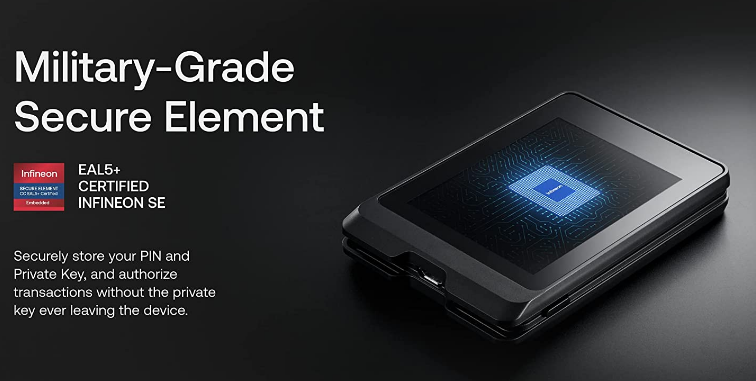
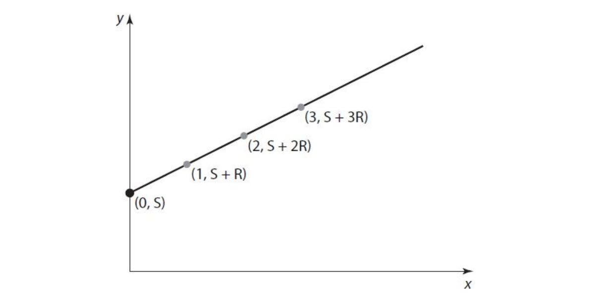
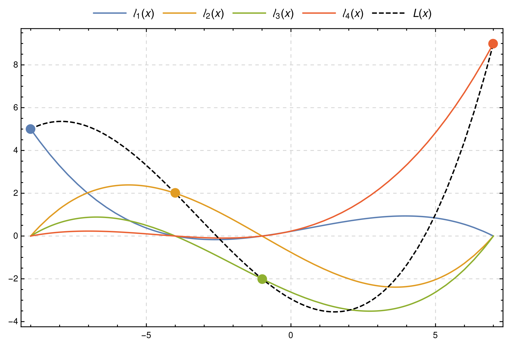
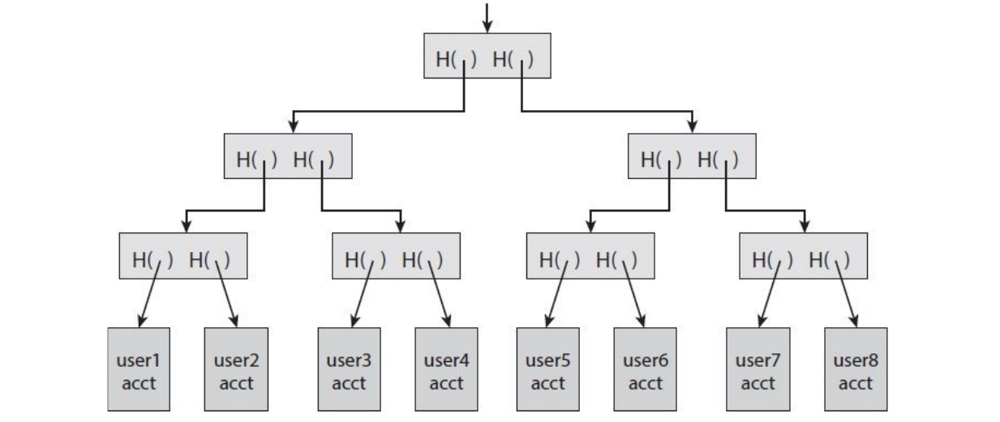
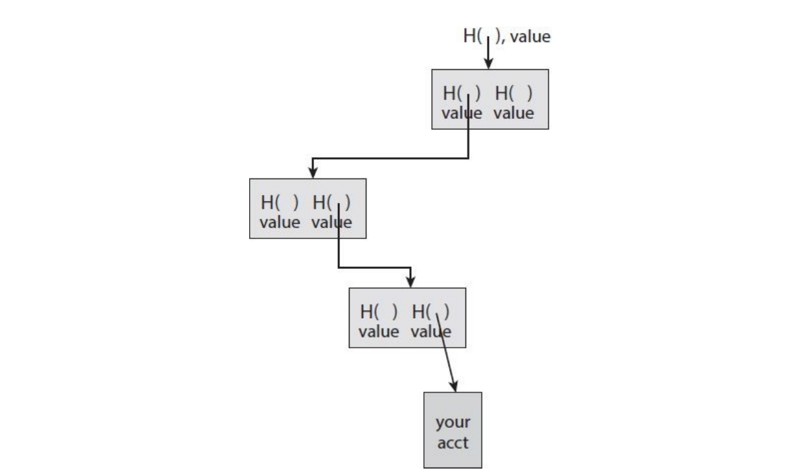

# Conservazione ed utilizzo dei Bitcoin

> Conservare i Bitcoin consiste nel conservare e gestire le proprie chiavi segrete.  

[TOC]

## Proprietà ideali di uno storage

1. **Disponibilità**. Dobbiamo poter spendere i Bitcoin quando vogliamo. 
2. **Sicurezza**. Vogliamo essere sicuri che nessun altro possa spendere i nostri Bitcoin.
3. **Convenienza**. Gestire le chiavi deve essere semplice.

Solitamente, uno storage offre un trade-off tra le tre proprietà. La maniera più semplice per gestire le proprie chiavi è **in locale** (es. tramite una applicazione). Tuttavia, se il dispositivo contenente le chiavi dovesse danneggiarsi o venire rubato, avremmo perso i nostri Bitcoin. Corrisponde a portarsi tutti i propri soldi con sé, il che è sicuramente **conveniente**, ma non è per niente **sicuro**. 

## Wallet

Un wallet è un software che si occupa della gestione della chiavi e tiene traccia dei nostri Bitcoin, attraverso una semplice interfaccia utente. Potrebbe semplificare il processo di creazione di un nuovo indirizzo, o le istruzioni per effettuare un pagamento. 

### Encoding keys

Per spendere o ricevere Bitcoin abbiamo bisogno di comunicare gli indirizzi. I due metodi principali sono la codifica in base 58 e i QR code. La base 58 è utile poiché 58 è il numero di lettere maiuscole, minuscole e numeri utilizzabili come caratteri (meno alcuni caratteri che potrebbero essere confusi, come la "O" con lo "0"). 

### Vanity address 

Un vanity address è un indirizzo che contiene una parola leggibile. 

> ES. 1bonesEeTcABPjLzAb1VkFgySY6Zqu3 è un indirizzo in base 58 che contiene la parola "bones". L'1 prefisso indica che questo indirizzo è di tipo Pay-to-Pubkey-hash. 

Gli indirizzi sono output di una funzione hash, quindi ottenere un vanity address è pura casualità. E' possibile velocizzare il processo di generazione di un vanity address nel seguente modo. Sia $x$ la chiave privata, la chiave pubblica è $g^x$ e l'indirizzo è $H(g^x)$. L'esponenziazione è una operazione molto onerosa. Se prendessimo di volta in volta una $x$ a caso, dovremmo calcolare $g^x$. Se invece prendessimo $x+1$ come nuova chiave segreta, allora potremmo riutilizzare il $g^x$ calcolato prima, e ottenere $g^{x+1} = g^x \cdot g$, il che risulta essere molto più rapido. In base 58, per trovare un indirizzo con all'interno una parola di lunghezza $k$ dovremmo fare all'incirca $58^k$ tentativi. 

## Hot storage e cold storage

Per **hot storage** intendiamo l'utilizzo di un wallet che registra le chiavi in locale. Per **cold storage** intendiamo invece una conservazione "offline" delle chiavi, quindi le chiavi non sono immediatamente reperibili, ma sono conservate in un posto sicuro e disconnesso da internet. Le chiavi conservate nei due storage devono essere differenti, altrimenti compromettendo uno comprometteremmo anche l'altro storage. 

Vorremmo idealmente poter muovere dei Bitcoin tra i due tipi di storage, ricordandoci che il cold storage è disconnesso dalla rete. Se l'hot storage conosce gli indirizzi corrispondenti alle chiavi segrete conservate nel cold storage, allora basterebbe effettuare una transazione per muovere i Bitcoin (es. stiamo conservando troppi soldi nell'hot storage e vogliamo muoverli nel cold storage). Quando il cold storage si connetterà, andrà a conoscenza delle transazioni verso i propri indirizzi. 

Idealmente vorremmo che ogni volta che facciamo una transazione dell'hot storage al cold storage, l'indirizzo di destinazione nel cold storage sia un nuovo indirizzo appena generato (per questioni di privacy e di non tracciabilità). Il prossimo meccanismo ci consentirà di sincronizzare i due storage con ingegno. 

### Hierarchical Deterministic Wallets

Un **hierarchical deterministic wallet** permette al cold storage di utilizzare un numero illimitato di indirizzi, e permette all'hot storage di conoscere questi indirizzi attraverso una breve comunicazione iniziale tra le due parti. Gli step sono i seguenti: 

1. Si genera un `address generation info` ed un `private key generation info`.
2. Attraverso l'`address generation info` possiamo generare una sequenza di chiavi pubbliche: una `address generation function` prende in input l'`address generation info` ed un intero `i`, e genera l'`i`-esimo indirizzo della sequenza. 
3. In maniera simile, possiamo generare la corrispondente sequenza di chiavi private utilizzando la `private key generation info`.
4. La $i$-esima chiave della sequenza delle chiavi controlla l'$i$-esimo indirizzo della sequenza di indirizzi. 

La `address generation info` non travisa nessuna informazione sulla generazione delle corrispondenti chiavi private, quindi può essere tranquillamente conservata nell'hot storage. Detto questo, potremmo anche fornire questa informazione a qualcuno, in modo che questo possa generare l'$i$-esimo indirizzo. Vediamo come funziona tutto ciò con ECDSA: 

1. Siano $k, y$  due numeri random. 
2. Il `private key generation info` è $(k, x, y)$
3. La $i$-esima chiave è $x_i = y + H(k \mid\mid i)$
4. L'`address generation info` è $(k, g^y)$
5. Quindi la $i$-esima public key si ottiene come $g^{x_i} = g^{H(k\mid\mid i)} \cdot g^y$
6. E l'$i$-esimo indirizzo come $H(g^{x_i})$

Questo schema ha le proprietà desiderate, più una nuova: le public key sono scorrelate l'una con l'altra, quindi è impossibile capire se due public key provengano dallo stesso wallet.  Attraverso questa tecnica, mantenendo l'address generation info nell'hot storage è possibile trasferire Bitcoin in indirizzi sempre nuovi nel cold storage, e se l'hot storage viene compromesso, la unlinkability sarà compromessa, ma le chiavi nel cold storage saranno comunque al sicuro. 

## Tipi di wallet

### Brain wallet

Consiste nel controllare l'accesso ai Bitcoin attraverso una **passphrase** da ricordare a memoria. Supponiamo che esista una hash function che trasformi la passphrase $p$ scelta in una chiave privata $sk$, e che da tale chiave privata si derivi una chiave pubblica $pk$. 

Un banale attacco di un avversario, supponendo che esso conosca la procedura di generazione delle chiavi, è quella di generare coppie $(pk, sk)$ a partire da passphrase random. L'avversario controlla poi che esista una transazione contenente l'indirizzo $pk$ nella blockchain, e utilizza la corrispondente chiave $sk$ per accaparrarsi i BTC. L'attacco non è rivolto ad un utente in particolare, l'attaccante potrebbe scaricare una lista di indirizzi e computare delle password in maniera offline per trovare le loro chiavi private attraverso passphrase probabili (*offline guessing - password cracking*). 

Nella pratica, è buona norma generare una passphrase random (che però è difficile da memorizzare) e selezionare una funzione che genera la chiave privata deliberatamente lenta, in modo da scoraggiare l'attacco, questo prende il nome di **key stretching**. Un esempio: utilizzare SHA-256 iterativamente per ($2^{20}$ iterazioni). 

> **Generare passphrases mnemoniche**
> Un metodo per generare delle passphrase mnemoniche con una distribuzione che dia circa 80 bit di entropia, consiste nel selezionare in maniera uniforme 6 parole random dalle 10.000 parole inglesi più comuni. 
> $$
> 6\log_2(10.000) \approx 80
> $$
> Molta gente considera questo tipo di passphrase facili da ricordare.  

### Paper wallet

Consiste nello stampare su carta sia la chiave privata che la chiave pubblica, sotto forma di barcode o in base 58. La sicurezza dipende strettamente dalla conservazione della carta. 

### Tamper-resistant device

Dall'inglese, tamper resistant si traduce in "resistente alle manomissioni". In tal caso, il device contiene la nostra chiave o genera per noi le chiavi. Il dispositivo è progettato per non divulgare la chiave, bensì è facilmente utilizzabile per firmare gli statement alla pressione di un pulsante o all'inserimento di una password. L'unico modo per rubare la chiave è rubare l'intero dispositivo. 

## Divisione e condivisione delle chiavi

Fino ad ora abbiamo supposto di conservare la nostra chiave privata in un singolo posto, quindi se il singolo posto viene manomesso allora anche la chiave privata lo sarà (*single point of failure*). La tecnica crittografica del **secret sharing** è un trade-off tra disponibilità e sicurezza: vogliamo dividere la nostra chiave privata $S$ in $N$ pezzi, che chiameremo **shares**, e vogliamo fare in modo che date $K$ di queste shares, siamo in grado di ricostruire interamente la chiave privata $S$. 

### Metodo 1: One-time pad

Se $S$ è lunga 128 bit, generiamo una randomness $R$ lunga altrettanti bit e sia $T=R \oplus S$. In questo metodo si ha $N=K=2$, poiché abbiamo due shares in totale ($T, R$) e abbiamo bisogno di entrambe per riottenere $S$ attraverso $S = T \oplus R$. In pratica stiamo codificando la chiave con one-time pad. Questo metodo funziona sinché $N=K$, poiché possiamo generare $N-1$ share come stringhe random e la $N$-esima sarà lo XOR tra le share precedenti e il segreto $S$. 

### Metodo 2: Una retta

Generiamo il punto $(0, S)$ nell'asse $y$ e dopodiché disegniamo una retta con un coefficiente angolare random e che passi da quel punto. In questo caso $N$ contiene tutti i punti appartenenti alla retta, e $K=2$ poiché bastano due punti per identificare la retta, e dopodiché è banale identificare $S$ ponendo $x=0$. Affinché tutto funzioni, bisogna svolgere l'aritmetica in modulo $P$, dove $P$ è un numero primo molto grande, e sia $S$ che le shares devono essere selezionate in $\{0, \dots, P-1\}$. 

### Metodo 3: I polinomi

Dati $m+1$ punti nel piano, esiste un solo polinomio di grado $m$ che interpola esattamente tali punti, e tale polinomio può essere ottenuto attraverso i metodi dell'interpolazione lagrangiana. Il metodo che enunceremo è una generalizzazione del precedente, essendo la retta un polinomio di grado 1. 

Supponiamo di avere $m+1$ punti $(0, S), (1, R_1), \dots, (m, R_m)$, dove $R_i$ per $i=1, \dots, m$ è random ed $S$ è la nostra chiave segreta. Tramite l'interpolazione lagrangiana ci troveremo l'unico polinomio $p$ di grado $m$ che interpola esattamente questi punti. Utilizzando $p$ possiamo porre $N$ al numero di punti contenuti nella curva del polinomio (infiniti, ma verranno discretizzati e limitati), e $K=m+1$, dato che servono almeno $m+1$ punti del polinomio per ricostruirlo esattamente. La chiave segreta $S$ si ottiene come $p(0)=S$. 

## Threshold cryptography

Utilizzando solo il key sharing, per firmare una transazione dovremmo comunque portare tutte le shares da una parte, ricostruire la chiave privata e firmare. Il *single point of vulnerability* è il passaggio in cui si ricrea l'intera chiave. Tramite la threshold cryptography, che non discuteremo matematicamente, è possibile firmare un documento attraverso le shares. Se il documento è firmato da almeno $K$ shares, allora la firma diventa valida (la firma può quindi essere decentralizzata). Abbiamo proposto un esempio con le firme, che prende il nome di **threshold signature**, ma il concetto si estende in generale alla crittografia.  

#### Schnorr Signature

Sia $G$ un gruppo ciclico di ordine $q$ e sia $g$ un suo generatore. Si supponga che il problema del logaritmo discreto sia complesso in $G$. Sia $H: \{0,1\}^* \to \Z_q$ una funzione hash crittografica.

- **Key generation**
  - Si sceglie la chiave privata $x \in G$ random e si determina la chiave pubblica $y=g^x$.
- **Sign** del messaggio $M$
  - Si sceglie $k \in G$ random e sia $R = g^k$ 
  - Sia $e = H(R \mid\mid M)$ 
  - Sia $z = k + ex \mod q$
  - La firma sarà $(R, z)$
- **Verify** della firma $(R,z)$ sul messaggio $M$
  - Sia $e = H(R \mid \mid M)$
  - La firma è verificata se $g^z == R y^e$ 

Lo schema è adattabile alla threshold cryptography, dove $n$ su $n$ share sono richieste per effettuare una firma valida. Supponiamo esistano $n$ shares $y_1, y_2, \dots, y_n$ con rispettive chiavi segrete $x_1, x_2, \dots, x_n$. Sia $y_{sum}$ la somma delle chiavi pubbliche e sia nota a tutti i partecipanti. Vediamo come viene effettuata l'operazione di firma: 

* **MultiSign** del messaggio $M$: 
  * ogni server $S_i$ sceglie $k_i$ random 
  * Determina $R_i = g^{k_i}$ e lo invia a tutti
  * Ognuno calcola $R = \prod R_i = \prod G^{k_i} = G^{k_1 + \dots + k_n}$
  * Ognuno calcola $e = H(R \mid \mid M)$
  * Ognuno calcola $z_i = k_i + e x_i$
  * Ognuno invia la firma parziale $(R, z_i)$ 
  * Si determina $Z = \sum z_i$ 
  * La firma finale è $(R, Z)$ 

## Multisignature

Anziché dividere una chiave segreta in shares, Bitcoin ci permette di utilizzare il meccanismo delle multisignature (MULTISIG), dove sono presenti $n$ chiavi private separate. Una transazione sarà valida solo se firmata attraverso $k$ delle $n$ chiavi. Le ragioni dell'utilizzo sono multiple: 

* Divide la responsabilità del possesso di BTC su più persone
* Rimuove il single point of failure
* Resiste alla perdita di $n-k$ chiavi

## Online wallet

Gli online wallet sono wallet in cloud al quale ci si interfaccia tramite interfacce web (es. [blockchain.info](https://www.blockchain.com/explorer) o [coinbase](https://www.coinbase.com/it/)). La sicurezza è strettamente legata al programma fornito dai terzi, l'utente deve riporre fiducia nel servizio online affinché esso si comporti onestamente, sperando che le proprie chiavi vengano cifrate.

## Bitcoin exchange

Prima di parlare di un exchange, riassumiamo il funzionamento di una classica banca: 

* L'utente deposita dei soldi nella banca
* La banca promette all'utente di poter ritornare i soldi
* La banca esegue degli investimenti tramite i depositi

La banca non investe una frazione dei depositi, chiamata **fractional reserve**, così da garantire all'utenza un rimborso parziale o totale ad ogni evenienza. I **bitcoin exchange** funzionano allo stesso modo, ovvero prendono in carico dei BTC e promettono all'utenza di poterli ritornare quando chiesto. Oltre ai BTC, possiamo trasferire all'exchange anche fiat currencies (moneta legale) come euro o dollari, e chiedere all'exchange di ritornare altri tipi di currency, come BTC. Tramite gli exchange possiamo effettuare le solite azioni bancarie, pagare qualcuno attraverso il nostro conto, indicare l'indirizzo del nostro conto per ricevere soldi, etc. 

### Come avviene l'exchange in BTC

Tipicamente, se un utente vuole cambiare un BTC in dollari, l'exchange cerca un cliente che voglia fare l'azione opposta, ovvero comprare un BTC con dollari. Se il prezzo è mutuamente accettabile, allora avviene la transazione. Bisogna notare che nessuna transazione viene pubblicata nella blockchain: dato che sia la fiat currency che i BTC degli utenti sono di proprietà dell'exchange, quest'ultimo rivede semplicemente i bilanci degli utenti coinvolti. 

### I rischi degli exchange

Il grande vantaggio degli exchange è la connessione creata tra l'economia delle criptovalute e quella delle monete legali. Tuttavia esistono tre grandi rischi da considerare: 

* **bank run**: troppi utenti ritirano soldi allo stesso momento e il fractional reserve non basta. 
* **schema ponzi**: exchange promette profitti futuri, ma ripaga gli utenti precedenti con i soldi acquisiti.
* **attacchi hacker**: es. un dipendente potrebbe penetrare nel sistema dall'interno e rubare.

Questi eventi sono tutti successi, nello specifico il primo ha coinvolto 18 su 40 exchange, un caso molto famoso è quello di Mt. Gox. 

### Bank regulation

Le banche sono regolamentate dagli stati. Negli US, gli stati obbligano le banche ad avere una fraction reserve di circa 3%-10%. Gli stati regolano anche i tipi di investimenti che le banche possono effettuare, limitandosi ad investimento a basso rischio. In cambio della regolamentazione, lo stato aiuta sia le banche che i depositatori, garantendo alle prime dei fondi in caso di necessità, e ai secondi un rimborso parziale nel caso in cui la banca fallisca. Agli exchange manca questo tipo di regolamentazione. 

### Garantire una fraction reserve

L'exchange può garantire di avere una certa fraction reserve nel seguente modo: 

* Sia $l$ il reale numero di bitcoin subito disponibili
* L'exchange dimostra di avere almeno $L$ bitcoin subito disponibili
  * quindi $L \le l$
* Sia $r$ il reale numero di bitcoin depositati dagli utenti
* L'exchange dimostra che al più $R$ bitcoin sono stati depositati 
  * quindi $R \ge r$

Sia $F = \frac{l}{r}$ il fraction reserve, allora: 
$$
F = \frac{l}{r} \ge \frac{L}{R}
$$
Dividendo $L/R$ l'exchange può mostrare e garantire agli utenti un lower bound del reale fraction reserve $F$. I valori $L$ ed $R$ vengono rispettivamente ottenuti attraverso la **proof of reserve** e la **proof of liability**. 

La **proof of reserve** è molto semplice, l'exchange può eseguire una transazione verso se stesso di $L$ BTC. Un utente che vuole verificare il tutto può fornire una stringa random all'exchange, che firmerà la stringa con la stessa chiave privata che ha utilizzato per effettuare la transazione. L'utente potrà osservare che con la stessa chiave pubblica riuscirà a verificare sia la firma alla tx che alla stringa random.   

> Questo non prova che l'exchange ha questi BTC, ma che esiste qualcuno che coopera in tale processo che detiene l'ammontare. Inoltre, l'exchange potrebbe dimostrare di avere $L$ BTC liquidi, ma tenerne molti altri al di fuori della transazione, per questo parliamo di un lower bound. 

La parte più complessa sta nel dimostrare quanti depositi gestisce l'exchange, per questo esiste la **proof of liability**. Presenteremo uno schema che permette di dare un limite superiore $R$ al numero di depositi. Per fare ciò, l'exchange utilizza un merkle tree nel seguente modo: 

* Diamo per assodato il funzionamento del merkle tree attraverso gli hash pointers
* Ogni foglia è un deposito e contiene un attributo in più che indica il quantitativo monetario
* Ogni nodo dell'albero contiene la somma dei depositi nel sottoalbero
* La root conterrà il valore $R$ e verrà firmata dall'exchange

Ogni utente può verificare che il suo deposito sia all'interno del merkle tree andando a chiedere all'exchange una **proof of correct inclusion**. L'exchange mostrerà al cliente l'albero parziale che collega la foglia (corrispondente al suo deposito) alla root. 

Il cliente verificherà che: 

1. L'hash pointer ed il valore conservato nella root siano gli stessi firmati dagli exchange. 
2. Gli hash pointer sono consistenti nell'albero parziale calcolando gli hash. 
3. La foglia contiene le corrette informazioni (id utente, ammontare del deposito).
4. Nessuno dei valori è negativo. 

Se ogni cliente esegue la proof of inclusion, ogni ramo sarà esplorato. L'exchange non potrà inserire valori monetari diversi negli alberi parziali poiché: 

* L'abilità nel fare questo mantenendo lo stesso hash della root implicherebbe trovare collisioni nella funzione hash. 
* Non trovare una collisione vorrebbe dire presentare un hash della root differente. 

> Questi protocolli permettono di estrapolare molte informazioni all'exchange, e perfino ai clienti delle exchange. Un nuovo protocollo proposto chiamato "Provisions" permette di controllare la **solvibilità** della banca senza andare a svelare il numero totale di depositi o riserve. 

## Servizi di pagamento

Supponiamo che un venditore voglia mettere a disposizione il pagamento in bitcoin per i clienti, ma voglia che tali soldi siano convertiti in fiat currency (es. dollari) alla fine della giornata. Il venditore potrebbe voler questo per vari motivi, il più valido di questi è che semplicemente non vuole addentrarsi in tale tecnologia. Il venditore dovrebbe tener conto anche delle oscillazioni del tasso di cambio, che in BTC sono frequenti. I **servizi di pagamento** sono terzi che si interpongono tra cliente e commerciante, garantendo al cliente la possibilità di pagare in bitcoin, e al commerciante di non doversi preoccupare dei vari rischi, a cospiquo costo degli interessi imposti. Vediamo come il mercante effettua il setup del pagamento in bitcoin:  

1. Il mercante genera un payment widget dal servizio di pagamento specificando il costo e la desc. 
2. Il servizio genera codice HTML da incorporare nella pagina del mercante.
3. Quando il cliente clicca nel bottono "paga con bitcoin" inizia un processo di pagamento.
4. Alla fine del processo di pagamento, il mercante riceve dal servizio di pagamento una conferma.

Ovviamente nel caso di e-commerce il servizio di pagamento disporrà delle API per interagire in maniera dinamica, anziché creare un widget per ogni prodotto. Adesso dettagliamo come avviene il processo di pagamento citato nel passaggio (3): 

1. All'acquisto sono associati l'oggetto di interesse ed un Transaction ID utile per il commerciante
2. L'utente preme il bottone "paga con Bitcoin", che genera una chiamata HTTPS
3. La chiamata conterrà l'identità del mercante, la Transaction ID e l'ammontare 
4. Il servizio di pagamento mostrerà all'utente le istruzioni per effettuare il pagamento 
5. Una volta effettuato il pagamento in BTC, l'utente viene riportato al sito del commerciante
6. Il servizio di pagamento notifica al mercante che il pagamento sembra essere avvenuto.
   1. Questo completa il pagamento lato utente, ma non lato commerciante
7. Il servizio di pagamento conferma che la tx è andata a buon fine solo quando è nella blockchain
8. Il commerciante riceve la notifica con il transaction ID e invia l'oggetto acquistato

Il servizio di pagamento convoglia i soldi del mercante in pagamenti effettuati periodicamente (es. ogni fine giornata, fine settimana, etc.). Il servizio di pagamento tiene parte dei soldi come interesse. In sintesi, il cliente paga in BTC, il marcante riceve in dollari, meno qualche interesse che va nelle tasche del servizio di pagamento. 

Il servizio di pagamento si assume tutti i rischi, sia quelli di sicurezza, nel gestire bene i Bitcoin, ma anche i rischi del tasso di cambio: se il BTC scende di valore, allora il servizio perde soldi, e viceversa. Inoltre, il servizio deve essere attivo nel mercato che collega le cripto con le valute legali. 

## Il prezzo dei Bitcoin 

> Per semplicità ragioniamo in dollari. 

Costruiamo un semplice modello che ci dia un'idea di come il prezzo dei Bitcoin viene calcolato. La sintesi del modello è: 

* Più domanda, meno offerta $\to$ il prezzo sale
* Più offerta, meno domanda $\to$ il prezzo scende

Sia $T$ il valore totale in dollari delle transazioni mediate attraverso Bitcoin da chi partecipa al mercato. Il valore $T$ è misurato in dollari al secondo. Sia $D$ la durata in secondi in cui i bitcoin devono essere tenuti fuori circolazione per mediare una transazione, ovvero l'intervallo di tempo che intercorre tra l'istante in cui il compratore compra il bitcoin e l'istante in cui potrà venderlo nuovamente. Sia $S$ il numero totale di bitcoin disponibili e sia $P$ il prezzo dei bitcoin. Dalla parte dell'offerta, abbiamo $S$ bitcoin totali e ogni bitcoin può essere rivenduto dopo $D$ secondi, quindi in un istante di tempo abbiamo circa $S/D$ bitcoin disponibili. Dalla parte della domanda, abbiamo $T$ dollari al secondo da transare e ogni bitcoin vale $P$ dollari, quindi $T/P$ è il numero di bitcoin al secondo che servono per soddisfare la domanda. Quindi: 

* Domanda: $T/P$
* Offerta: $S/D$ 

I valori di domanda e offerta oscillano naturalmente: il prezzo è basso, c'è tanta offerta, i compratori comprano a basso prezzo, sale la domanda, l'offerta non riesce a coprire il tutto, sale il prezzo, la domanda cala ma l'offerta sale poiché i compratori vogliono vendere per fare profitto, dopodiché dato che la domanda cala anche il prezzo cala, e così via, fino a raggiungere un equilibro, dove:
$$
S/D = T/P
$$
Considerando questa formula, possiamo calcolare il prezzo dei bitcoin come: 
$$
P = TD/S
$$
E considerando $D$ ed $S$ costanti, possiamo dire che $P$ è proporzionale al valore totale $T$ da transare. 

