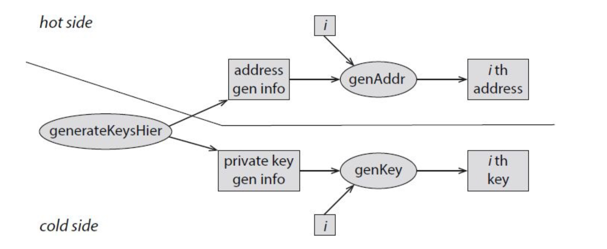

# Conservazione ed utilizzo dei Bitcoin

> Conservare i Bitcoin consiste nel conservare e gestire le proprie chiavi segrete.  

[TOC]

## Proprietà ideali di uno storage

1. **Disponibilità**.Dobbiamo poter spendere i Bitcoin quando vogliamo. 
2. **Sicurezza**. Vogliamo essere sicuri che nessun altr possa spendere i nostri Bitcoin.
3. **Convenienza**. Gestire le chiavi deve essere semplice.

Solitamente, uno storage offre un trade-off tra le tre proprietà. La maniera più semplice per gestire le proprie chiavi è **in locale** (es. tramite una applicazione). Tuttavia, se il dispositivo contenente le chiavi dovesse danneggiarsi o venire rubato, avremmo perso i nostri Bitcoin. Corrisponde a portarsi tutti i propri soldi con sé, il che è sicuramente **conveniente**, ma non è per niente **sicuro**. 

## Wallet

Un wallet è un software che si occupa della gestione della chiavi e tiene traccia dei nostri Bitcoin, attraverso una semplice interfaccia utente. Potrebbe semplificare il processo di creazione di un nuovo indirizzo, o le istruzioni per effettuare un pagamento. 

### Encoding keys

Per spendere o ricevere Bitcoin abbiamo bisogno di comunicare gli indirizzi. I due metodi principali sono la codifica in base 58 e i QR code. La base 58 è utile poiché 58 è il numero di lettere maiuscole, minuscole e numeri utilizzabili come caratteri (meno alcuni caratteri che potrebbero essere confusi, come la "O" con lo "0"). 

### Vanity address 

Un vanity address è un indirizzo che contiene una parola leggibile. 

> ES. 1bonesEeTcABPjLzAb1VkFgySY6Zqu3 è un indirizzo in base 58 che contiene la parola "bones". L'1 prefisso indica che questo indirizzo è di tipo Pay-to-Pubkey-hash. 

Gli indirizzi sono output di una funzione hash, quindi ottenere un vanity address è pura casualità. E' possibile velocizzare il processo di generazione di un vanity address nel seguente modo. Sia $x$ la chiave privata, la chiave pubblica è $g^x$ e l'indirizzo è $H(g^x)$. L'esponenziazione è una operazione molto onerosa. Se prendessimo di volta in volta una $x$ a caso, dovremmo calcolare $g^x$. Se invece prendessimo $x+1$ come nuova chiave segreta, allora potremmo riutilizzare il $g^x$ calcolato prima, e ottenere $g^{x+1} = g^x \cdot g$, il che risulta essere molto più rapido. In base 58, per trovare un indirizzo con all'interno una parola di lunghezza $k$ dovremmo fare all'incirca $58^k$ tentativi. 

## Hot storage e cold storage

Per **hot storage** intendiamo l'utilizzo di un wallet che registra le chiavi in locale. Per **cold storage** intendiamo invece una conservazione "offline" delle chiavi, quindi le chiavi non sono immediatamente reperibili, ma sono conservate in un posto sicuro e disconnesso da internet. Le chiavi conservate nei due storage devono essere differenti, altrimenti compromettendo uno comprometteremmo anche l'altro storage. 

Vorremmo idealmente poter muovere dei Bitcoin tra i due tipi di storage, ricordandoci che il cold storage è disconnesso dalla rete. Se l'hot storage conosce gli indirizzi corrispondenti alle chiavi segrete conservate nel cold storage, allora basterebbe effettuare una transazione per muovere i Bitcoin (es. stiamo conservando troppi soldi nell'hot storage e vogliamo muoverli nel cold storage). Quando il cold storage si connetterà, andrà a conoscenza delle transazioni verso i propri indirizzi. 

Idealmente vorremmo che ogni volta che facciamo una transazione dell'hot storage al cold storage, l'indirizzo di destinazione nel cold storage sia un nuovo indirizzo appena generato (per questioni di privacy e di non tracciabilità). Il prossimo meccanismo ci consentirà di sincronizzare i due storage con ingegno. 

### Hierarchical Deterministic Wallets

Un **hierarchical deterministic wallet** permette al cold storage di utilizzare un numero illimitato di indirizzi, e permette all'hot storage di conoscere questi indirizzi attraverso una breve comunicazione iniziale tra le due parti. Gli step sono i seguenti: 

1. Si genera un `address generation info` ed un `private key generation info`.
2. Attraverso l'`address generation info` possiamo generare una sequenza di chiavi pubbliche: una `address generation function` prende in input l'`address generation` info ed un intero `i`, e genera l'`i`-esimo indirizzo della sequenza. 
3. In maniera simile, possiamo generare la corrispondente sequenza di chiavi private utilizzando la `private key generation info`.
4. La $i$-esima chiave della sequenza delle chiavi controlla l'$i$-esimo indirizzo della sequenza di indirizzi. 

La `address generation info` non travisa nessuna informazione sulla generazione delle corrispondenti chiavi private, quindi può essere tranquillamente conservata nell'hot storage. Detto questo, potremmo anche fornire questa informazione a qualcuno, in modo che questo possa generare l'$i$-esimo indirizzo. Vediamo come funziona tutto ciò con ECDSA: 

1. Siano $k, y$  due numeri random. 
2. Il `private key generation info` è $(k, x, y)$
3. La $i$-esima chiave è $x_i = y + H(k \mid\mid i)$
4. L'`address generation info` è $(k, g^y)$
5. Quindi la $i$-esima public key si ottiene come $g^{x_i} = g^{H(k\mid\mid i)} \cdot g^y$
6. E l'$i$-esimo indirizzo come $H(g^{x_i})$

Questo schema ha le proprietà desiderate, più una nuova: le public key sono scorrelate l'una con l'altra, quindi è impossibile capire se due public key provengano dallo stesso wallet.  Attraverso questa tecnica, mantenendo l'address generation info nell'hot storage è possibile trasferire Bitcoin in indirizzi sempre nuovi nel cold storage, e se l'hot storage viene compromesso, le chiavi nel cold storage saranno comunque al sicuro. 

