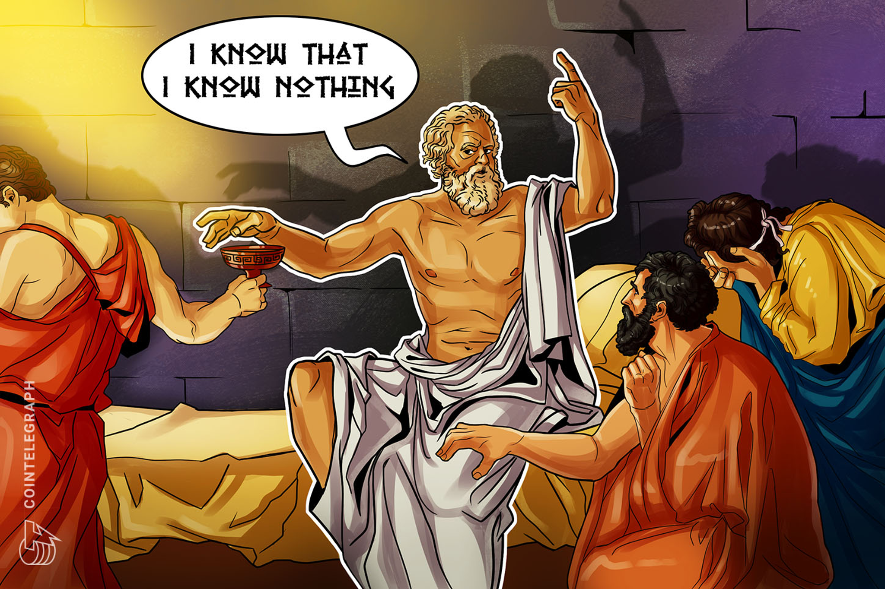

# Zero knowledge proof 

[TOC]

*****

## Introduzione

Le zero knowledge proof sono uno strumento per dimostrare delle affermazioni matematiche (statement) senza rivelare altre informazioni che portino a quella informazione. Ad esempio, supponiamo di aver risolto un hash puzzle e di voler convincere qualcuno di questo. In altre parole, vorremmo provare di conoscere una $x$ tale che $H(x \mid \mid \text{altri input noti}) < \text{target}$. Una soluzione banale consiste nel mostrare $x$. Una zero-knowledge proof permette di convincere chi verifica questo statement che esso sia vero senza mostrare $x$, né rivelare informazioni utili su $x$. 

## Struttura delle dimostrazioni

Una dimostrazione (proof) è qualcosa che ci convince della validità di un asserto. In matematica, tale concetto è spesso inteso in senso statico. In altre aree una dimostrazione può essere qualcosa di molto diverso, come un **processo interattivo**. In ogni caso, si possono distinguere due entità:  

* Un prover $P$ (provatore) vuole provare che un certo statement $S$ (dichiarazione) è vero. 
* Un verifier $V$ (verificatore) è addetto a controllare che esso sia vero ed emettere la sentenza.

In genere, verificare è più facile che dimostrare da zero. Tale asimmetria è catturata perfettamente dalla classe NP: ogni linguaggio $L$ in NP ha una procedura di verifica efficiente per enunciati del tipo $x \in L$. Provare che $x \in L$ può invece essere difficile. 

## Guadagno di conoscenza

Consideriamo il seguente scenario: Alice parla e Bob ascolta. Possiamo dire che Alice certamente non guadagna nessuna conoscenza, e Bob non necessariamente acquisisce conoscenza. Diciamo che Bob acquisisce conoscenza se la sua capacità computazionale è in qualche modo arricchita dalla conversazione. Bob non acquisisce conoscenza se la sua capacità computazionale rimane inalterata. Dunque Bob acquisisce conoscenza solo se riceve il risultato di una computazione che non era in grado di compiere da solo. 

## Zero-knowledge proof

$P$ potrebbe non voler dimostrare in maniera diretta che lo statement $S$ sia vero. Il suo obiettivo è quello di mostrare la validità di $S$ a $V$ senza che esso impari nulla dal processo di verifica. La definizione di **zero-knowledge proof** cattura proprio l'idea che durante il processo di verifica, il verifier $V$ non apprenda nulla sullo statement $S$ meno che la validità dello statement $S$, e **(1)** che ogni cosa che apprende può essere appresa anche al di fuori del processo di verifica, non consultando il prover $P$. Definiamo **transcript** (trascrizione) di un protocollo interattivo la lista dei messaggi scambiati tra il prover $P$ ed il verifier $V$ durante l'esecuzione del protocollo. L'ultimo asserto **(1)** è formalizzato attraverso un algoritmo chiamato **simulatore**, che preso in input lo statement $S$ da provare, produce lo stesso transcript prodotto dal processo di verifica tra $P$ ed $S$. 

### Proprietà di una ZPK

* **Completezza** (*completeness*): se l'affermazione è vera, un prover onesto potrà convincere del  fatto un verifier onesto (cioè chi segue esattamente il protocollo).
* **Correttezza** (*soundness*): se l'affermazione è falsa, nessun prover imbroglione potrà  convincere il verifier onesto che essa è vera, o meglio la  probabilità di riuscire a convincerlo può essere resa bassa a piacere.
* **Conoscenza zero** (*zero knowledge*): se l'affermazione è vera, nessun verifier imbroglione potrà sapere  altro che tale informazione. Questo fatto è formalizzato mostrando che a ogni verifier imbroglione può essere associato un *simulatore* che, se gli viene data solo l'affermazione da provare (e nessun accesso al dimostratore), può ricavare una trascrizione che "sembra" un'interazione tra il dimostratore onesto e il verificatore imbroglione.

### Definizione formale 

Una dimostrazione (proof) che coinvolge un prover $P$ ed un verifier $V$ per un linguaggio $L$ è detta essere zero-knowledge se per ogni strategia di verifica $\hat{V}$ probabilista e polinomiale esiste un algoritmo $S$ (che può dipendere da $\hat{V}$, chiamato simulatore, tale che $\forall x \in L$, la distribuzione dell'ouput $S(x)$ è indistinguibile da $View_{\hat{v}}(P(x), V(x))$, dove quest'ultimo denota la "distribution over transcript" generata dal processo di verifica, ovvero dall'interazione della strategia di dimostrazione $P$ e da quella di verifica $\hat{V}$.

### Classificazione delle ZKP

Prendiamo in considerazione la distribuzione $S(x)$ e $view_{\hat{v}}(P(x), V(x))$, allora la zero-knowledge proof può essere: 

* **perfect zero-knowledge**: le distribuzioni sono uguali
* **statistical zero-knowledge**: le distribuzioni hanno una distanza statistica trascurabile
* **computational zero-knowledge**: la probabilità di distinguere le distribuzioni è trascurabile

### Teorema su problemi NP

Se esistono funzioni unidirezionali allora ogni linguaggio in NP ammette una computational zero-knowledge proof. 

> Nella dimostrazione del teorema la cui tesi sostiene che per ogni linguaggio in NP esiste una computational zero-knowledge proof, gli autori utilizzano il problema del tricoloring e alcuni commitment. Le dimostrazioni suppongono l'esistenza di funzioni unidirezionali affinché valga la tesi.  

## ZKP of membership

Le zero-knowledge proof of mebmbership dimostrano che un certo elemento appartiene ad un certo insieme. Vedremo due esempi: uno sui grafi isomorfi e uno sulle triple Diffie-Hellman. 

### Isomorfismo tra grafi

Siano $G_0$ e $G_1$ due grafi aventi $n$ nodi. Vogliamo stabilire se essi siano isomorfi. Tale problema non sembra essere in $P$, ovvero non è noto alcun algoritmo polinomiale, ma sembra essere in NP, dato che fornendo la soluzione, ovvero l'isomorfismo, si può verificare in tempo polinomiale che essa sia valida.

Il prover $P$ vuole convincere $V$ di conoscere una permutazione $\pi$ tale che $\pi(G_0) = G_1$. $P$ potrebbe semplicemente inviare $\pi$ a $V$, ma questo non è zero-knowledge. Vogliamo convincere $V$ senza rivelare la permutazione. Il protocollo funziona come segue: 

1. $P \to V$ : $P$ sceglie random una permutazione $\sigma$ ed un bit $b$ e calcola $H = \sigma(G_b)$ e invia $H$ a $V$. 
2. $V \to P$ : $V$ sceglie un bit $b' \in \{0,1\}$ e lo invia a $P$.
3. $P \to V$ : $P$ invia la permutazione $\tau$ a $V$
4. $V$ accetta se e solo se $H=\tau(G_{b'})$

Dove la permutazione $\tau$ è calcolata come segue: 
$$
\tau = \begin{cases}
\sigma & \text{ if } b =b' \\
\sigma \pi^{-1} & \text{ if } b = 0, b'=1 \\
\sigma \pi & \text{ if } b = 1, b'=0
\end{cases}
$$
Il protocollo ha perfetta completezza, dato che se $\pi$ è realmente un isomorfismo allora avverrà sempre che $\tau(G_{b'}) = \sigma (G_b)$. Assumendo che il verifier $V$ sia onesto, il protocollo è anche corretto: se $\pi$ non è un isomorfismo valido allora l'ultima condizione vale se e solo se $b=b'$, e questo accade con probabilità di $1/2$ a scelta del verificatore. Il protocollo è zero knowledge: nel caso in cui il verifier $V$ scelga $b'$ randomicamente, abbiamo che: 
$$
\text{View}_v [P(G_0, G_1) \leftrightarrow V(G_0, G_1)] = (b', H, \sigma)
$$
Il simulatore $S$ per $V$ opera prima scegliendo un bit random $b'$ ed una permutazione random $\sigma$, e dopodiché da in output la tripla $(b', \sigma(G_b), \sigma)$, la cui distribuzione è esattamente la distribuzione di $\text{view}_v$, quando $G_0 \cong G_1$ (sono isomorfi). 

> La dimostrazione con un verifier disonesto [si trova qui](http://www.cs.cornell.edu/courses/cs6810/2009sp/scribe/lecture18.pdf), a pagina 3. 

### Coppia Diffie-Hellman

Vedasi il capitolo di Crittografia riguardo al problema Diffie-Hellman. Siano $(g, g^x, g^y, g^{xy})$ dei parametri pubblici, il prover $P$ deve dimostrare di conoscere il valore di $x$ o $y$ al verifier (nella dimostrazione d'esempio si suppone conosca $x$). Si suppone che nel gruppo in cui si opera, il problema del logaritmo discreto sia computazionalmente difficile. Sia $m$ l'ordine del gruppo, la dimostrazione zero knowledge funziona nel seguente modo: 

1. $P$ sceglie casualmente $r =_R \{0, \dots, m\}$ 
2. $P$ calcola $R_1 = g^r$ ed $R_2 = (g^y)^r$ e invia $(R_1, R_2)$ a $V$
3. $V$ sceglie casualmente $c =_R \{0, \dots, m\}$ e invia $c$ a $P$
4. $P$ calcola $z= r + cx \mod m$ e invia $z$ a $V$
5. $V$ verifica che $R_1 (g^x)^c = g^z$ e che $R_2(g^{xy})^c = (g^y)^z$ 

Osserviamo che $V$ non può estrarre $x$ dal passo $4$, non conoscendo $r$. 

> TODO: dimostrare completeness, soundness e zero-knowledge. 

## Proof of knowledge

> Anche chiamate **prove di conoscenza**. 

In crittografia, una proof of knowledge (prova di conoscenza) è una prova interattiva in cui il prover ha successo se riesce a convincere il verifier di sapere qualcosa. Cosa significa per una macchina "sapere qualcosa" è definito in termini di computazione. Una macchina 'sa qualcosa', se questo qualcosa può essere calcolato, data la macchina come input. Se la prova di conoscenza è zero-knowledge, allora il prover riesce a dimostrare il tutto senza fare acquisire informazioni (che non può calcolare da solo) al verifier. Per catturare l'idea, bisogna introdurre un programma chiamato extractor $E$, di cui parleremo durante le proprietà. Siamo perlopiù interessati a programmi polinomialmente limitati.

### Approfondimenti e proprietà

Sia $x$ uno statement del linguaggio $L \in NP$ e sia $W(x)$ l'insieme di witness per $x$ che possono essere accettati nella dimostrazione.  

> **Cosa è una witness?** [Da StackExchange](https://crypto.stackexchange.com/questions/43462/what-is-a-witness-in-zero-knowledge-proof).
> Una witness per uno statement NP è un pezzo di informazione che permette di verificare efficientemente che lo statement è vero. Per esempio, se lo statement afferma che esiste un ciclo hamiltoniano in un grafo, la witness potrebbe essere proprio il ciclo. Dato il ciclo, si potrebbe efficientemente verificare se il ciclo è hamiltoniano, ma trovare tale ciclo è difficile. 

Nelle proof of knowledge, il prover non deve dimostrare che un certo statement è vero, ma deve dimostrare di conoscere una witness per lo statement. Una macchina che conosce qualcosa (una witness) è definita dall'esistenza di un programma extractor che, utilizzando la macchina come oracolo, riesce a dare in output la witness posseduta dalla macchina. 

Adesso che è chiaro cosa siano le witness, possiamo definire la seguente relazione $R$: 
$$
R = \{ (x,w) : x \in L, w \in W(x) \}
$$
Una prova di conoscenza per una relazione $R$ è un protocollo a due parti con un prover $P$ ed un verifier $V$ che segue le seguenti due proprietà:

* **Completezza** (*Completeness*): Se $(x,w) \in R$, ovvero lo statement è vero, allora il prover $P$ che conosce la witness $w$ per $x$ riesce a convincere $V$ della sua conoscenza. Più formalmente, data l'interazione tra $P$ e $V$, la probabilità che il verificatore sia convinto è 1. 
* **Validità** (*Validity*): Tale proprietà richiede che la probabilità che un programma extractor $E$ riesca ad estrarre la witness $w$, dato un oracolo per l'accesso ad un prover $\tilde{P}$ possibilmente disonesto, deve essere almeno alta quanto la probabilità che $\tilde{P}$ riesca a convincere il verificatore. Questa proprietà garantisce che nessun prover che non conosce alcuna witness può avere successo nel convincere il verifier. 

