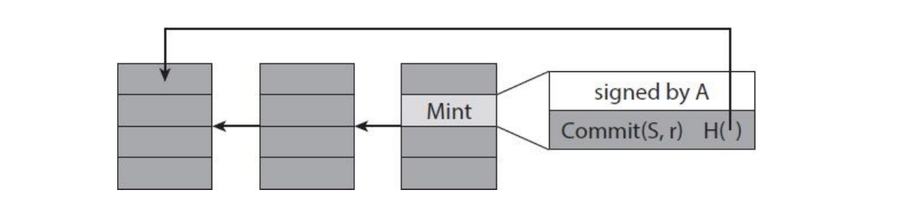
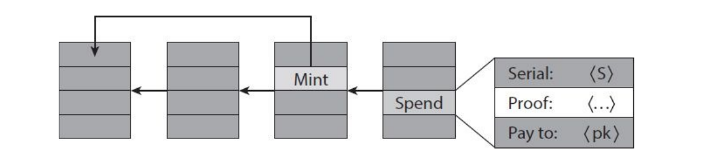

# Zero knowledge proof 


[TOC]

*****


## Introduzione

Le zero knowledge proof sono uno strumento per dimostrare delle affermazioni matematiche (statement) senza rivelare altre informazioni che portino a quella informazione. Ad esempio, supponiamo di aver risolto un hash puzzle e di voler convincere qualcuno di questo. In altre parole, vorremmo provare di conoscere una $x$ tale che $H(x \mid \mid \text{altri input noti}) < \text{target}$. Una soluzione banale consiste nel mostrare $x$. Una zero-knowledge proof permette di convincere chi verifica questo statement che esso sia vero senza mostrare $x$, né rivelare informazioni utili su $x$. 


## Struttura delle dimostrazioni

Una dimostrazione (proof) è qualcosa che ci convince della validità di un asserto. In matematica, tale concetto è spesso inteso in senso statico. In altre aree una dimostrazione può essere qualcosa di molto diverso, come un **processo interattivo**. In ogni caso, si possono distinguere due entità:  

* Un prover $P$ (provatore) vuole provare che un certo statement $S$ (dichiarazione) è vero. 
* Un verifier $V$ (verificatore) è addetto a controllare che esso sia vero ed emettere la sentenza.

In genere, verificare è più facile che dimostrare da zero. Tale asimmetria è catturata perfettamente dalla classe NP: ogni linguaggio $L$ in NP ha una procedura di verifica efficiente per enunciati del tipo $x \in L$. Provare che $x \in L$ può invece essere difficile. 


## Guadagno di conoscenza

Consideriamo il seguente scenario: Alice parla e Bob ascolta. Possiamo dire che Alice certamente non guadagna nessuna conoscenza, e Bob non necessariamente acquisisce conoscenza. Diciamo che Bob acquisisce conoscenza se la sua capacità computazionale è in qualche modo arricchita dalla conversazione. Bob non acquisisce conoscenza se la sua capacità computazionale rimane inalterata. Dunque Bob acquisisce conoscenza solo se riceve il risultato di una computazione che non era in grado di compiere da solo. 


## Zero-knowledge proof

$P$ potrebbe non voler dimostrare in maniera diretta che lo statement $S$ sia vero. Il suo obiettivo è quello di mostrare la validità di $S$ a $V$ senza che esso impari nulla dal processo di verifica. La definizione di **zero-knowledge proof** cattura proprio l'idea che durante il processo di verifica, il verifier $V$ non apprenda nulla sullo statement $S$ meno che la validità dello statement $S$, e **(1)** che ogni cosa che apprende può essere appresa anche al di fuori del processo di verifica, non consultando il prover $P$. Definiamo **transcript** (trascrizione) di un protocollo interattivo la lista dei messaggi scambiati tra il prover $P$ ed il verifier $V$ durante l'esecuzione del protocollo. L'ultimo asserto **(1)** è formalizzato attraverso un algoritmo chiamato **simulatore**, che preso in input lo statement $S$ da provare, produce lo stesso transcript prodotto dal processo di verifica tra $P$ ed $S$. 


### Proprietà di una ZPK

* **Completezza** (*completeness*): se l'affermazione è vera, un prover onesto potrà convincere del  fatto un verifier onesto (cioè chi segue esattamente il protocollo).
* **Correttezza** (*soundness*): se l'affermazione è falsa, nessun prover imbroglione potrà  convincere il verifier onesto che essa è vera, o meglio la  probabilità di riuscire a convincerlo può essere resa bassa a piacere.
* **Conoscenza zero** (*zero knowledge*): se l'affermazione è vera, nessun verifier imbroglione potrà sapere  altro che tale informazione. Questo fatto è formalizzato mostrando che a ogni verifier imbroglione può essere associato un *simulatore* che, se gli viene data solo l'affermazione da provare (e nessun accesso al dimostratore), può ricavare una trascrizione che "sembra" un'interazione tra il dimostratore onesto e il verificatore imbroglione.


### Definizione formale 

Una dimostrazione (proof) che coinvolge un prover $P$ ed un verifier $V$ per un linguaggio $L$ è detta essere zero-knowledge se per ogni strategia di verifica $\hat{V}$ probabilistica e polinomiale esiste un algoritmo $S$ (che può dipendere da $\hat{V}$, chiamato simulatore, tale che $\forall x \in L$, la distribuzione dell'ouput $S(x)$ è indistinguibile da $View_{\hat{v}}(P(x), V(x))$, dove quest'ultimo denota la "distribution over transcript" generata dal processo di verifica, ovvero dall'interazione della strategia di dimostrazione $P$ e da quella di verifica $\hat{V}$.


### Classificazione delle ZKP

Prendiamo in considerazione la distribuzione $S(x)$ e $view_{\hat{v}}(P(x), V(x))$, allora la zero-knowledge proof può essere: 

* **perfect zero-knowledge**: le distribuzioni sono uguali
* **statistical zero-knowledge**: le distribuzioni hanno una distanza statistica trascurabile
* **computational zero-knowledge**: la probabilità di distinguere le distribuzioni è trascurabile


### Teorema su problemi NP

Se esistono funzioni unidirezionali allora ogni linguaggio in NP ammette una computational zero-knowledge proof. 

> Nella dimostrazione del teorema la cui tesi sostiene che per ogni linguaggio in NP esiste una computational zero-knowledge proof, gli autori utilizzano il problema del tricoloring e alcuni commitment. Le dimostrazioni suppongono l'esistenza di funzioni unidirezionali affinché valga la tesi.  


## ZKP of membership

Le zero-knowledge proof of membership dimostrano che un certo elemento appartiene ad un certo insieme. Vedremo due esempi: uno sui grafi isomorfi e uno sulle triple Diffie-Hellman. 


### Isomorfismo tra grafi

Siano $G_0$ e $G_1$ due grafi aventi $n$ nodi. Vogliamo stabilire se essi siano isomorfi. Tale problema non sembra essere in $P$, ovvero non è noto alcun algoritmo polinomiale, ma sembra essere in NP, dato che fornendo la soluzione, ovvero l'isomorfismo, si può verificare in tempo polinomiale che essa sia valida.

Il prover $P$ vuole convincere $V$ di conoscere una permutazione $\pi$ tale che $\pi(G_0) = G_1$. $P$ potrebbe semplicemente inviare $\pi$ a $V$, ma questo non è zero-knowledge. Vogliamo convincere $V$ senza rivelare la permutazione. Il protocollo funziona come segue: 

1. $P \to V$ : $P$ sceglie random una permutazione $\sigma$ ed un bit $b$ e calcola $H = \sigma(G_b)$ e invia $H$ a $V$. 
2. $V \to P$ : $V$ sceglie un bit $b' \in \{0,1\}$ e lo invia a $P$.
3. $P \to V$ : $P$ invia la permutazione $\tau$ a $V$
4. $V$ accetta se e solo se $H=\tau(G_{b'})$

Dove la permutazione $\tau$ è calcolata come segue: 
$$
\tau = \begin{cases}
\sigma & \text{ if } b =b' \\
\sigma \pi^{-1} & \text{ if } b = 0, b'=1 \\
\sigma \pi & \text{ if } b = 1, b'=0
\end{cases}
$$
Il protocollo ha perfetta completezza, dato che se $\pi$ è realmente un isomorfismo allora avverrà sempre che $\tau(G_{b'}) = \sigma (G_b)$. Assumendo che il verifier $V$ sia onesto, il protocollo è anche corretto: se $\pi$ non è un isomorfismo valido allora l'ultima condizione vale se e solo se $b=b'$, e questo accade con probabilità di $1/2$ a scelta del verificatore. Il protocollo è zero knowledge: nel caso in cui il verifier $V$ scelga $b'$ randomicamente, abbiamo che: 
$$
\text{View}_v [P(G_0, G_1) \leftrightarrow V(G_0, G_1)] = (b', H, \sigma)
$$
Il simulatore $S$ per $V$ opera prima scegliendo un bit random $b'$ ed una permutazione random $\sigma$, e dopodiché da in output la tripla $(b', \sigma(G_b), \sigma)$, la cui distribuzione è esattamente la distribuzione di $\text{view}_v$, quando $G_0 \cong G_1$ (sono isomorfi). 

> La dimostrazione con un verifier disonesto [si trova qui](http://www.cs.cornell.edu/courses/cs6810/2009sp/scribe/lecture18.pdf), a pagina 3. 


### Coppia Diffie-Hellman

Vedasi il capitolo di Crittografia riguardo al problema Diffie-Hellman. Siano $(g, g^x, g^y, g^{xy})$ dei parametri pubblici, il prover $P$ deve dimostrare di conoscere il valore di $x$ o $y$ al verifier (nella dimostrazione d'esempio si suppone conosca $x$). Si suppone che nel gruppo in cui si opera, il problema del logaritmo discreto sia computazionalmente difficile. Sia $m$ l'ordine del gruppo, la dimostrazione zero knowledge funziona nel seguente modo: 

1. $P$ sceglie casualmente $r =_R \{0, \dots, m\}$ 
2. $P$ calcola $R_1 = g^r$ ed $R_2 = (g^y)^r$ e invia $(R_1, R_2)$ a $V$
3. $V$ sceglie casualmente $c =_R \{0, \dots, m\}$ e invia $c$ a $P$
4. $P$ calcola $z= r + cx \mod m$ e invia $z$ a $V$
5. $V$ verifica che $R_1 (g^x)^c = g^z$ e che $R_2(g^{xy})^c = (g^y)^z$ 

Osserviamo che $V$ non può estrarre $x$ dal passo $4$, non conoscendo $r$. 

> TODO: dimostrare completeness, soundness e zero-knowledge. 


## Proof of knowledge

> Anche chiamate **prove di conoscenza**. 

In crittografia, una proof of knowledge (prova di conoscenza) è una prova interattiva in cui il prover ha successo se riesce a convincere il verifier di sapere qualcosa. Cosa significa per una macchina "sapere qualcosa" è definito in termini di computazione. Una macchina 'sa qualcosa', se questo qualcosa può essere calcolato, data la macchina come input. Se la prova di conoscenza è zero-knowledge, allora il prover riesce a dimostrare il tutto senza fare acquisire informazioni (che non può calcolare da solo) al verifier. Per catturare l'idea, bisogna introdurre un programma chiamato extractor $E$, di cui parleremo durante le proprietà. Siamo perlopiù interessati a programmi polinomialmente limitati.


### Approfondimenti e proprietà

Sia $x$ uno statement del linguaggio $L \in NP$ e sia $W(x)$ l'insieme di witness per $x$ che possono essere accettati nella dimostrazione.  

> **Cosa è una witness?** [Da StackExchange](https://crypto.stackexchange.com/questions/43462/what-is-a-witness-in-zero-knowledge-proof).
> Una witness per uno statement NP è un pezzo di informazione che permette di verificare efficientemente che lo statement è vero. Per esempio, se lo statement afferma che esiste un ciclo hamiltoniano in un grafo, la witness potrebbe essere proprio il ciclo. Dato il ciclo, si potrebbe efficientemente verificare se il ciclo è hamiltoniano, ma trovare tale ciclo è difficile. 

Nelle proof of knowledge, il prover non deve dimostrare che un certo statement è vero, ma deve dimostrare di conoscere una witness per lo statement. Una macchina che conosce qualcosa (una witness) è definita dall'esistenza di un programma extractor che, utilizzando la macchina come oracolo, riesce a dare in output la witness posseduta dalla macchina. 

Adesso che è chiaro cosa siano le witness, possiamo definire la seguente relazione $R$: 
$$
R = \{ (x,w) : x \in L, w \in W(x) \}
$$
Una prova di conoscenza per una relazione $R$ è un protocollo a due parti con un prover $P$ ed un verifier $V$ che segue le seguenti due proprietà:

* **Completezza** (*Completeness*): Se $(x,w) \in R$, ovvero lo statement è vero, allora il prover $P$ che conosce la witness $w$ per $x$ riesce a convincere $V$ della sua conoscenza. Più formalmente, data l'interazione tra $P$ e $V$, la probabilità che il verificatore sia convinto è 1. 
* **Validità** (*Validity*): Tale proprietà richiede che la probabilità che un programma extractor $E$ riesca ad estrarre la witness $w$, dato un oracolo per l'accesso ad un prover $\tilde{P}$ possibilmente disonesto, deve essere almeno alta quanto la probabilità che $\tilde{P}$ riesca a convincere il verificatore. Questa proprietà garantisce che nessun prover che non conosce alcuna witness può avere successo nel convincere il verifier. 


### Protocollo di Schnorr

Il protocollo di Schnorr è una delle proof of knowledge più famose, ed è una proof of knowledge del logaritmo discreto. Il protocollo è definito per un gruppo ciclico $G_q$ di ordine $q$ con un generatore $g$. Per provare la conoscenza di $x = \log_g y$, il prover $P$ interagisce con il verifier $V$ come segue: 

1. $P$ sceglie un esponente random $r$, calcola $R=g^r$ (*commitment*) e lo invia a $V$.  
2. $V$ sceglie un esponente random $c$ (*challenge*) e lo invia a $P$
3. $P$ calcola $z=(r+cx \mod q)$ (*response*) e invia $z$ a $V$
4. $V$ accetta se $g^z = Ry^c$. 

La prova è completa e valida, infatti è semplice dimostrare che esiste un extractor che funzioni nella seguente maniera: 

1. Simuliamo il momento in cui $P$ invia $R= g^r$, diciamo che $P$ è allo stato $Q$. 
2. Generiamo un valore random $c_1$ che dato in input a $P$ ci ritorna $s_1 = r + c_1 x$
3. Rewind allo stato $Q$, inviamo un altro valore random $c_2$, stavolta otteniamo $s_2 = r +c_2 x$ 
4. L'extractor da in output $(s_1-s_2)(c_1-c_2)^{-1}$. 

Dimostriamo che l'output è esattamente $x$: 
$$
(s_1-s_2) = (r+ c_1x) - (r+ c_2x) = x(c_1 - c_2)
$$
Quindi avremo: 
$$
(s_1-s_2)(c_1-c_2)^{-1} = x(c_1 - c_2)(c_1-c_2)^{-1} = x
$$


# Zerocoin e Zerocash

Anziché proporre soluzioni di anonimato costruite al di sopra del protocollo, cryptocurrency come Zerocoin e Zerocash incorporano l'anonimato nel protocollo. Questi protocolli non sono compatibili con Bitcoin, al contrario dei servizi di mixing. Mentre Zerocoin può essere implementato attraverso una soft fork di Bitcoin, Zerocash richiede addirittura la creazione di una altcoin (alternative to Bitcoin). La garanzia di anonimato si basa sui limiti computazionali dell'avversario, come molte delle primitive crittografiche. 


## Zerocoin

Introduciamo Basecoin (Bitcoin-like altcoin) che servirà per effettuare le transazioni vere e proprie. Zerocoin è un meccanismo che permette di ripulire le basecoin. Quello che accade è che si scambia una basecoin con uno zerocoin, e dopodiché si ri-scambia lo zerocoin con una nuova basecoin. Questo scollega le monete, quindi le ripulisce. Lo zerocoin serve a dimostrare di possedere una basecoin, rendendola di fatto non spendibile, ma non specifica quale. Per redimere una nuova basecoin a partire da uno zerocoin bisogna utilizzare delle zero-knowledge proof da sottomettere ai miners, e tali dimostrazioni devono funzionare una sola volta (altrimenti abbiamo basecoin infiniti). 


### Coniare zerocoin

Supponiamo che esista solo una taglia unitaria di zerocoin, e che 1.0 zerocoin valga 1 basecoin. Tutti possono coniare zerocoin, ma essi acquisiscono valore solo quando sono nella blockchain, e per metterli nella blockchain bisogna spendere 1 basecoin. Per coniare uno zerocoin bisogna effettuare uno statement crittografico (capitolo 1), il che si traduce in tre step: 

1. Generare un numero seriale $S$ ed un segreto random $r$
2. Calcolare $commit(S, r)$, il commitment per il numero seriale. 
3. Pubblicare il commitment nella blockchain.

Come vediamo nell'immagine sottostante, la transazione che contiene il conio (mint) di uno zerocoin è firmata dall'utente e contiene in output il commitment del numero seriale dello zerocoin, mentre l'input è proprio il basecoin che si vuole "ripulire". La transazione **non rivela** il numero seriale. 



Per spendere uno zerocoin e redimere un nuovo basecoin, dobbiamo provare di aver precedentemente coniato uno zerocoin. Si potrebbe fare questo andando ad aprire il commitment, ovvero rivelando sia $S$ che $r$, ma questo permetterebbe di collegarci al vecchio basecoin (calcolando il commitment e controllando gli output delle tx di mint). Il modo in cui si rompe il collegamento è utilizzando la **zero knowledge proof**. In un certo istante di tempo ci saranno vari commitment $c_1, c_2, \dots, c_n$ nella blockchain. Vediamo gli step per spendere uno zerocoin con numero seriale $S$ ed acquisire un nuovo basecoin: 

1. Creare una "spend" transaction contenente $S$ insieme alla zero-knowledge proof $\pi$ dello statement "conosco una randomness segreta $r$ tale che $commit(S, r)$ è un commitment nell'insieme dei commitment $c_1, c_2, \dots, c_n$". 
2. I miner fungono da verifier e stabiliscono se l'utente possa o meno aprire uno dei commitment all'interno della blockchain, senza aprirli realmente. 
3. I miner controllerano anche che il numero seriale $S$ non sia stato utilizzato nelle transazioni precedenti, altrimenti si avrebbe double spending. 
4. L'output della "spend" transaction funzionerà come un nuovo basecoin da poter spendere. Infatti, nell''output address si dovrebbe utilizzare un indirizzo da noi posseduto. 

L'immagine sottostante illustra la spend transaction. Una volta redento il basecoin, non sarà più possibile utilizzare il numero seriale dello zerocoin per acquisire altri basecoin. Quindi ogni zerocoin può essere speso **una sola volta**. 




### Anonimato ed efficienza

Osserviamo che durante tutto il processo il segreto $r$ non è mai rivelato, questo impedisce di calcolare il commitment attraverso il numero seriale $S$, e dunque di collegare la spend transaction con la mint transaction, ovvero garantisce l'**unlinkability**, che insieme alla pseudonimity definiscono l'anonimato. Dal punto di vista dell'**efficienza**, intuitivamente la zero knowledge proof contenuta nella spend transaction dovrebbe aumentare linearmente con il numero di commitment contenuti nella blockchain, riferendosi proprio ad essi. Tuttavia, gli autori sono riusciti a limitare il tutto ad una crescita logaritmica rispetto ai commitment. Rispetto a Bitcoin, Zerocoin introduce ovviamente delle inefficienze, che baratta per la garanzia di anonimato. 


### Trusted setup

Uno degli strumenti crittografici utilizzati per costruire Zerocoin, chiamato [accumulatore RSA](https://blog.goodaudience.com/deep-dive-on-rsa-accumulators-230bc84144d9), richiede un trusted setup da fare una sola volta per far partire tutti il sistema. Il setup consiste nello scegliere due grossi primi $p$ e $q$ (trapdoor) e calcolare il parametro pubblico $N$. Una volta calcolato, i parametri $p,q$ dovrebbero essere distrutti, altrimenti chi ne è in possesso potrebbe generare infiniti zerocoin.  


### RSA Accumulator Quick overview

```python
import random

class RSAAcc: 
    
    def setup(self, p, q):
        """ Given two large prime numbers, calculate 
        	the parameter N and u, then return the public
        	parameters.
        """
        self.N = p * q
        w = random.randint(0, N)
        self.u = (w ** 2) % N
        return (N, u)

    def accumulate(commitments):
        """ Create A by exponentiating u to all the commitments
        	inside the accumulator.
        """
        if not self.A: self.A = self.u
        for c in commitments:
            self.A = self.A ** c
		return self.A
    
    def gen_witness(c, commitments: Set):
        """ Prove that a certain commitment c is in the 
        	accumulator by computing W as the exponentiation
        	of u by all the commitments minus c, and comparing 
        	W to the previous computed value A.
        """
        commitments = commitments.remove(c)
        W = self.u
        for _c in commitments:
            W = W ** _c
        return W == self.A:
```

Supponiamo che i commitment siano $a,b,c$ e che si stia cercando di dimostrare che $d$ sia nell'accumulator, ovvero deve essere vero che $W_d^d\mod N = A$, ma dato che $A = u^{abc}$, allora per far valere l'equazione precedente dovremmo trovare $W_d = \root{d}\of{A}$, ma calcolare la radice $d$-esima è un problema computazionalmente difficile nel gruppo ciclico scelto. 
