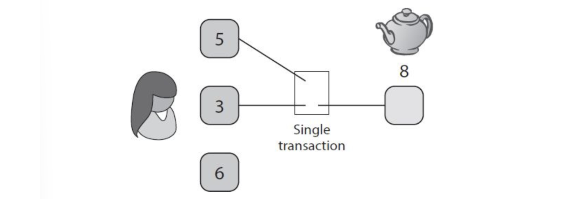
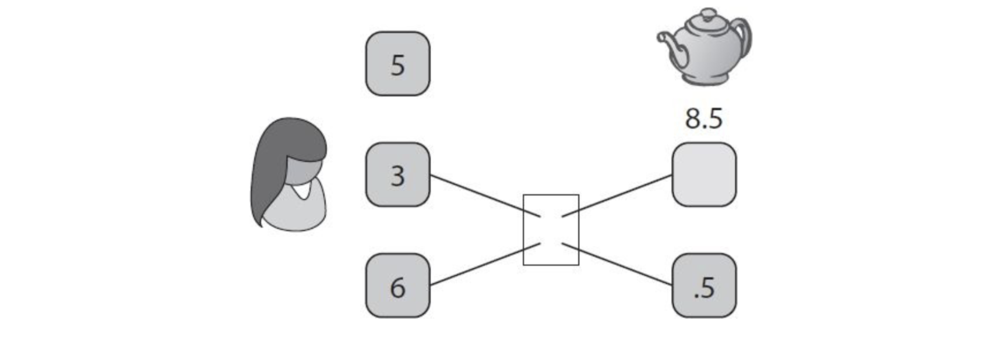
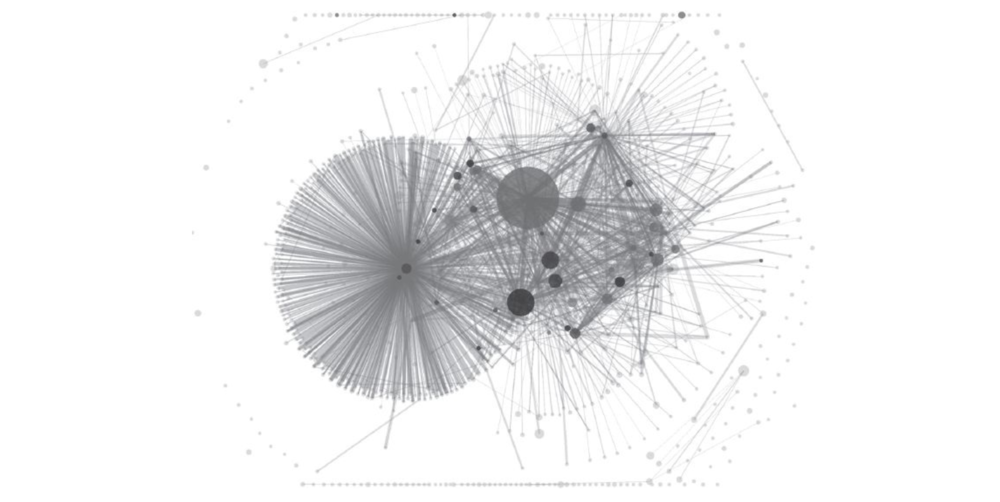
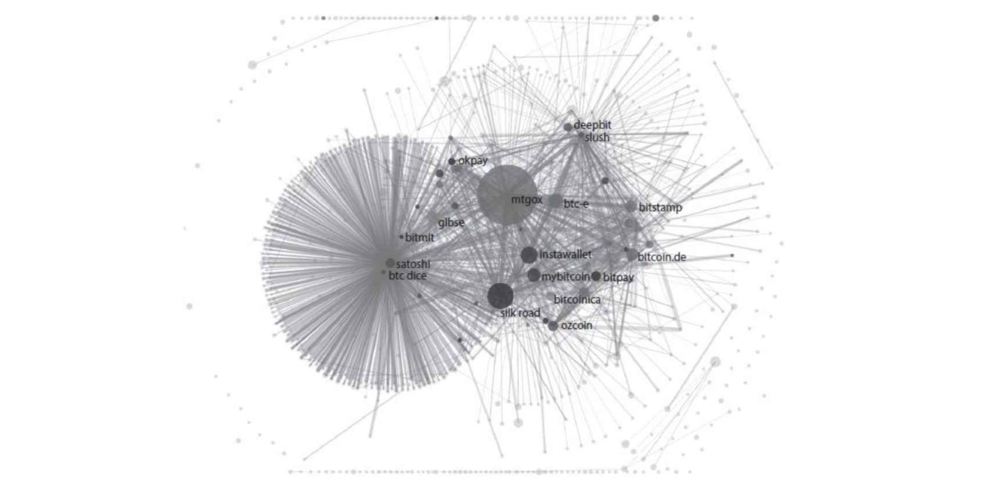

# Bitcoin e anonimità

Due grandi motivi per garantire l'anonimato sono: 

1. Raggiungere il livello di privacy del sistema di banking centralizzato
2. Superarlo, rendendo le transazioni non rintracciabili. 

Non è chiaro come si possano evitare gli aspetti moralmente discutibili dell'anonimato, essendo che tecnologicamente parlando una transazione moralmente onesta ed una moralmente disonesta sono la stessa cosa per Bitcoin. Non ci resta che separare le proprietà di anonimato dai principi legali, concentrandoci sulla prima e lasciando la seconda a chi di competenza.  

## Definizione di anonimato

In informatica, l'anonimity (anonimato) viene definito come l'insieme di due proprietà 

* **Pseudonymity**, utilizzare uno pseudonimo anziché il nome reale;
* **Unlinkability**, difficoltà nel collegare più azioni alla stessa identità;

Bitcoin rispetta la pseudonymity, dato che ogni utente è rappresentato dai propri indirizzi. Questo non basta per ottenere la seconda proprietà: la blockchain è pubblica, quindi lo sono anche le transazioni. Collegare un'indirizzo ad una persona fisica permette a catena di scoprire anche altri indirizzi collegati a questa persona. Collegare indirizzi a persone reali è spesso semplice: exchange, servizi wallet, mercanti spesso conoscono o pretendono di conoscere l'identità reale per eseguire delle azioni. 

> **Side channels**
> Uno pseudonimo può essere deanonimizzato sfruttando canali secondari o informazioni indirette. Se un utente effettua con lo stesso indirizzo delle transazioni a degli orari specifici, ed un utente Twitter è attivo in quegli stessi orari, dopo un lungo periodo di monitoraggio è possibile ipotizzare che l'utente e l'indirizzo combacino. La pseudonymity non è quindi sufficiente. 

## Unlinkability

Per contestualizzare la unlinkability in Bitcoin, numeriamo le seguenti proprietà: 

1. Deve essere difficile collegare diversi indirizzi dello stesso utente
2. Deve essere difficile collegare diverse transazioni dello stesso utente
3. Deve essere difficile collegare il pagante dal pagato

Se intendiamo un pagamento come una singola transazione, allora la proprietà (3) è banalmente non vera, dato che le transazioni hanno un input ed un output e sono pubbliche nella blockchain. Per pagamento intenderemo qualsiasi cosa abbia l'effetto di trasferire bitcoin da un indirizzo ad un altro, attraverso un certo numero di transazioni. Non vogliamo che il sender sia collegato all'ultimo ricevente dei bitcoin, osservando la blockchain. 

> [Blaumer G. (2011) Unlinkability](https://link.springer.com/referenceworkentry/10.1007/978-1-4419-5906-5_236)
> Unlinkability of two events occurring during a process under observation of an attacker is the property that the two events appear to the  attacker *after the process* exactly as much related – or unrelated – as they did *before the process* started (see [[1](https://link.springer.com/referenceworkentry/10.1007/978-1-4419-5906-5_236#CR1_236)]).

## Anonimity Set

Anche utilizzando una versione più generica di "pagamento", il solo fatto che l'ammontare di BTC esca da un indirizzo, e (circa) lo stesso ammontare arrivi in un altro indirizzo, in un arco di tempo "limitato", permette di collegare gli attori del pagamento con alta probabilità. 

Per questo motivo, ammorbidiamo la definizione considerando un **anonimity set**, ovvero un insieme di transazioni tra cui l'avversario non riesce a distinguere la nostra transazione. 

Anche se l'avversario riconosce che noi abbiamo effettuato una transazione, non riesce a distinguerla tra tutte le transazioni dell'anonimity set, ma sa che è una tra queste. L'obiettivo è quello di massimizzare la cardinalità di questo insieme. 

Tuttavia, per calcolare la grandezza dell'insieme è necessario modellare l'avversario (o gli avversari), quindi capire cosa sanno, cosa non sanno, cosa cerchiamo di nascondere e cosa non possono sapere, in modo da mantenere l'anonimato. Non esiste una regola generale, ma le analisi variano caso per caso. 

> **Taint analysis**
> L'analisi di Taint calcola quanto due indirizzi siano correlati tra loro. Se i bitcoin dell'indirizzo $S$ finiscono sempre all'indirizzo $R$ (anche passando per indirizzi intermedi), allora $(R,S)$ avranno un Taint score alto. Lo score non garantisce anonimato, dato che un avversario potrebbe utilizzare informazioni di canali secondari per raggiungere il suo scopo. 

## Anonimato vs decentralizzazione

Il sistema e-cash di David Chaum riusciva a raggiungere l'anonimato, ma sfruttando un sistema centralizzato (banca). Supponiamo esista un modo per creare una firma digitale di un documento, senza vedere il documento in questione. Questo processo prende il nome di **blind signature** e sta alla base del sistema e-cash. In generale, il pagamento tra $A$ e $B$ avveniva nel seguente modo: 

* $A$ ha 10 monete in banca
* $A$ vuole ritirare una moneta, quindi genera un numero seriale casuale per quest'ultima e chiede alla banca di utilizzare la blind signature per firmare il numero seriale. 
* La banca utilizza la blind signature per firmare il numero seriale e scala 1 moneta dal conto di $A$. 
* $A$ paga 1 moneta a $B$ fornendo il numero seriale e la firma della banca. 
* $B$ chiama la banca e detta il numero seriale: se la banca non ha mai sentito il seriale e la firma è valida, allora la banca aggiunge il seriale nella lista dei seriali utilizzati e inserisce una moneta nel conto di $B$. Se il seriale è già stato inserito nella lista, allora $A$ sta cercando di fare double spending, quindi $B$ non riceve i soldi. 

In questo modo, la banca non riuscirà a collegare il pagamento tra $A$ e $B$, non conoscendo il seriale generato da $A$ quando viene firmato. 

Decentralizzare protocolli del genere è difficile, tanto da pensare che l'idea di anonimato si contrapponga a quella di decentralizzazione. Monete come zerocash e zerocoin raggiungono proprietà del genere pur essendo decentralizzate, attraverso complessi giochi crittografici.

> **Blind signature**
> Supponiamo che Alice voglia far firmare a Bob un messaggio $m$, senza far conoscere $m$. Alice applica a $m$ una funzione $f$ con particolari proprietà. Sia $c=f(m)$, Alice invia $c$ a Bob. Quest'ultimo calcola la firma $c'=g(c)$, ovvero $c'= g(f(m))$ ed invia la firma $c'$ ad Alice. La proprietà particolare di $f$ è che $g(f(m))=g(m)$ e quindi $c' = g(m)$ è la firma di $m$.

## Deanonimizzare Bitcoin

Supponiamo che Alice voglia comprare una teiera da 8 BTC. Supponiamo che i suoi BTC siano in 3 separati UTXO rispettivamente con 3, 6 e 5 BTC. Alice deve combinare due UTXO per pagare la teiera:

Questa transazione rivela che le due UTXO sono con alta probabilità appartenenti allo stesso utente. Lo **shared spending** è una evidenza di controllo su indirizzi differenti. Un avversario potrebbe transitivamente riconoscere gli altri indirizzi e transazioni di Alice, controllando a catena altri shared spending. Supponiamo adesso che la teiera costi 8.5 BTC, allora Alice dovrebbe pagare con le UTXO da 6 e 3, e necessiterebbe di un resto di 0.5 BTC. 

Il resto va in un **change address** di Alice. L'avversario potrebbe individuare il resto e conoscere un ulteriore indirizzo da collegare ad Alice. Supporre che il resto sia sempre l'output minore non è sempre corretto, ma supporlo nel caso in cui l'input è composto da più monete è generalmente una correct guess.

### Idiomi di utilizzo

Quello visto precedente è un idioma di utilizzo. Un altro idioma di utilizzo molto potente scoperto dalla ricercatrice **Sarah Meiklejonh** è il seguente: un change address è spesso un nuovo indirizzo generato da un wallet. Questo implica che tale indirizzo non è coinvolto in alcune transazioni precedenti. Questa osservazione non vale invece per l'indirizzo a cui è indirizzato il pagamento. Questa euristica ha permesso di effettuare grossi **linking** di indirizzi. L'idioma non è da assumersi vero, dato che i wallet e gli utenti potrebbero cambiare comportamento di conseguenza. 

### Identificare cluster

La seguente immagine mostra come Meiklejonh et al. clusterizzarono gli indirizzi Bitcoin utilizzando idiomi di base come euristiche. 

Possiamo attaccare delle etichette ai cluster facendo delle considerazioni sull'economia del periodo in cui è stato prodotto il grafico. Il diametro dei cluster è proporzionalmente grande al volume di denaro che circola nello stesso. Potremmo etichettare il cerchio più grande come Mt. Gox, il più grande Bitcoin exchange nel 2013, ed il cerchio con moltissime transazioni ma con poco volume come Satoshi Dice, un provider di giochi d'azzardo con piccole puntate attraverso Bitcoin. 

Un altro modo più sicuro per etichettare un cluster è interagire con un servizio (facendo acquisti, convertendo valuta in Bitcoin). La transazione finirà nella blockchain, così come l'indirizzo fornito dal servizio. Bisogna poi mappare l'indirizzo in uno dei cluster e dopodiché sarà possibile etichettare il cluster con il nome del servizio. Da questo tipo di indagine, vengono fuori le seguenti etichette: 

### Identificare individui

Per deanonimizzare un individuo bisogna conoscere almeno un indirizzo da lui utilizzato. Spesso questo avviene nei seguenti modi: 

* Transazioni dirette, effettuate di persona
* Service providers che richiedono l'identità per prestare servizio
* Mancanza di attenzione degli utenti, che postano online i propri indirizzi
* Avanzamento negli algorimti di deanonimizzazione

Le tecniche di deanonimizzazione si basano sulla **transaction graph analysis**, ovvero analisi condotte sul grafo delle transazioni. 

### Network layer deanonimization

La network layer deanonimization è una tecnica che non sfrutta l'analisi del grafo delle transazioni, bensì la rete su cui esse viaggiano. Il criterio afferma che con alta probabilità, chi trasmette per primo la transazione è proprio il creatore di quest'ultima. Se un insieme sufficientemente grande di nodi collude, allora potrebbero smascherare il primo nodo che trasmette una specifica transazione. In questo modo, verrebbe collegato indirizzo Bitcoin all'indirizzo IP del nodo, che facilmente si collega ad una identità reale. Il problema viene parzialmente risolto utilizzando **Tor**, che permette una comunicazione anonima per Internet basata sul protocollo di rete di onion routing. Tor è pensato per navigazione a bassa latenza, quindi è un trade-off tra anonimità e performance. Essendo Bitcoin ad alta latenza, potremmo utilizzare sistemi che garantiscono meglio l'anonimità sulla rete, come le **mix-net**.

### Onion routing

L'onion routing è la tecnica di anonimizzazione utilizzata in una rete onion. I messaggi sono incapsulati in strati di crittografia (paragonati agli strati della cipolla). Il dato cifrato viene trasmesso attraverso una serie di nodi, chiamati onion router, ognuno dei quali "sbuccia" via un singolo strato di crittografia, scoprendo così chi è il prossimo nodo di destinazione del dato. Il mittente rimane anonimo perché ciascun intermediario conosce solo la posizione del nodo immediatamente precedente e di quello immediatamente successivo.  

## Mixing

Lo scopo di un servizio di mixing è quello di indebolire la transaction graph analysis. L'idea è quella di utilizzare un intermediario per effettuare una transazione, in modo da non collegare mittente e destinatario direttamente nel transaction graph.

### Online wallets as Mixes

I wallet online permettono di depositare Bitcoin e di prelevarli successivamente. Al prelievo, i coin non saranno gli stessi di quelli depositati. Gli online wallet potrebbero essere considerati servizi di mixing. Tuttavia, dobbiamo considerare che:

* Non garantiscono che avvenga il mixing 
* (quindi) il meccanismo di mixing potrebbe essere sostituito
* Per motivi legali tracciano i collegamenti depositi-prelievi
* Molto spesso conoscono la vera identità dell'utente

Per i motivi sopracitati, usare un online wallet come servizio di mixing ci porrebbe in una posizione peggiore rispetto a quella precedente. L'anonimato fornito dagli online wallet è lo stesso di quello fornito dalle banche: un'entità centralizzata che conosce le nostre transazioni. Se un online wallet viene hackerato, le conseguenze sono peggiori rispetto alla controparte bancaria: gli indirizzi verrebbero collegati alle identità reali, e dato che la blockchain è pubblica, si potrebbe consultare per tracciare le loro transazioni. 

### Servizi di Mixing dedicati (mixer)

I servizi di mixing dedicati, anche chiamati **mixer** (o laundry), promettono di non tener traccia dei collegamenti tra depositi e prelievi e di non richiedere l'identità reale dell'utente. Nella pratica si inviano i Bitcoin al servizio di mixing indicando un indirizzo di destinazione, e si attende che il servizio effettui la transazione. Nulla vieta al mixer di non inviare i Bitcoin all'indirizzo di destinazione, per cui bisogna fidarsi del servizio.

### Linee guida per il mixing

Presentiamo delle linee guida per aumentare il grado di anonimato fornito dai mixer, e per incrementare la fiducia degli utilizzatori.

1. **Utilizzare una serie di mix.** Il primo principio è quello di utilizzare una serie di mix uno dopo l'altro.
2. **Utilizzare transazioni uniformi.** Usare tagli standard (ognuno dei quali è chiamato **chunk size**) permette di uniformare le transazioni che partecipano al mixing, rendendole più difficili da distinguere ed incrementando l'anonimity set.
3. **Il client dovrebbe essere automatizzato.** L'automatismo provvisto da un software, come un privacy-friendly wallet, difende da attacchi basati sul timing delle transazioni. 
4. **Le mixing-fees dovrebbero essere All-or-Nothing.** I servizi di mixing vogliono essere pagati. Le mixing fees potrebbero essere percentuali detratte dalle chunk-size, ma a questo punto non si avrebbe più una grandezza standard. Una soluzione migliore consiste nel settare la probabilità che il mixer si tenga l'intero chunk, ad esempio lo 0.001%, 1 chunk su ogni 1000 trasmessi. Il chunk sfortunato andrà interamente al mixer. Risulta difficile garantire agli utenti che tale probabilità sia rispettata, e che il mixer non prenda più chunk di quanto ne millanti. Una soluzione è data da Mixcoin, un paper del 2014 prodotto da Bonneau. 

### Il mixing nella pratica

Nella pratica non sono stati realizzati sistemi di mixing stabili. Il problema consiste nel bootstrapping di un mixer, che non garantisce molto finché non ha un bacino di utilizzatori consistente. Inoltre alcuni mixer sono stati colti a rubare Bitcoin.

### Mixing decentralizzato

Un protocollo di mixing decentralizzato si allinea con la filosofia di Bitcoin. L'idea è quella di sviluppare un protocollo peer-to-peer in cui un gruppo di utenti possono fare mixing dei loro coin. Il protocollo non avrebbe problemi di bootstrapping e (teoricamente) non sarebbe possibile effettuare furti. Il mixing decentralizzato provvede migliore anonimato, ed un esempio è la proposta CoinJoin. 

#### CoinJoin

CoinJoin è la proposta principale di mixing decentralizzato. Utenti differenti si uniscono per creare una singola transazione combinando tutti i loro input, e firmano i rispettivi. Ogni utente indica l'indirizzo di input (UTXO) e quello di output. L'ordine degli input e degli output è permutato randomicamente. L'utente controlla che l'output sia incluso nella transazione condivisa e che esso riceva il numero di Bitcoin prestabilito (meno le tx fees), e dopodiché procede a firmare la transazione. Chi osserva la tx nella blockchain, non saprà il mapping tra gli input e gli output. Gli utenti dovrebbero ripetere più round di mixing e assicurarsi che la chunk size sia quella standard. 

Gli step del protocollo CoinJoin sono i seguenti: 

1. Cercare i peer che vogliono effettuare mixing
2. Scambiare gli indici di input e output
3. Costruire la transazione (svolta da un peer qualunque)
4. Inviare la tx ad ogni partecipante ed attendere la firma
5. Inviare la tx firmata in broadcast

Il primo step può essere supportato da un server che fa da hub tra chi vuole effettuare mixing. I peer proseguiranno poi da soli. Servono protocolli di anonimizzazione affinché durante la comunicazione di input e output agli altri peer non venga svelata la nostra transazione (es. usare Tor). Così definito, il protocollo è debole contro attacchi di **Denial of Service**, che non permettono il suo completamento: un utente potrebbe partecipare alla prima fase, ma rifiutarsi di firmare la transazione, oppure firmare e cercare di effettuare double spending con lo stesso input. Per impedire questo tipo di attacco, si propone l'imposizione di un costo per partecipare al protocollo (es. proof of work, o proof of burn su un piccolo quantitativo di Bitcoin).

#### High level flows

Supponiamo che Alice riceva mensilmente il suo salario di $x$ BTC e che depositi una percentuale fissata di questo nel suo fondo pensionistico. Anche usando le tecniche di mixing, è possibile sfruttare la periodicità di queste transazioni per collegare i due indirizzi. Questo tipo di pattern viene chiamato **high level flow** (flusso di alto livello). Un modo per rompere il pattern è chiamato **merge avoidance**: anziché unire i singoli input per pagare un certo prezzo, vengono specificati $N$ indirizzi di output su cui effettuare pagamenti con singoli input la cui somma corrisponde al prezzo. Affinché funzioni, il ricevente deve evitare di combinare le monete ricevute in un'unico indirizzo. La merge avoidance evita che gli indirizzi siano clusterizzati a causa delle transazioni in cui essi risultano sfruttati insieme.

 

