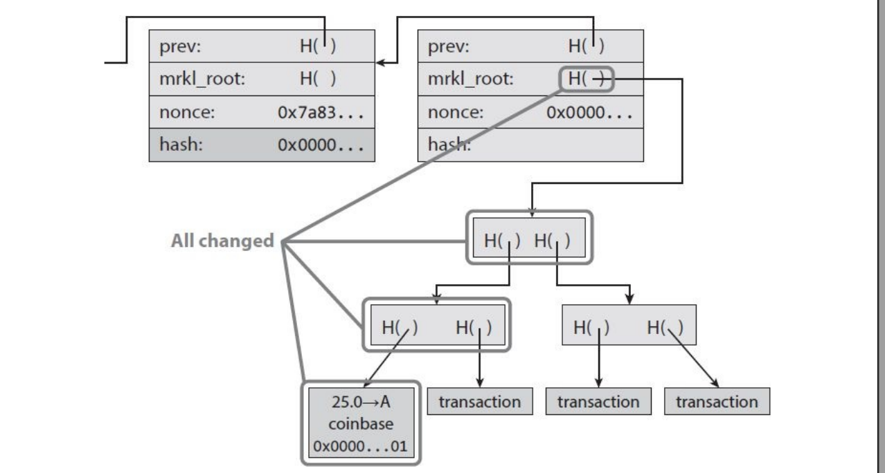
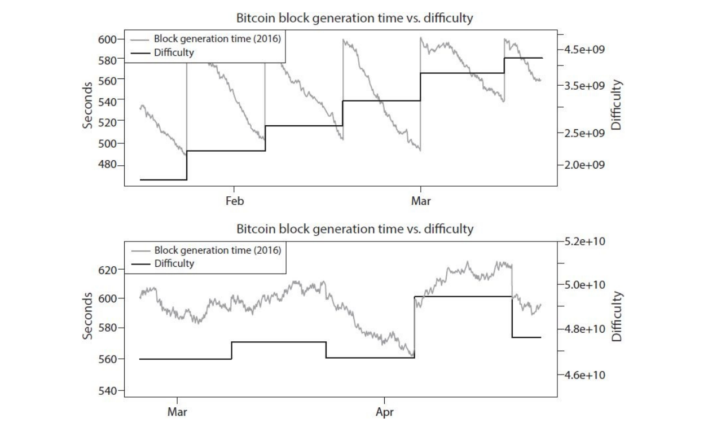
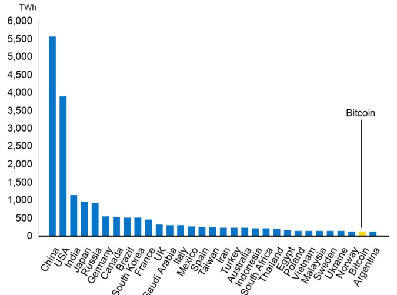

# Bitcoin mining

> Il mining oggi è simile alla corsa all'oro e a tutti gli schemi get-rich-quick.

Ci sono 6 task principali svolti da un miner, e sono i seguenti: 

1. **Ascoltare le transazioni**, verificare le firme e controllare se sono double spending. 
2. **Mantenere la blockchain**, ricevere e validare i nuovi blocchi.
3. **Assemblare un nuovo blocco candidato** inserendo solo tx valide.
4. **Trovare una nonce** che renda il blocco candidato valido.
5. **Sperare che il blocco venga accettato** all'interno della catena di consenso.
6. Godersi il **profitto** dato dalla block-reward e dalle tx fees. 

Possiamo suddividere i precedenti in task che aiutano a mantenere l'ambiente bitcoin in salute (1, 2, 3) e task che servono ad incentivare i miner a continuare il loro lavoro (4, 5, 6). Entrambe le categorie sono necessarie per far funzionare Bitcoin come criptovaluta. 


## Trovare un blocco valido

Per prima cosa, il miner deve costruire un merkle tree attraverso delle tx valide contenute nel proprio transaction pool. Il numero di tx da includere è limitato dalla dimensione massima di un blocco. Dopodiché si crea un blocco il cui header punta al blocco precedente della blockchain. La block header include un campo nonce da 32 bit che con tanta fortuna ospiterà la nonce vincente. Una nonce vincente è un valore che permette alla funzione hash di produrre un output al di sotto del valore target. Se provando tutte le $2^{32}$ combinazioni non si trova una nonce vincente, allora è possibile cambiare il contenuto arbitrario all'interno della coinbase transaction, e continuare a provare a cambiare nonce. 



Cambiare il contenuto della coinbase transaction è un'operazione più onerosa poiché la modifica di tale nodo comporta il ricalcolo parziale del merkle tree. Per questo, per la maggior parte del tempo la nonce cambiata è quella posizionata nel block header. 

> Nel 2015 la difficoltà era tale da trovare una nonce valida una volta su $2^{68}$, circa il quadrato del numero totale di esseri umani nella Terra. 

I miner non lavorano tutti allo stesso puzzle, banalmente poiché i blocchi candidati sono spesso diversi (tx diverse, ordine delle tx diverso, campo coinbase arbitrario). 


## Determinare la difficoltà del mining

La difficoltà del mining cambia ogni 2016 blocchi, ovvero circa ogni 2 settimane. 

```
2016 * 10 = 20160 minuti totali
20160 / 60 = 336 ore totali
336 / 24 = 14 giorni totali = 2 settimane
```

La regola di aggiornamento della difficolta è la seguente: 
$$
\text{next difficulty} = 
\text{(prev difficulty)} \cdot 
\frac{ 2016 \cdot 10 \text{ minutes}}{\text{time to mine last 2016 blocks}}
$$
Al numeratore abbiamo $2016 \cdot 10$ minuti, ovvero esattamente 2 settimane. L'effetto della formula è il seguente: la difficoltà cresce se i 2016 blocchi sono stati estratti prima di 2 settimane, e quindi in media si produce un blocco in meno di 10 minuti. Al contrario, la difficoltà diminuisce se i miners impiegano più di due settimane per il mining di 2016 blocchi.

> Non c'è nulla di speciale nelle due settimane, ma se il periodo fosse **molto** più corto allora il risultato della formula sarebbe molto più influenzato dalle variazioni del mining, mentre se fosse **molto** più lungo non aggiornerebbe in tempo la difficoltà per impedire che il sistema decolli. 

Ogni miner calcola la difficoltà indipendentemente, due miner che hanno come riferimento lo stesso ultimo blocco avranno la stessa difficoltà. Il fattore al denominatore varia anche in base al mercato dei bitcoin. 

Il grafico sottostante mostra quanti secondi passano tra un blocco e l'altro in media ogni giorno (per due mesi). Notiamo che ogni 2016 blocchi il tempo medio viene "resettato" a 10 minuti a causa del ricalcolo della difficoltà. Nei mesi Febbraio e Marzo la difficoltà aumentava del 25% ogni due settimane, fino ad arrivare al periodo di Marzo e Aprile, in cui la difficoltà era insostenibile tanto da dover decrescere (il tasso di aumento della difficoltà è andato in negativo). 




### CPU Mining pseudocode

```python
TARGET = (65535 << 208) # difficulty
coinbase_nonce = 0
block_found = False
while not block_found:
    header = make_block_header(txs, coinbase_nonce)
    for header_nonce in range(1 << 32):
        block = make_block(header, header_nonce)
        if sha256(sha256(block)) < TARGET:
            block_found = True
            break
	coinbase_nonce += 1
```


## Mining hardware

| Device | hash rate | Anni per blocco (~) | pro                               | contro                                                      |
| :----: | :-------: | :-----------------: | --------------------------------- | ----------------------------------------------------------- |
|  CPU   |  20 Mh/s  |     960.000.000     | nessuno                           | no parallelismo                                             |
|  GPU   | 200 Mh/s  |       960.000       | parallelismo                      | consumi, scarsa efficienza termica, componenti inutilizzate |
|  FPGA  |  1 Gh/s   |       200.000       | programmabili, ottime prestazioni | breve successo                                              |
|  ASIC  |  1 Th/s   |          2          | prestazioni estreme               | rapida obsolescenza                                         |

> ASIC: Application-Specific integrated circuits

La rapida obsolescenza degli ASIC è data dal fatto che essi contribuiscono rapidamente alla crescita della difficoltà del puzzle. 


## Il mining e l'ambiente

Tramite il [principio di Landauer](https://it.wikipedia.org/wiki/Principio_di_Landauer) possiamo stimare un lower bound del consumo energetico per ogni bit perso in una operazione non reversibile. Come usa l'energia il mining di Bitcoin?

1. Energia incorporata: produzione, gestione e spedizione degli ASICs
2. Elettricità: computazioni attraverso ASIC, principio di Landauer
3. Raffreddamento: alimentazione dei sistemi di raffreddamento

L'energia incorporata e l'elettricità diminuiscono quando si lavora su larga scala: chip più economici, meno alimentatori. Al contrario, i costi di raffreddamento aumentano (a meno di non aumentare lo spazio in cui sono disposti i dispositivi). Il grafico sottostante ci mostra che ad oggi (2022) il consumo energetico del mining supera quello dell'Argentina: 





Un'idea è quella di riproporre il calore creato dal mining per fare qualcosa di utile, come sostituire impianti di riscaldamento. 


## Mining pools

Le mining pools sono analoghe alle società di mutua assicurazione, dove i soci forniscono da assicuratori e da assicurati. Un gruppo di miner si riunisce in una mining pool per cercare di minare un blocco. Tutti condividono un destinatario comune della coinbase (ovvero della block reward), che prende il nome di **pool manager**. Quest'ultimo distribuirà la reward a tutta la pool, tipicamente in maniera proporzionale al lavoro svolto dai partecipanti. Per segnalare al pool manager il lavoro svolto, il miner potrebbe inviare delle **share**, ovvero dei blocchi semi validi (non validi per poco). Il pool manager crea il blocco con la transazioni e lo invia ai partecipanti, che cercheranno la nonce. Quando un partecipante trova una nonce valida, invia tutto al pool manager, e se il blocco entra nella blockchain, la reward viene suddivisa ai miners della pool, senza bonus aggiuntivi a colui che ha trovato la nonce. 


