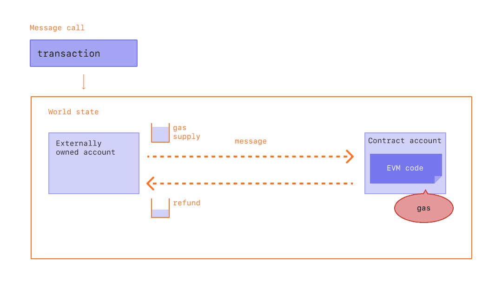
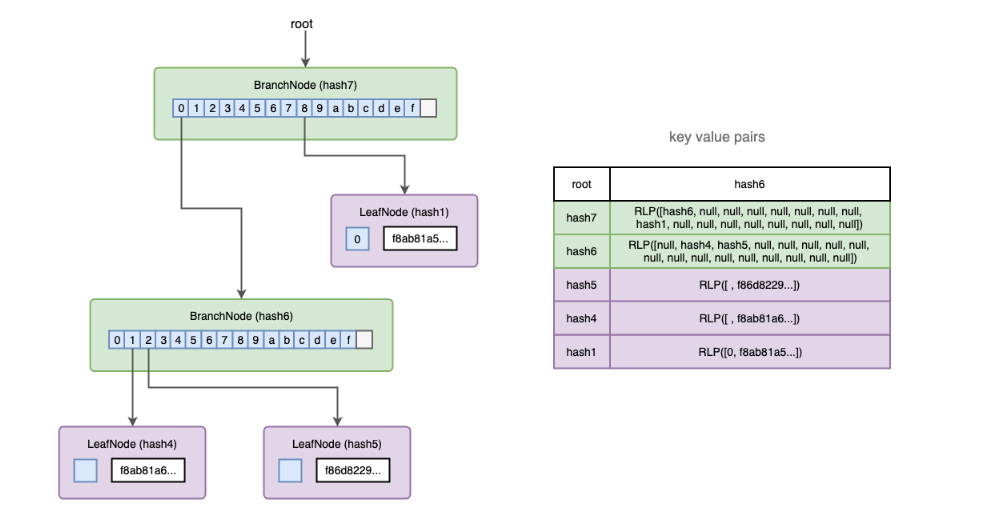

# Ethereum 

[TOC]

Nell'universo Ethereum esiste un singolo, computer canonimo chiamato Ethereum Virtual Machine (EVM), il cui stato è stabilito da un consenso omogeneo nella rete. Chiunque voglia partecipare alla rete Ethereum (Ethereum node) tiene una copia di tale stato nel proprio computer. Ogni partecipante può inviare in broadcast una richiesta per effettuare una computazione arbitraria. Alla sottomissione della richiesta, gli altri partecipanti verificano, validano ed eseguono la computazione. Questa esecuzione causa la transizione della EVM ad un nuovo stato, che viene propagato (commitment) alla rete in broadcast. Le richieste di computazione prendono il nome di **transaction request** ed insieme allo **stato della EVM** vengono conservate nella blockchain, il cui contenuto è confermato attraverso un protocollo di consenso. 


## 1. Cosa è un ether?

L'ether (ETH) è la cryptocurrency nativa di Ethereum. Lo scopo dell'ether è quello di consentire un mercato per la computazione. Un mercato di questo tipo fornisce un incentivo economico affinché i partecipanti verifichino ed eseguano le richieste di transazione e forniscano risorse di calcolo alla rete. Ogni partecipante che trasmette una richiesta deve anche offrire alla rete un certo importo in ether a titolo di ricompensa (transaction fees). Il costo della fee cresce con la complessità della computazione da eseguire e dalle risorse richieste. 

|  nome  |   1 ETH   |
| :----: | :-------: |
| ether  |     1     |
| finney |  $10^3$   |
| szabo  |  $10^6$   |
|  wei   | $10^{18}$ |


## 2. Gli account

In Ethereum, lo stato è costituito da **account**, ognuno di essi possiede un indirizzo di 20 byte. Per transizione di stato ci si riferisce al *trasferimento diretto di informazioni* tra account. Esistono due tipi di account: 

* **External Owned Account** (**EOA**): controllato da chiunque abbia la chiave privata
* **Smart Contracts**: un agente intelligente controllato dal codice. 

Entrambi i tipi di account hanno l'abilità di ricevere, conservare ed inviare ETH e token, e di interagire con gli altri smart contract. Vediamo le differenze sostanziali: 

| EOA                                                          | Smart Contract                                               |
| ------------------------------------------------------------ | ------------------------------------------------------------ |
| Creare un account non costa nulla.                           | Creare un contratto ha un costo, poiché utilizza l'archiviazione di rete. |
| Può avviare transazioni.                                     | Può inviare transazioni solo in risposta alla ricezione di una transazione. |
| Le transazioni tra EOA possono riguardare unicamente trasferimenti di ETH / token. | Le transazioni da EOA a Smart Contract possono innescare un codice che può eseguire le azioni più svariate, come il trasferimento di token o persino la creazione di un nuovo contratto. |

Gli account Ethereum hanno principalmente quattro campi: 

| Nome          | Descrizione                                                  |
| ------------- | ------------------------------------------------------------ |
| *nonce*       | un contatore che indica il numero di tx inviate dall'account. Questo assicura che le tx siano elaborate una volta. In un account Contract, questo numero rappresenta il numero di contratti creati dallo Smart Contract. |
| *balance*     | Il numero di wei posseduti da questo indirizzo. Ricordiamo che 1 ETH = 1e+18 wei. |
| *codeHash*    | Questo hash si riferisce al frammento di codice (in bytecode) di uno Smart Contract sulla EVM. Ogni volta che il contratto riceve un messaggio, questo frammento viene eseguito. Il codice **non può essere modificato in futuro**. Negli EOA questo campo è vuoto. |
| *storageRoot* | Hash a 256 bit della root di un Merkle Patricia Trie che codifica il contenuto dello spazio di archiviazione dell'account. Negli EOA questo campo è vuoto. |

L'indirizzo dell'account varia in base al tipo. Se l'account è un EOA allora l'indirizzo è l'hash della chiave pubblica, mentre se l'account è uno Smart Contract allora l'indirizzo è l'hash della concatenazione tra indirizzo del creatore e la nonce del creatore. 


### 2.1 Approfondire gli Smart Contracts

Uno Smart Contract è un programma eseguito sulla blockchain di Ethereum. È una raccolta di codice (le funzioni) e dati (lo stato) che risiede ad un indirizzo specifico della blockchain di Ethereum. Gli Smart Contract possono definire regole come un normale contratto, ed eseguirle automaticamente tramite codice. Non sono eliminabili di default e le interazioni con essi sono irreversibili.  

#### 2.1.1 Esempio: Digital Vending Machine

Un distributore è una metafora azzeccata per descrivere gli Smart Contract, poiché con i giusti input è garantito un determinato output. Per ricevere uno snack, la logica è la seguente: 

```python
denaro + scelta dello snack = snack erogato
```

Vediamo come questa funzionalità può essere trasferita in uno Smart Contract, utilizzando il linguaggio ad alto livello Solidity: 

```solidity
pragma solidity 0.8.7;

contract VendingMachine {
	
	// indirizzo dell'owner della vending machine.
	address public owner; 
	// mappa (indirizzo, unità) che conta quanti cupcake ha
	// ciascuno degli indirizzi che interagisce con la v.m.
	mapping (address => unit) public cupcakeBalances;

	// al deploy dello smart contract, impostiamo l'owner
	// all'indirizzo di chi fa il deploy e inizializziamo 
	// il numero di cupcake a 100. 
	constructor() {
		owner = msg.sender;
		cupcakeBalances[address(this)] = 100;
	}

	// solo l'owner può rifornire (di 100 cupcake) il distributore
	function refill(uint amount) public {
		require(msg.sender == owner, "Solo il proprietario può rifornire.")
		cupcakeBalances[address(this)] += amount; 
	}

	// chiunque con almeno 1 ETH può comprare 1 cupcake. 
	// il bilancio dei cupcake dell'acquistatore aumenterà di "amount"
	function purchase(uint amount) public payable {
		require(msg.value >= amount * 1 ether, "Almeno 1 ETH per 1 cupcake");
		require(cupcakeBalances[address(this)]) -= amount;
		cupcakeBalances[msg.sender] += amount; 
	}

}
```


#### 2.1.2 Ancora sugli Smart Contracts

Chiunque può scrivere uno smart contract e distribuirlo nella rete, è sufficiente saper programmare in un linguaggio per Smart Contract (es. Solidity, Vyper) e avere abbastanza ETH. Distribuire uno Smart Contract è tecnicamente una transazione, quindi occorre pagare del gas. I costi in gas per la distribuzione di uno Smart Contract sono però più elevati. Gli Smart Contract sono **pubblici** su Ethereum e possono essere considerati delle API aperte. Significa che è possibile chiamare altri Smart Contract nel proprio contratto in modo da ampliare enormemente quello che è possibile fare con essi. Un contratto può distribuire altri contratti. Gli Smart Contract non possono ottenere informazioni sugli eventi nel mondo reale perché non possono inviare richieste HTTP. Basarsi su informazioni esterne potrebbe pregiudicare il consenso, importante per la sicurezza e la decentralizzazione. Un modo per ovviare a questo problema è l'utilizzo degli [oracoli](https://ethereum.org/it/developers/docs/oracles/).


### 2.2 External Owned Accounts

Un EOA è costituito da una coppia di chiavi crittografiche di firma digitale: pubblica e privata. Una chiave privata si compone di 64 caratteri esadecimali (256 bit) ed è codificabile con una password. La chiave pubblica è generata dalla chiave privata usando ECDSA (Elliptic Curve Digital Signature Algorithm). Si può ottenere l'indirizzo pubblico dell'account attraverso gli ultimi 20 byte dell'hash Kekkak-256 della chiave pubblica e aggiungendo `0x` all'inizio.


## 3. Le transazioni

La transazione è uno speciale messaggio creato e firmato da un EOA (una persona), verso un altro EOA, uno Smart Contract, o atto alla creazione di un nuovo Smart Contract. La transazione viene inviata in broadcast all'intera rete e modifica lo stato globale della EVM. I miner si occuperanno di elaborare e validare la richiesta di transazione e di calcolare il nuovo stato della EVM. Le transazioni richiedono una commissione, di cui parleremo dopo. Una transazione contiene le seguenti informazioni: 

| Campo                  | Descrizione                                                  |
| ---------------------- | ------------------------------------------------------------ |
| *recipient*            | L'indirizzo ricevente (se si tratta di un account di proprietà esterna,  la transazione trasferirà valore. Se si tratta di un contratto, la  transazione eseguirà il codice del contratto) |
| *signature*            | Identificatore del mittente. Viene generata quando la chiave privata del mittente firma la transazione e conferma che il mittente ha autorizzato la transazione. |
| *value*                | Quantità di ETH da trasferire dal mittente al destinatario (in WEI, un taglio dell'ETH) |
| *data*                 | Campo opzionale per includere dati arbitrari                 |
| *gasLimit*             | Importo massimo di unità di gas che possono essere consumate  dalla transazione. Le unità di carburante rappresentano fasi di calcolo |
| *maxPriorityFeePerGas* | la quantità massima di carburante da includere come mancia al miner |
| maxFeePerGas           | la quantità massima di carburante che si è disposti a pagare per la transazione (comprensiva di *baseFeePerGas* e *maxPriorityFeePerGas*) |

Vediamo un esempio di transazione: 

```json
{
  from: "0xEA674fdDe714fd979de3EdF0F56AA9716B898ec8",
  to: "0xac03bb73b6a9e108530aff4df5077c2b3d481e5a",
  gasLimit: "21000",
  maxFeePerGas: "300",
  maxPriorityFeePerGas: "10",
  nonce: "0",
  value: "10000000000",
}

```

Su Ethereum esistono due diversi tipi di transazione: 

| Nome                    | Tipo                              | To             | Descrizione                                                  |
| ----------------------- | --------------------------------- | -------------- | ------------------------------------------------------------ |
| Trasferimento di valuta | Ordinary Transaction              | EOA            | Una transazione di ETH da un account ad un altro             |
| Attivazione contratto   | Ordinary Transaction              | Smart Contract | Esecuzione del codice di un contratto, triggerandolo e passando eventualmente parametri dal campo data. |
| Creazione contratto     | Contract Distribution Transaction | -              | creazione di un nuovo contratto, in tal caso i dati conterranno il codice del contratto. |


### 3.1 Costo in gas delle transazioni

Come accennato, le transazioni hanno un costo in gas per essere eseguite. Semplici transazioni di trasferimento richiedono 21000 unità di carburante. Per poter inviare 1 ETH ad Alice con una baseFeePerGas di 190 gwei ed una maxPriorityFeePerGas di 10gwei, Bob dovrà pagare la seguente commissione: 

```py
(190 + 10) * 21000 = 4,200,000 gwei = 0.0042 ETH
```

In questo caso: 

1. A Bob verranno addebitati -1,0042 ETH
2. Ad Alice verrà accreditato +1.0 ETH
3. La commissione base brucerà -0.00399 ETH
4. Il miner riceverà una mancia di +0.000210 ETH

Il carburante è richiesto anche per ogni interazione con Smart Contract. Il carburante non utilizzato viene **rimborsato** all'utente. 



### 3.2 Ciclo di vita delle transazioni

Una volta inviata una transazione, succede quanto segue: 

1. Viene generato un hash crittografico della transazione
2. Viene inviata in broadcast e inclusa nel mempool dei miner 
3. Il miner sceglie la tx da inserire nel blocco per verificarla e considerarla riuscita
4. La tx riceverà un certo numero di conferme (blocchi creati dopo il blocco che la contiene)

Più alto è il numero di conferme, maggiore è la certezza che la rete abbia elaborato e riconosciuto la transazione. 


### 3.3 I messaggi

Per messaggio si intende in generale una comunicazione tra account Ethereum. Una transazione è un messaggio, firmato da un EOA. Anche una chiamata `CALL` effettuata da un contratto ad un altro contratto ([composability](https://ethereum.org/en/developers/docs/smart-contracts/#composability)) è un messaggio, ma questo non ha bisogno di firme o convalidazioni, essendo un codice deterministico è possibile riprodurre i messaggi inviati data una transazione in input.  Vediamo come una transazione effettuata da un utente può scatenare una catena di messaggi: 

```
     T--------------------------------(msg)
 	 | 									|
     v                   |(msg)----> CNTR_2 (msg)---> EOA_2 
EOA_1 (tx)---> CNTR_1 -- |				
                     	 |(msg)----> CNTR_3 
```


## 4. ⚒️ Gas e commissioni

>[Link alla documentazione](https://ethereum.org/en/developers/docs/gas)

>  **ROBA GIÀ SCRITTA**
>
>  primi tre campi sono standard in ogni crypto. Il campo **data** può essere utilizzato per interagire con i contratti, nel caso di un contratto che implementa un DNS distribuito potremmo utilizzare il campo data per specificare la coppia \<dominio/ip\> e inviarla al contratto. I campi **STARTGAS** e **GASPRICE** sono essenziali per il sistema anti-DoS di Ethereum. Per contrastare dei loop infiniti intenzionali o accidentali, ad ogni transazione si associa un numero massimo di step computazionali da eseguire. L'unità di computazione è chiamata **gas**, spesso uno step computazionale costa 1 gas, ma esistono operazioni che ne richiedono di più poiché computazionalmente costose o poiché richiedono di conservare un certo quantitativo di dati nello stato. Esiste anche una fee di 5 gas per ogni byte nel campo transaction data. L'intento del sistema di fee è quello di far pagare all'attaccante un costo proporzionale ad ogni risorsa consumata, includendo il calcolo, la banda e lo storage. In sintesi: 
>
>  * Si pagano 5 gas per ogni byte nel campo dati
>  * Si paga 1 gas circa per ogni step computazionale
>  * Si paga >1 gas per step computazionalmente o spazialmente onerosi.


## 5. La Ethereum Virtual Machine (EVM)

L'EVM esiste come entità singola gestita da migliaia di computer collegati, che eseguono un client Ethereum. Il protocollo Ethereum stesso esiste unicamente allo scopo di garantire un funzionamento continuo, ininterrotto e immutabile di questa speciale macchina a stati. Essa è l'ambiente in cui sono presenti tutti gli account Ethereum (EOA e Smart Contracts). In ognuno dei blocchi della blockchain, Ethereum ha uno ed un solo stato "canonico", e la EVM è ciò che definisce le regole per calcolare un nuovo stato valido da blocco a blocco.  Mentre Bitcoin è considerabile un libro mastro distribuito, dato che quello che principalmente si può fare sono delle transazioni, Ethereum è da considerarsi una macchina a stati distribuita, che permette anche di eseguire dei programmi chiamati Smart Contract. Lo stato di Ethereum è una enorme struttura dati che contiene non solo gli account e i rispettivi saldi, ma anche una macchina a stati che può cambiare da blocco a blocco in base ad un set prefissato di regole, e che può eseguire codice macchina arbitrario. Le regole specifiche di cambio stato da blocco a blocco sono definite dall'EVM. 


### 5.1 La funzione di transizione di stato


L'EVM si comporta come una funzione matematica: dato un input, produce un output deterministico. Quindi è più utile descrivere formalmente Ethereum come avente una funzione di transizione di stato: 
$$
Y(S, T) = S'
$$
Dato un vecchio stato valido $S$ ed un nuovo set di transizioni valide $T$, la funzione di transito di stato di Ethereum $Y(S, T)$ produce un nuovo stato di output valido $S'$. Nell'ambito di Ethereum, lo **stato** è un enorme struttura di dati chiamata **Modified Merkle Patricia Trie** (di cui parleremo in seguito) che tiene tutti gli account collegati tramite hash e riducibili ad un singolo hash della root, memorizzato sulla blockchain. La funzione di transizione di stato `Y(S, T) -> S'` può essere definita come segue: 

* Controllare se la transazione è sintatticamente valida, che la sua firma sia valida e che la nonce combaci con la nonce conservata nell'account del mittente. Altrimenti ritorna errore. 
* Calcolare la transaction fee come `STARTGAS * GASPRICE` e determina l'indirizzo del mittente dalla firma. Sottrarre la fee dal bilancio dell'account del sender e incrementare la nonce del sender. Se il sender non ha abbastanza ether, ritornare errore. 
* Inizializzare `GAS = STARTGAS` e rimuovere una certa quantità di gas per byte per pagare i byte della transazione. 
* Trasferire il valore da transare dall'account del mittente all'account del destinatario. Se l'account destinatario non esiste, crealo. Se l'account destinatario è un contratto, esegui il codice del contratto fino a completamento o fine ad esaurimento del gas. 
* Se il trasferimento fallisce a causa della mancanza di soldi del mittente, o dell'esaurimento di gas, esegui un revert di tutti i cambiamenti di stato eccetto per il pagamento delle fees, e inserisci le fees nell'account del miner.
* Se il trasferimento ha successo, ritorna le fees del gas rimanente al mittente, e invia le fees per il gas consumato al miner. 


#### 5.1.1 Esempio di transazione di stato

Supponiamo che il codice del contratto sia: 

```python
if !self.storage[calldataload(0)]:
	self.storage[calldataload(0)] = calldataload(32)
```

Notiamo che il codice non è scritto il EVM code, bensì in Serpent (linguaggio di alto livello), successivamente compilato in EVM code. Supponiamo che lo storage del contratto parta inizialmente vuoto, e che una transazione viene inviata con i seguenti campi: 

```json
{
	"ether": 10, 
	"gas": 2000, 
	"ether_gasprice": 0.001, 
	"data": <byte[0,31]: "2", byte[32,63]: "CHARLIE">
}
```

1. Controllare che la tx sia ben formata e valida. 
2. Controllare che il sender ha almeno $2000 * .001 = 2$ ether. Se è così, sottrarre 2 dal bilancio del sender.
3. Inizializzare $gas=2000$, assumendo che la tx sia lunga 170 byte e che il byte-fee sia 5, allora sottraiamo $170 * 5 = 850$ gas, rimangono quindi $2000 - 850=1150$ gas rimanenti. 
4. Sottraiamo 10 ether (valore indicato nella tx) dall'account del sender e inseriamoli nell'account del receiver (il contratto). 
5. Eseguiamo il codice: controlla che nello storage l'indice 2 sia libero, e se non lo è, inserisce nell'indice 2 la stringa "CHARLIE". Supponiamo che questo costi 187 gas, allora l'ammontare rimanente di gas è $1150 - 187 = 963$ gas.
6. Ritornare $963 * 0.001 = 0.963$ ether all'account sender, e ritornare lo stato risultante. 

Se dall'altra parte non ci fosse stato un contratto ma un EOA, allora la transaction fee sarebbe semplicemente il GASPRICE moltiplicato alla lunghezza della transazione in byte, e il campo dati trasferito sarebbe irrilevante. 

Notare che i messaggi funzionano in maniera equivalente per il revert: se l'esecuzione del messaggio termina il gas, allora tale esecuzione e tutte le esecuzioni innestate eseguono il revert, ma l'esecuzione parent non necessita di effettuare il revert. Questo implica che è "sicuro" per un contratto richiamare un altro contratto, dato che se A chiama B con G gas, allora all'esecuzione di A è garantita la perdita di al più G gas. Esiste un opcode `CREATE` che permette di creare contratti: tale meccanismo è simile a `CALL`, con l'eccezione che l'output dell'esecuzione determina il codice del contratto creato.


### 5.2 Code execution e memorie

Il codice di un contratto Ethereum è scritto in un linguaggio bytecode di basso livello e stack-based, chiamato "Ethereum virtual machine code" o "EVM code". Il codice consiste in una serie di byte, dove ogni byte rappresenta una operazione. In generale, l'esecuzione del codice consiste in un loop infinito che seleziona l'operazione indicata dal program counter e la esegue, incrementando poi il program counter di 1 (esso parte da 0), fino alla fine del codice o fino ad una istruzione STOP o RETURN. Le operazioni possono accedere a 3 tipi di spazio in cui conservare i dati: 

*  Lo **stack**, un contenitore LIFO 
*  In **Memoria**, un byte array espandibile all'infinito
*  Il **long-term storage** del contratto, uno storage key-value.

Al contrario dello stack e della memoria, il long-term storage non si resetta alla fine dell'esecuzione del codice, ma mantiene i dati. Il codice può anche accedere ai campi legati al messaggio in arrivo (valore, sender, etc) o anche ai valori del block-header, e il codice può ritornare un byte array di dati come output.


### 5.3 Execution model

Il modello di esecuzione del codice EVM è sorpendentemente semplice. Mentre la EVM esegue codice, il suo stato computazione è definibile dalla tupla: 

```python
(block_state, transaction, message, code, memory, stack, pc, gas)
```

Dove `block_state` è lo stato globale contenente tutti gli account con i relativi dati, bilanci e storage. All'inizio di ogni iterazione, la `pc`-esima operazione è eseguita andando a selezionare il `pc`-esimo byte di codice (o 0 se `pc >= len(code)`).  Ogni istruzione è definita nei termini in cui modifica la tupla. Per esempio: 

* `ADD` spila 2 item dallo stack e impila la loro somma, riduce il gas di 1 e incrementa il program counter di 1.
* `SSTORE` spila 2 item `(a, b)` dello stack e inserisce all'indice `a` dello storage del contratto il valore `b`.


### 5.4 ⚠️ The Merkle Patricia Tree

> ⚠️ Non ho avuto il tempo di trovare una fonte che spieghi bene le regole di aggiornamento dei nodi in un modified Merkle Patricia Tree.  

Il Merkle Patricia Tree fornisce una struttura dati autenticata crittograficamente che può essere utilizzata per conservare coppie (key, value), che supporremo essere stringhe (per generalizzare, utilizzare serializzazione). Questa struttura è totalmente deterministica e può essere ricalcolata con esattezza. Provvede dei tempi di inserimento, visita e cancellazione logaritmici. Partiamo prima dal preambolo: i radix tree. 

#### 5.4.1 Merkle Radix Trie

Abbiamo bisogno di due strutture dati: 

* Un oggetto Nodo, che corrisponderà al nodo del Radix Trie
* Un database chiave valore dove le chiavi sono hash-pointers e i valori sono oggetti Node

Supponiamo di disporre di un alfabeto, che per semplicità assumiamo essere quello esadecimale: 

```
1, 2, 3, 4, 5, 6, 7, 8, 9, A, B, C, D, E, F
```

Supponiamo che all'interno del nodo ci sia un array di hash-pointers (facciamolo partire da 1 per semplicità), quindi richiamando: 

```python
node.pointers[1]
```

Allo stesso tempo, ogni nodo contiene un valore codificato in RLP: 

```python
node.value # RLP encoded string
```

Ottengo l'hash-pointer del nodo che sta sotto il nodo corrente, all'indice 1. Per ottenere realmente il nodo, quello che si deve fare è utilizzare il database: 

```python
database.get( node.pointers[1] ) # ottengo un oggetto nodo
```

L'hash pointer è calcolato attraverso una funzione hash crittografica, come kekkak-256 o SHA3: 

```python
belownode = database.get( currentnode.pointers[1] ) 
assert hash(belownode) == currentnode.pointers[1]
```

Quando un valore viene aggiornato, aggiunto o eliminato gli hash-pointers vengono ricalcolati di conseguenza fino alla radice. Di fatto questa è la parte "Merkle" di questa implementazione del Radix Trie. 

**Esempio.** Abbiamo la chiave `dog` e vogliamo ottenere il corrispondente valore. Convertiamo in esadecimale la stringa e otteniamo `64 6F 67`. Questo implica che il percorso da compiere è `root > 6 > 4 > 6 > F > 6 > 7`. Esplicitando la ricerca senza alcun algoritmo ricorsivo, avremmo: 

```python
root = database.get(roothash)
liv_1_node = database.get( root.pointers[6] )
liv_2_node = database.get( liv_1_node.pointers[4] )
liv_3_node = database.get( liv_2_node.pointers[6] )
liv_4_node = database.get( liv_3_node.pointers[15] )
liv_5_node = database.get( liv_4_node.pointers[6] )
liv_6_node = database.get( liv_5_node.pointers[7] )
value = rlp_decode( liv_6_node.value )
print(value)
```

Il radix trie ha problemi di inefficienza: se vogliamo conservare solo una coppia (path, value) dove path è una stringa di 64 caratteri (codificabile in 32 byte, essendo un carattere codificabile in 4 bit), allora dobbiamo creare 64 livelli (space inefficient). Una delete dovrebbe ripercorrere tutti i 64 livelli (time inefficient). I Merkle Patricia Trie risolvono questo problema.


#### 5.4.2 Merkle Patricia Trie

Un nodo in un Merkle Patricia Trie può assumere uno tra questi quattro aspetti:

* `EmptyNode` (rappresenta la stringa vuota)
* `BranchNode` un nodo con 17 item `[v0, ..., v15, vt]`
* `LeafNode` un nodo con 2 item `[encoded_path, value]`
* `ExtensionNode` un nodo con 2 item `[encoded_path, key]`

Chiamiamo "trie" la struttura per brevità. Strutturiamola come un'interfaccia: 

```go
type Trie struct {
	root Node
}
```

Quando il trie viene creato, la root è un Empty node. 


Inseriamo la prima coppia chiave valore `(80,f8ab...)` , dove sia la chiave che il valore sono codificati in RLP. Viene creato un LeafNode contenente il valore: 


Quando viene inserita la seconda coppia `(01, f8ab...)`, il LeafNode nella root diventa un BranchNode con due rami che puntano a 2 LeafNode. Il LeafNode sulla destra contiene il primo valore, quello sulla sinistra il secondo. Notiamo che la chiave del primo è `80`, di fatto dal primo nibble `8` ci si riconduce al valore, mentre la chiave secondo è `01`, di fatti per raggiungerlo si parte da `0`.


Aggiungiamo una terza coppia `(02, f86d...)` e osserviamo che il nodo sulla sinistra diventa un BranchNode: 




In generale, quando andiamo ad aggiungere una coppia `(k, v)` percorriamo l'albero dalla root verso il basso, seguendo la path indicata dall'encoding il RLP della chiave (carattere per carattere). Le regole per l'aggiornamento dei nodi di un Merkle Patricia Trie sono le seguenti: 

1. Quando ci si ferma su un EmptyNode, esso si rimpiazza con un LeafNode contenente la rimente path.
2. Quando ci si ferma su un LeafNode, si converte in un ExtensionNode e si aggiunge un nuovo branch ed un nuovo LeafNode.
3. Quando ci si ferma su un ExtensionNode, si converte in un altro ExtensionNode con un cammino più breve e si crea un nuovo BranchNode che punta all'ExtensionNode. 


#### 5.4.3 I Trie in Ethereum

Tutti i trie in Ethereum sono Merkle Patricia Trie. Analizzando il block header troviamo gli hash di 3 Trie root: `stateRoot`, `transactionsRoot` e `receiptsRoot`. Esiste anche un Trie, chiamato `StateTrie` dove è conservato l'intero stato globale. All'interno di questo `StateTrie` vengono conservati gli account Ethereum e le loro informazioni, tra le cui esiste anche lo `storageRoot`, che non è altro che un ulteriore Trie dove vivono tutti gli oggetti nello storage dello Smart Contract. 


## 6. Blockchain e mining

La blockchain di Ethereum è simile a quella di Bitcoin, vedremo le differenze a partire dai blocchi, per finire all'algoritmo di mining. 


### 6.1 Blocchi

Un blocco è un batch di transazioni con un hash del precedente blocco della catena. Sappiamo già come funziona una blockchain dai capitoli precedenti. Un blocco è aggiunto ogni **15 secondi** circa, e per aggiunto intendiamo che viene stabilito il consenso, o ancora che viene trovata una nonce valida. Per preservare uno storico delle transazioni, ogni blocco è **numerato** e ogni transazione all'interno del blocco è **numerata**. Vediamo adesso cosa contiene un blocco: 

|           attributo | descrizione                                                  |
| ------------------: | ------------------------------------------------------------ |
|     ***timestamp*** | timestamp di quando il blocco è stato minato                 |
|   ***blockNumber*** | la lunghezza della blockchain in blocchi                     |
| ***baseFeePerGas*** | la minima fee (in ETH) per unità di gas richiesta alle transazioni per essere aggiunte nel blocco. |
|    ***difficulty*** | l'effort richiesto per minare il blocco                      |
|       ***mixHash*** | un identificativo univoco per il blocco                      |
|    ***parentHash*** | il mixHash del blocco precedente (link)                      |
|  ***transactions*** | le transazioni incluse nel blocco                            |
|     ***stateRoot*** | la Trie Root dello State Trie                                |
|         ***nonce*** | un hash che, se combinato con il mixHash, prova che il blocco ha superato la PoW. |


L'immagine sottostante mostra i vari Merkle Patricia Tree puntati dalle root nella block header. 


#### 6.1.1 Block time e Block size

Per **block time** si intende il tempo richiesto per minare un nuovo blocco. In Ethereum corrisponde in media tra i 12 e i 14 secondi. Il block time atteso è hard-coded nel codice di Ethereum ed è usato per ri-bilanciare la difficoltà del mining quando i miner raggiungono una potenza di calcolo più elevata, e viceversa. 

I blocchi sono limitati in termini di **dimensioni**. Ogni blocco ha una dimensione prevista di 15 milioni di gas, ma la dimensione dei blocchi aumenta o diminuisce in base alla domanda della rete, fino ad un limite massimo di 30 milioni di gas. L'ammontare del gas utilizzato da tutte le transazioni deve essere inferiore al limite di gas del blocco. Questo evita che i blocchi siano arbitrariamente grandi, altrimenti i full node meno performanti non potrebbero stare dietro ai requisiti di spazio e velocità.


### 6.2 Mining delle transazioni

La blockchain di Ethereum è simile alla blockchain di Bitcoin, ma ha delle differenze. Quella principale è che i blocchi di Ethereum contengono una copia sia della lista di transazioni, che dello **stato globale** più recente. Inoltre, altri due valori sono conservati nel blocco: la **difficulty** ed il **block number**. Come già sappiamo, il mining è il processo di creazione di un blocco di transazioni, da aggiungere alla blockchain di Ethereum. Al momento, Ethereum utilizza un meccanismo di consenso basato su **proof-of-work**, ma verrà sostituito in futuro con il proof of stake. Il mining delle transazioni su Ethereum avviene nel seguente modo: 

1. Un account scrive e firma una richiesta di transazione con la propria chiave privata. 
2. L'utente trasmette la richiesta all'intera rete Ethereum attraverso un nodo. 
3. Ogni nodo che la riceve e la inserisce nel proprio mempool locale. 
4. Un miner aggrega centinaia di tx in un blocco in modo da massimizzare le commissioni sulle transazioni che verranno guadagnate, rimanendo entro il limite di gas per blocco. A questo punto, il miner: 
   1. Verifica la validità di ogni transazione, esegue il codice della richiesta cambiando lo stato della propria copia locale della EVM. Assegna la commissione sulle transazioni per ogni richiesta di transazione al proprio account. 
   2. Inizia il processo di produzione del "certificate of legitimacy" proof-of-work per il potenziale blocco.
5. Se il miner riesce a completare la proof-of-work, e quindi la produzione di tale certificato, allora egli trasmetterà alla rete Ethereum il blocco completo e corredato di certificato e di una checksum del nuovo stato dell'EVM dichiarato. 

> Il mempool locale di un miner è l'elenco delle transazioni non ancora state inviate alla blockchain.

La procedura di block validation più basilare, svolta da chi riceve il blocco proposto, consiste nel: 

1. Controllare se il blocco precedente referenziato esiste ed è valido. 
2. Controllare che il timestamp del blocco è maggiore del blocco precedente e non più avanti di 15 min. 
3. Controllare che il block number, la difficulty, la transaction root, l'uncle root ed il gas limit (concetti low-lever di Ethereum) siano validi. 
4. Controllare che la proof-of-work nel blocco sia valida. 
5. Sia `S[0]` lo stato alla fine del precedente blocco
6. Sia `TX` la lista delle $n$ tx nel blocco, allora: `S[i+1] = APPLY(S[i], TX[i])` per `i=0,...,n-1`. Se almeno una delle applicazioni da errore, o se il gas totale supera il gaslimit, ritornare errore. 
7. Sia `S_FINAL = S[n]`, aggiungere la block reward da pagare al miner. 
8. Controllare che la merkle tree root dello stato `S_FINAL` sia uguale allo stato conservato nel block header. Se è così, allora il blocco è valido, altrimenti è non valido. 


Una volta svolti tutti questi passaggi, se il blocco è valido ogni miner lo aggiunge alla propria blockchain e rimuove dalla propria mempool le transazioni che sono già state aggiunte. 

Conservare l'intero stato può sembrare una inefficienza, ma bisogna evidenziare la strategia sottostante. Lo stato è memorizzato in una particolare struttura ad albero, chiamata Merkle Patricia Tree, che permette di aggiungere o rimuovere nodi, oltre che a modificare il contenuto dell'albero (i Merkle tree erano limitati a questo). Tra un blocco e l'altro della blockchain, l'albero cambia nelle piccole parti coinvolte dalle tx. La maggioranza dei nodi saranno uguali tra l'albero di un blocco e quello del precedente, per cui è possibile utilizzare dei puntatori. 


> **Dove viene eseguito il codice del contratto?**
> Ci si chiede "dove" sia eseguito il codice del contratto, in termini di hardware fisico. La risposta è semplice: l'esecuzione fa parte della funzione di transizione tra stati, che a sua volta fa parte dell'algoritmo di convalida del blocco. Quindi se una tx viene aggiunta al blocco B, l'esecuzione del codice generata da quella tx avverrà in tutti i nodi (ora e in futuro) che eseguono e convalidano il blocco B. 


### 6.1 Ethash, l'algoritmo di mining

L'algoritmo di mining di Ethereum prende il nome di **Ethash**, ed è una versione specifica dell'algoritmo di [Dagger-Hashimoto](https://eth.wiki/concepts/dagger-hashimoto). Tale algoritmo ha due obiettivi principali: 

1. **ASIC-resistance**: il beneficio di creare hardware apposito per l'algoritmo deve essere più piccolo possibile, idealmente al punto tale che il profitto ricavato attraverso un ASIC sia paragonabile a quello ottenuto utilizzando delle CPU. 
2. **Light client verifiability**: un blocco dovrebbe essere facilmente verificabile da un light client. 

Il protocollo venne modificato a scapito della sua semplicità, per raggiungere un terzo obiettivo: 

3. **Full chain storage**: il mining deve richiedere la conservazione dell'intera blockchain.

L'algoritmo di Dagger-Hashimoto è costruito on-top di due famosi lavori: 

* [Hashimoto](http://diyhpl.us/%7Ebryan/papers2/bitcoin/meh/hashimoto.pdf) - Un algoritmo che raggiunge la ASIC-resistance attraverso operazioni IO-bound. 
* [Dagger](http://www.hashcash.org/papers/dagger.html) - Un algoritmo con memory-hard computation, ma memory-easy validation.  

Ethereum utilizza kekkak256 come algoritmo di hashing, talvolta chiamato (erroneamente) SHA3. Per maggiori informazioni consultare il [repository ufficiale](https://github.com/ethereum/eth-hash).

Esistono due metodi per rendere una funzione hash ASIC-resistant: 

* Utilizzare molta memoria e banda, così che le nonce non possano essere calcolate in parallelo. 
* Rendere la funzione da calcolare "general-purpose" così da evitare lo "specialised hardware". 

Nello specifico: 

* Sia $H_{\not n}$ il block header del nuovo blocco ma senza la nonce ed il mix-hash
* Sia $H_n$ la nonce del block header
* Sia $d$ un dataset molto grande necessario a calcolare il mix-hash
* Sia $H_d$ la difficoltà del nuovo blocco

Allora bisogna calcolare il mix-hash $H_m$ tale che: 
$$
m = H_m \and n \le \frac{2^{256}}{H_d} \hspace{1cm} (m,n) = PoW(H_{\not n}, H_n, d)
$$
Dove $m$ è, per l'appunto, il mix-hash ed $n$ è un valore correlato alla funzione $H$ e a $d$. L'algoritmo che calcola tali valori è il sopracitato Ethash. 

Vediamo adesso **come funziona l'algoritmo Ethash** di Ethereum 1.0: esiste un seed che può essere calcolato per ogni blocco andando a scansionare i block headers fino al blocco di interesse. Dal seed, è possibile calcolare una cache pseudorandom con $J_{\text{cacheinit}}$ byte iniziali. I light client conservano tale cache. Dalla cache, è possibile generare un dataset con $J_{\text{datasetinit}}$ byte iniziali, con la proprietà che ogni item nel dataset dipende da un piccolo numero di item nella cache. I full client ed i miner conservano il dataset. Il dataset cresce in maniera lineare con il tempo. Il mining consiste nel selezionare pezzi random del dataset ed effettuare l'hash della loro concatenazione, insieme agli header del blocco indicati sopra. La verifica può essere fatta con poca memoria, andando a generare i pezzi utilizzati attraverso la cache (per questo i light client conservano le cache). Il dataset è aggiornato ogni $J_{\text{epochs}}$ blocchi, così che la maggior parte della difficolta del mining stia nel leggere il dataset più che computarlo. I parametri sono presenti nello yellow-paper e sono i seguenti: 


